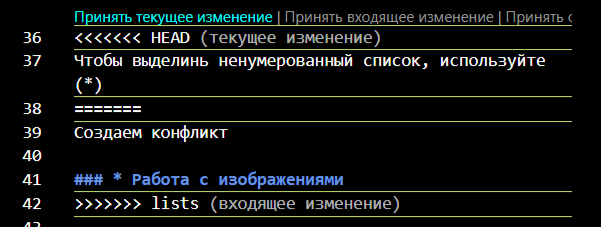
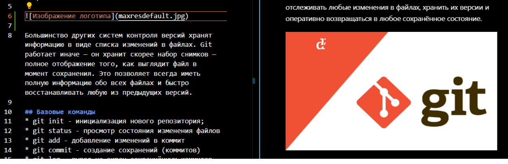

# Иструкция по Git

## Что такое Git?
Git — это специальная программа, которая позволяет отслеживать любые изменения в файлах, хранить их версии и оперативно возвращаться в любое сохранённое состояние.

Большинство других систем контроля версий хранят информацию в виде списка изменений в файлах. Git работает иначе — он хранит скорее набор снимков — полное отображение того, как выглядит файл в момент сохранения. Это позволяет всегда иметь полную информацию обо всех файлах и быстро восстанавливать любую из предыдущих версий.

## Базовые команды
* git init - инициализация нового репозитория;
* git status - просмотр состояния изменения файлов
* git add - добавление изменений в коммит
* git commit - создание сохранений (коммитов)
* git log - вывод на экран сохраннённых коммитов

## Возможности  MarkDown

### * Выделение текста
Для выделения текста курсивом используется обрамление его звёздочками и _ (* или _) *Вот так))* или _вот так_

Чтобы выделить текст полужирным, обрамляем его вот так (**)
**Например так))**

*__Одновременно и курсив и полужирный__* (ыыы)
### * Списки
Для добавления ненумерованных списков, необходимо выделить пункты звёздочкой(*), пример в инструкции выше.
* Элемент 1
* Элемент 2
* Элемент 3

Чтобы добавить нумерованные списки, нужно пронумеровать пункты
1. Первый пункт
2. Второй пункт

Чтобы выделинь ненумерованный список, используйте (*)

Создаём конфликт между метками

### * Работа с изображениями
Для вставки изображния в текст необходимо:
! [] ()

### * Ссылки

### * Работа с таблицами

### * Цитаты

### * Заключение

