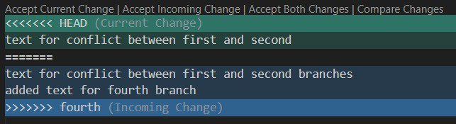

# **Инструкция по работе Git**

## *Что такое Git?*

Git - самая популярная система контроля версий, но не единственная. Программа Git берет на себя контроль версий проекта и позволяет переключаться между ними. 

## *Создание Git - репозитория:*

Для создания репозитория необходимо выполнить команду *git init* в папке с репозиторием, появится скрытая папка *.git*.

## *Основные команды Git*

* **git init** - инициализация локального репозитория;
* **git status** - показывает текущее состоянии;
* **git commit** - зафиксировать или сохранить;
* **git add** - добавить файл к следующему коммиту;
* **git log** - вывод на экран журнал изменений;
* **git checkout** - переход от одного коммита к другому;
* **git checkout master** - вернуться к актуальному состоянию;
* **git diff**- увидеть разницу между текущим файлом и закоммиченным.

## *Синтаксис языка Markdown*

### Выделение текста

 Чтобы выделить текст курсивом, необходимо обрамить его звездочкой (*) или знаком нижнего подчеркивания (_). Например, *вот так* или _вот так_.

 Чтобы выделить текст полужирным, необходимо обрамить его двойными звездочками (**) или двойным знаком нижнего подчеркивания (__). Например, **вот так** или __вот так__.

 Альтернативные способы выделения текста жирным или курсивом нужны для того, чтобы мы могли совмещать оба этих способа. Например, _текст может быть выделен курсивом и при это быть **полужирным**_.

Чтобы выделить текст зачеркнутым, необходимо обрамить его (~~). Например, ~~вот так~~.

Чтобы выделить заголовки , необходимо обрамить в начале строки (#). 

###  Списки

Чтобы добавить ненумерованные списки, необходимо пункты выделить звездочкой (*) или (-). 
Например, вот так: 
* Элемент 1
- Элемент 2

Чтобы добавить нумерованные списки, необходимо пункты просто пронумеровать. Например, вот так:
1. Элемент 1
2. Элемент 2

## Ветки в Git и их использование 
Ветки позволяют легко управлять черновиками и чистовиками в Git. Работу с ветками начинаем с запуска Git в репозитории. Если у нас несколько версий черновика, мы можем вывести на экран ветку, где находимся командой *git branch*.
Создаем ветку командой в папке с репозиторием:
 - git branch <название новой ветки>

 Во время работы у нас будет ветка *master* с черновиком и отдельная ветка с чистовиком.
 Если потребуется переключиться с одной ветки на другую, вызовем команду:
 - git checkout <имя ветки>

 Когда мы правим текст/код в текущей ветке, автоматического слияния не происходит: можно создавать один документ в разных версиях в разных ветках.

 Для того чтобы слить ветку с текущей, вызываем команду:
 - git merge <название ветки>

 Если ветка на которой работали больше не нужна, ее можно удалить, выполним команду:
 - git branch -d (D) <имя ветки, которую хотим удалить>

 *-d - сокращение от delete*

## Работа с изображениями

Чтобы добавить изображение в текст, необходимо выполнить слующие шаги:
1. Выбрать изображение и переместить в папку, в которой вы работаете.
2. Ввести команду в терминале git status, должна появиться информация о том, что добавлен файл.
3. Создать новый файл .gitignore, затем написать название картинки, и закоммитить.
4. И в текст написать  

Или можно сделать в начале работы следующее:
1. Создать файл .gitignore
2. Вписать либо название картинки, либо *.jpeg, */.jpeg (либо другой формат, jpg, png, в котором у вас картинка). Данная запись будет открывать все картинки в заданном формате.

## Конфликт изменений

Работая в двух ветках одновременно может возникнуть ситуация, когда в одной и другой ветке мы по-разному изменили блок текста. Если затем попробуем слить эти ветки, Git сообщит о конфликте и предложит выбрать, какие же изменения записать. 
У Visual Studio Code есть возможность принять текущую версию, которая к нам пришла.
- Текущая версия — это Current Change. 
- Incoming change  это то, что пришло с другой ветки. 
- Both Changes - возможность оставить и
сравнить оба варианта. 
Мы оставим оба варианта и вручную отредактируем их, оставим то, что хотим.

## Визуализация всех веток

Для того чтобы отобразить коммиты в виде дерева, используем команду:
- git log --graph

## Работа с удаленными репозиториями в git

### *Скачивание из текущего репозитория и слияние со своей версией.*

Копировать внешний репозиторий на свой ПК можно командой:
-  **git clone <адрес репозитория>**.

Команда git clone составная: она не только загружает все изменения, но и пытается слить все ветки на локальном компьютере и в удаленном репозитории.

Чтобы перейти для работы из локальной папки в папку удаленного репозитория, необходимо ввести команду:
- **cd <название папки>**

Для того чтобы скачать все из текущего репозитория и автоматически сделать merge с нашей версией, используем команду:
- **git pull**

Для того чтобы отправить нашу версию репозитория на внешний репозиторий. При первом ее использовании нужна авторизация. Используем команду:
- **git push**

### *Как настроить совместную работу*

1. Создать аккаунт на GitHub.com
2. Создать локальный репозиторий
3. "Подружить" ваш локальный и удаленный репозиторий (GitHub при создании нового репозитория подскажет, как это можно сделать)
4. Отправить (**push**) ваш локальный репозиторий в удаленный (GitHub), при этом, возможно, вам нужно будет авторизоваться на удаленном репозитории
7. Провести изменения "с другого компьютера"
8. Выкачать (**pull**) актуальное состояние из удалённого репозитория

### *Как сделать pull request*
**Pull request** - команда для предложения изменений. 
1. Делаем **fork** (ответвление) репозитория
2. Делаем **git clone** СВОЕЙ версии репозитория
3. Создаем новую ветку и в НЕЕ вносим свои изменения
4. Фиксируем изменения(делаем коммиты)
5. Отправляем (**push**) свою версию в свой GitHub
6. На сайте GitHub нажимаем кнопку **pull request** 