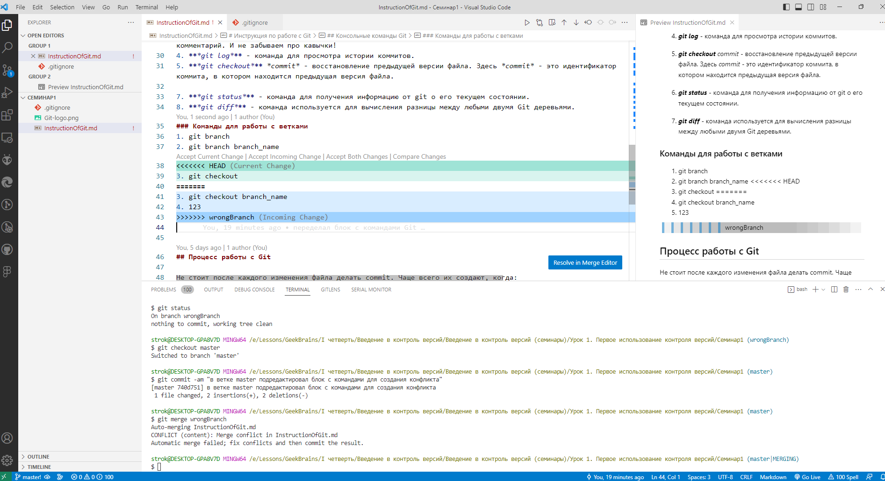

# Инструкция по работе с Git

Git - это система контроля версий, которая используется для управления изменениями в документах практически любого типа (код, текст и т.д.). Git невероятно быстр, очень эффективен для больших проектов, а также обладает превосходной системой ветвления для нелинейной разработки.

Для того, что бы использовать данную систему, её необходимо установить на свой компьютер. Для этого лучше всего использовать [официальный сайт Git](https://git-scm.com/download).

После установки, появятся два варианта взаимодействия с пользователем: графический - посредством GUI и консольный. Второй вариант наиболее предпочтителен и будет описан в данной инструкции.

## Перед началом работы

Прежде чем начать работу с Git, в системе обязательно надо прописать имя и email пользователя, для того, что бы однозначно определять авторство произведенных изменений.

Для этого запускаем Git Bash и пишем следующие команды:

__*git config --global user.name "<ваше_имя>"*__

__*git config --global user.email "<адрес_почты@email.com>"*__

где вместо <ваше_имя> вписывается имя пользователя (или ник), а вместо <адрес_почты@email.com> адрес электронной почты.

Теперь вы готовы к работе с Git локально на компьютере.

## Консольные команды Git
### Основные команды Git и их действие.
1. ***git init*** - создаёт новый локальный репозиторий Git. Эта команда создаёт в текущем каталоге новый подкаталог с именем .git содержащий все необходимые файлы — основу Git-репозитория.
2. ***git add*** _имя файла_, либо ***git add .*** - добавляет файлы в репозиторий.
3. ***git commit -m "<комментарий>"*** - фиксируем изменения - создаем commit. Обязательно указываем комментарий. И не забываем про кавычки!
4. ***git log*** - команда для просмотра истории коммитов.
5. ***git checkout*** *commit* - восстановление предыдущей версии файла. Здесь *commit* - это идентификатор коммита, в котором находится предыдущая версия файла.
6. ***git checkout master*** - команда для перехода к актуальному состоян
7. ***git status*** - команда для получения информацию от git о его текущем состоянии.
8. ***git diff*** - команда используется для вычисления разницы между любыми двумя Git деревьями.
### Команды для работы с ветками

Ветка - это набор commit (кружок), которые идут друг за другом. У ветки есть название, основную ветку чаще всего называют master (на картинках будет называться main) . Если говорить простыми словами, то ветка master - это наш проект.

Другие ветки - это отдельное место для реализации нового функционала или исправление багов (ошибок) нашего проекта. То есть, с отдельной веткой вы делаете что угодно, а затем сливаете эти изменения в основную ветку master.
1. ***git branch*** - команда выводит список всех имеющихся веток, ветка в которой мы находимся в данный момент, отмечена звёздочкоё (*).
2. ***git branch branch_name*** - команда для создания новой ветки с именем *branch_name*.
3. ***git checkout branch_name*** - команда для перехода с текущей ветки на ветку с именем *branch_name*.
4. ***git merge branch_name*** - команда *merge* берет все изменения из ветки с именем *branch_name* и добавляет их в ветку master.
5. ***git branch -d branch_name*** - данная команда удаляет ветку с именем *branch_name*.

Git старается автоматически сливать изменения, однако это не всегда возможно. Иногда возникают конфликты. Например, когда в двух ветках были изменения в одной и той же строчке кода. Если такое произошло, то необходимо разрешить конфликт вручную. Например, при слиянии, вы можете увидеть что-то подобное:

В окне редактора Git "подсвечивает" конфликтующие строки и предлагает три опции для разрешения конфликта:
* ***Accept Current Change*** - оставить код в текущей ветке без изменений.
* ***Accept Incoming Change*** - принять изменённый код от "входящей" ветки.
* ***Accept Both Changes*** - сохранить оба варианта: и текущий и входящий.
* ***Compare Changes*** - сравнить изменения.

Так же видно, что в файле появились новые дополнения:

Эти новые строки можно рассматривать как «разделители конфликта». Строка ======= является «центром» конфликта. Все содержимое между этим центром и строкой <<<<<<< HEAD находится в текущей ветке master/main, на которую ссылается указатель HEAD. А все содержимое между центром и строкой >>>>>>> wrongBranch является содержимым ветки для слияния.

После редактирования файла выполните команду ***git add file_name*** , чтобы добавить новое объединенное содержимое в раздел проиндексированных файлов. Для завершения слияния создайте новый коммит, выполнив следующую команду: ***git commit -m "your_comment"***. Git обнаружит, что конфликт разрешен, и создаст новый коммит слияния для завершения процедуры слияния.

## Процесс работы с Git

Не стоит после каждого изменения файла делать commit. Чаще всего их создают, когда:
* Создан новый функционал
* Добавлен новый блок на верстке
* Исправлены ошибки по коду
* Вы завершили рабочий день и хотите сохранить код

Это поможет держать вашу ветки в чистоте и порядке. Тем самым, вы будете видеть историю изменений по каждому нововведению в вашем проекте, а не по каждому файлу.

## Работа с удалёнными репозиториями
   Чтобы иметь возможность совместной работы над каким-либо Git-проектом, необхо-
димо знать, как управлять удалёнными репозиториями. Удалённые репозитории — это мо-
дификации проекта, которые хранятся в интернете или ещё где-то в сети. Их может быть
несколько, каждый из которых, как правило, доступен для вас либо только на чтение, ли-
бо на чтение и запись. Совместная работа включает в себя управление удалёнными репо-
зиториями и помещение (push) и получение (pull) данных в и из них тогда, когда нужно
обменяться результатами работы.

В данном руководстве будем рассматривать работу с сервисом **Github**. Предполагается, что у пользователя уже имеется действующий аккаунт на данной площадке.

### Добавление удалённых репозиториев
Чтобы создать репозиторий, выполните следующие шаги:
+ Перейдите в свой аккаунт на сайте [Github](https://github.com/).
+ Нажмите на кнопку “+”, расположенную в верхнем правом углу экрана и выберите “New repository” (Новый репозиторий).
+ Введите имя репозитория и выберите его тип: Public (Публичный) или Private (Приватный).
+ Если вы выбрали приватный репозиторий, вам потребуется ввести данные организации, к которой вы хотите его привязать.

Когда вы создадите репозиторий, он будет отображаться в вашем профиле.

### Синхронизация удалённого и локального репозиториев
+ Создайте новый локальный репозиторий или используйте существующий.
+ На вашем компьютере, откройте терминал или командную строку.
+ Перейдите в директорию вашего локального репозитория с помощью команды ***cd***.
+ Инициализируйте пустой репозиторий командой ***git init***.
+ Добавьте все файлы в репозиторий командой ***git add .***.
+ Сделайте коммит с сообщением о добавлении файлов в репозиторий командой ***git commit -m ‘Initial commit’***.
+ Создайте удаленный репозиторий на GitHub.
+ Получите URL созданного удаленного репозитория на GitHub (называется “Clone URL”).
+ Свяжите ваш локальный репозиторий с удаленным, выполнив команду ***git remote add origin <URL удаленного репозитория>***.
+ Отправьте изменения в удаленный репозиторий, выполнив команду ***git push origin master***.

Теперь ваш локальный репозиторий связан с удаленным репозиторием на GitHub и вы можете выполнять операции с файлами (добавление, изменение, удаление), делать коммиты и отправлять изменения на сервер.

Далее рассмотрим несколько команд для работы с удалёнными репозиториями

#### git clone

Команда ***git clone*** используется для создания локальной копии удаленного репозитория в системе контроля версий Git. Это позволяет разработчикам работать с репозиторием локально, без необходимости каждый раз загружать его с сервера.

Синтаксис команды:

***git clone [URL репозитория]***
где URL репозитория - это ссылка на удаленный репозиторий, который вы хотите клонировать.

Команда ***git clone*** выполняет следующие действия:

+ Создает новую папку для локального репозитория.
+ Инициализирует репозиторий в новой папке с помощью команды ***git init***.
+ Скачивает все коммиты и файлы из удаленного репозитория.
+ Создает указатель *origin*, который указывает на удаленный репозиторий.

После выполнения команды ***git clone***, вы получаете полную копию репозитория со всей историей изменений и можете выполнять все необходимые операции с этой копией, такие как добавление, изменение и коммит файлов, создание веток и слияние изменений.

#### git push
Команда ***git push*** используется для отправки (push) изменений из вашего локального репозитория в удаленный. С её помощью вы можете поделиться своими изменениями с другими разработчиками, отправить их на удаленный сервер для тестирования или интеграции в основную ветку проекта.

Перед использованием команды ***git push***, вам необходимо добавить удаленный репозиторий в ваш проект с помощью команды ***git remote add***. Это создаст указатель на удаленный репозиторий и позволит вам работать с ним.

Общий синтаксис команды ***git push***:

***git push [remote_name] [branch_name]***
Где:

*remote_name* - имя указателя на удаленный репозиторий (обычно «origin»),
*branch_name* - название ветки, изменения которой вы хотите отправить на удаленный сервер.
При выполнении команды ***git push***, git сравнивает вашу локальную ветку с удаленной и отправляет только те коммиты, которые еще не были отправлены на удаленный сервер. Если на сервере уже есть коммиты с таким же SHA-1, как у вашего последнего коммита, git откажется отправить эти изменения, чтобы избежать дублирования записей в истории репозитория.

#### git pull
Команда ***git pull*** используется для получения (pull) изменений из удаленного репозитория в ваш локальный. Она объединяет последние коммиты из удаленного репозитория с вашей текущей веткой и применяет эти изменения к вашим локальным файлам.

С помощью этой команды вы можете обновлять свою рабочую копию репозитория до актуального состояния, полученного с удаленного сервера, где работают другие разработчики. Это позволяет избежать конфликтов при слиянии веток и гарантирует, что вы всегда работаете с последней версией проекта.

Общий синтаксис команды ***git pull***:

***git pull [remote_name] [branch_name]***

Где:

+ *remote_name* — имя указателя на удалённый репозиторий
+ *branch_name* — название ветки, с которой вы хотите выполнить слияние

Если вы не укажете название ветки, ***git pull*** выполнит слияние с текущей веткой удалённого репозитория.

### Pull request
Pull request - это механизм системы контроля версий Git, позволяющий разработчикам запрашивать объединение их рабочей ветки с основной веткой проекта. Этот процесс позволяет другим разработчикам просматривать внесенные изменения, обсуждать их и принимать решение о принятии или отклонении запроса на слияние. Pull request обычно создается, когда разработчик закончил работу над определенной функцией или исправлением и хочет поделиться своими изменениями с командой. После создания pull request, другие разработчики могут обсудить изменения, задать вопросы, предложить свои изменения и, наконец, принять или отклонить запрос на слияние. Это помогает обеспечить совместную работу над проектом, прозрачность процесса разработки и контроль качества кода.