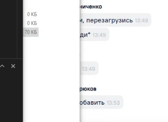

# Краткая инструкция по работе с Git

## Установка Git

Для начала работы с Git на Mac OS Monterey необходимо установить его на свой компьютер. Для этого необходимо выполнить следующие шаги:

1. Скачать установочный файл Git с официального сайта по ссылке https://git-scm.com/downloads.
2. Запустить установочный файл и следовать инструкциям установщика.
3. После завершения установки, открыть терминал и ввести команду git version, чтобы проверить, что Git установлен и работает корректно.

## Настройка Git

Перед началом работы с Git необходимо настроить его на своем компьютере. Для этого необходимо выполнить следующие шаги:

1. Открыть командную строку и ввести команды:

   
   git config --global user.name {Ваше имя}
   
   git config --global user.email {Ваш email}
   

   Эти команды устанавливают имя пользователя и email, которые будут использоваться при работе с Git.

2. Настроить редактор, который будет использоваться для написания комментариев к коммитам. Для этого введите команду:

   
   git config --global core.editor nano
   

   Название редактора может быть любым, например, "nano", "vim", "notepad" и другие.

## Создание репозитория

Для начала работы с Git необходимо создать репозиторий. Репозиторий - это место, где будут храниться все версии файлов проекта. Для создания репозитория необходимо выполнить следующие шаги:

1. Создать папку, в которой будет храниться проект.
2. Открыть командную строку (или редактор кода VisualStudio Code в нашем случае) и перейти в созданную папку командой cd /путь/к/папке.
3. Ввести команду git init, чтобы создать пустой репозиторий.

## Работа с репозиторием

После создания репозитория можно начинать работу с Git. Для этого необходимо выполнить следующие шаги:

1. Создать или изменить файлы проекта.
2. Добавить файлы в индекс командой git add /путь/к/файлу или git add ., чтобы добавить все файлы в текущей директории.
3. Сделать коммит командой git commit -m "комментарий к коммиту". Коммит - это сохранение версии файлов проекта в репозитории.
4. При необходимости можно создать ветку командой git branch имя_ветки.
5. При необходимости можно переключиться на другую ветку командой git checkout имя_ветки (ввести первые четыре символа id коммита из лога).
6. При необходимости можно сделать слияние веток командой git merge имя_ветки.

____

# Инструкция по работе с конфликтами в Git

Конфликт возникает, когда два и более человека пытаются изменить один и тот же файл в разное время. Когда Git не может автоматически объединить изменения, он создает конфликт.

О конфликте можно узнать по сообщению об ошибке при попытке объединения изменений. Также можно проверить статус репозитория с помощью команды git status.

## Разрешение конфликта

Для разрешения конфликта нужно открыть файл, в котором возник конфликт, и вручную выбрать либо входящие изменения, либо без имзенений, либо принятие и текущего и входящего варианта кода. После этого нужно добавить измененный файл в индекс с помощью команды git add и закоммитить изменения.

## Предотвращение конфликтов

Чтобы предотвратить конфликты, нужно часто обновлять репозиторий и синхронизировать изменения с другими участниками.

## Документирование конфликта

После разрешения конфликта нужно описать его в комментарии к коммиту, чтобы другие участники могли понять, что произошло и как это было разрешено. 

git commit -m "Разрешен конфликт в файле gitinstructions.md"

## Проверка изменений

После разрешения конфликта нужно проверить изменения, чтобы убедиться, что все работает корректно. Это можно сделать с помощью команды git diff.

# Работа с удаленными репозиториями в Git
## Создание удаленного репозитория

Перед тем, как начать работу с удаленным репозиторием, необходимо создать его. Существует несколько вариантов создания удаленного репозитория:

* Создание репозитория на платформе хостинга, такой как GitHub, GitLab или Bitbucket.
* Создание репозитория на собственном сервере с помощью Git.

## Клонирование удаленного репозитория

Клонирование удаленного репозитория - это процесс загрузки содержимого удаленного репозитория на локальную машину. Для этого необходимо выполнить команду git clone:

git clone <URL репозитория>

## Связывание локального и удаленного репозиториев

Чтобы связать свой локальный репозиторий с удаленным, необходимо выполнить следующие команды:

1. Переименовать свою master ветку в main

git branch add -M main

2. Добавить ссылку на удаленный репозиторий с помощью команды git remote add:

git remote add <имя репозитория> <URL репозитория>

**Например:**

git remote add origin https://github.com/username/repo.git

3. Проверить, что удаленный репозиторий был успешно добавлен с помощью команды git remote -v:

git remote -v

4. Отправить изменения из локального репозитория в удаленный с помощью команды git push:

git push <имя репозитория> <ветка>

**Например:**

git push origin master

## Работа с удаленным репозиторием

После того, как удаленный репозиторий был склонирован на локальную машину, можно начать работу с ним. Существует несколько команд для работы с удаленным репозиторием:

* git pull - загрузка изменений из удаленного репозитория на локальную машину.
* git push - отправка изменений с локальной машины в удаленный репозиторий.
* git fetch - загрузка изменений из удаленного репозитория без их автоматического объединения с локальными изменениями.

## Управление удаленными репозиториями

Для управления удаленными репозиториями можно использовать команды git remote. Существуют следующие команды:

* git remote add - добавление нового удаленного репозитория.
* git remote remove - удаление удаленного репозитория.
* git remote rename - переименование удаленного репозитория.

### Базовые команды Git

* git init - создание нового репозитория
* git add - добавление файлов в индекс
* git commit - создание нового коммита с сохранением изменений в репозитории
* git status - проверка статуса файлов в репозитории
* git log - просмотр истории коммитов
* git branch - создание, просмотр и удаление веток
* git checkout - переключение между ветками или коммитами
* git merge - объединение веток
* git remote - управление удаленными репозиториями
* git push - отправка изменений на удаленный репозиторий
* git pull - получение изменений с удаленного репозитория
* git clone - клонирование удаленного репозитория на локальный компьютер.

# Инструкция по работе с разметкой MARKDOWN

## Синтаксис языка Markdown

### Справочник по Markdown от Microsoft: https://docs.microsoft.com/ru-ru/contribute/markdown-reference

* \# Заголовок – выделение заголовков. Количество символов “#” задаёт уровень заголовка
(поддерживается 6 уровней).
* = или - – подчёркиванием этими символами (не менее 3 подряд) выделяют заголовки первого
(“=”) и второго (“-”) уровней.
* \*\*Полужирное начертание** или __ Полужирное начертание__
* \*Курсивное начертание* или \_Курсивное начертание_
* \*\*\*Полужирное курсивное начертание***
* \~~Зачёркнутый текст~~
* \* Строка – ненумерованные списки, символ “*” в начале строки
* 1, 2, 3 … – нумерованные списки

### Для работы с изображениями в инструкции по Git

Необходимо использовать следующую конструкцию:

\