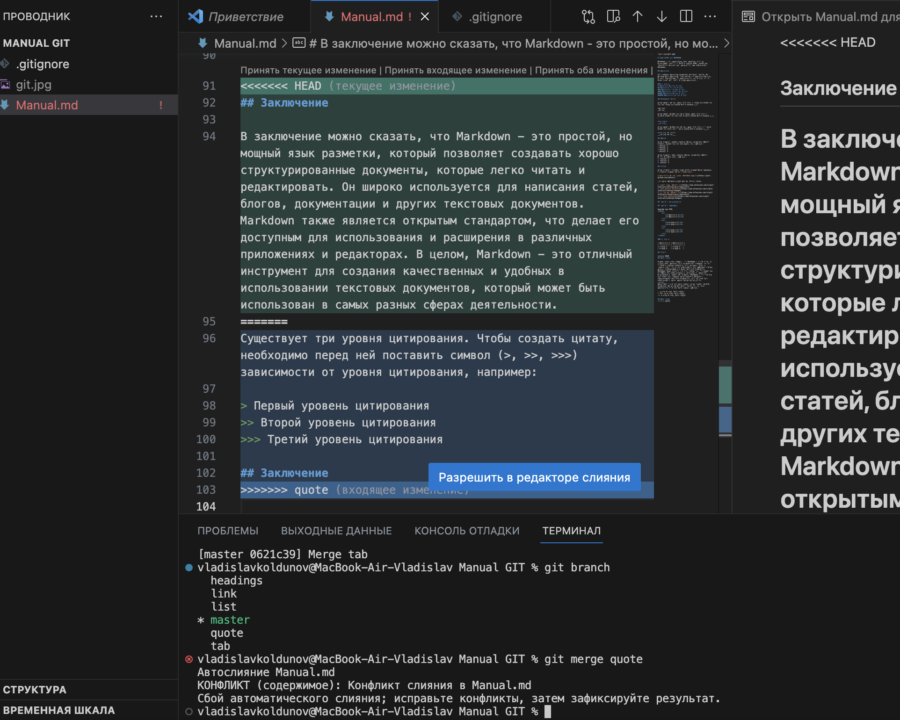

# ИНСТРУКЦИЯ для MARKDOWN

Markdown - это облегчённый язык разметки, который преобразует текст в структурированный HTML. Следующее руководство поможет вам разобраться, как использовать Markdown.

## Заголовки

Для создания заголовка необходимо поставить хештег (#) передначалом заголовка. Один хештег это заголовок первого уровня, два хештега это заголовок второго уровня, и т.д. Всего может быть шесть уровней заголовков.

### *Пример*:
# Заголовок первого уровня
## Заголовок второго уровня
### Заголовок третьего уровня
#### Заголовок четвёртого уровня
##### Заголовок пятого уровня
###### Заголовок шестого уровня

## Выделение текста

Чтобы задать курсив, заключите слово в одинарные звездочки (*) или одинарное нижнее подчеркивание (_):

*курсив*  
_курсив_

Чтобы задать полужирное начертание, заключите слово в двойные звездочки (**) или двойное нижнее подчеркивание (__):

**жирный**  
__жирный__

Чтобы задать полужирный курсив, заключите слово в тройные звездочки (***) или тройное нижнее подчеркивание (___):

***жирный курсив***  
___жирный курсив___

## Списки

Чтобы добавить ненумерованные списки, необходимо пункты выделить звездочкой (*) или знаком (+), например:
* Элемент 1
* Элемент 2
* Элемент 3
+ Элемент 4

Чтобы добавить нумерованные списки, необходимо пункты просто пронумеровать, например:
1. Элемент 1
2. Элемент 2
3. Элемент 3

### *Маркированный список*
- Пункт первый
- Пункт второй
- Пункт третий

### *Вложенные списки*
Также можно делать вложенные списки, добавляя 4 пробела перед пунктом:

1. Пункт первый
    - Подпункт первый
    - Подпункт второй
2. Пункт второй

## Ссылки

Чтобы вставить ссылку,в квадратных скобках пишем название, в круглых скобках -адрес ссылки :

[Руководство по оформлению Markdown файлов](https://gist.github.com/Jekins/)

Подробное описание команд git на русском языке:

1. [Настройка репозитория](https://www.atlassian.com/ru/git/tutorials/setting-up-a-repository)
2. [Сохранение изменений](https://www.atlassian.com/ru/git/tutorials/saving-changes)
3. [Проверка репозитория](https://www.atlassian.com/ru/git/tutorials/inspecting-a-repository)
4. [Отмена изменений](https://www.atlassian.com/ru/git/tutorials/undoing-changes)

## Работа с изображениями

Чтобы вставить изображение текст, достаточно выполнить следующее: :

При возникновении конфликта предлагается выбрать в ручную из трех вариантов:
1. Принять текущее изменение
2. Принять входящее изменение
3. Принять оба изменения

## Работа с таблицами

Таблица как HTML
<table>
    <tr>
        <th>Заголовок 1</th>
        <th>Заголовок 2</th>
    </tr>
    <tr>
        <td>Ячейка 1.1</td>
        <td>Ячейка 2.1</td>
    </tr>
    <tr>
        <td>Ячейка 1.2</td>
        <td>Ячейка 2.2</td>
    </tr>
</table>

### *Пример*:

| Заголовок 1 | Заголовок 2 |
| ----------- | ----------- |
| Ячейка 1    | Ячейка 2   |
| Ячейка 3    | Ячейка 4   |

## Цитаты

Существует три уровня цитирования. Чтобы создать цитату, необходимо перед ней поставить символ (>, >>, >>>) зависимости от уровня цитирования, например:

> Первый уровень цитирования
>> Второй уровень цитирования
>>> Третий уровень цитирования

# Работа с удаленным репозиторием

## Настройка совместной работы

1. Создать аккаунт на GitHub.com
2. Создать локальный репозиторий
3. “Подружить” ваш локальный и удалённый репозитории
4. Отправить (push) ваш локальный репозиторий в удалённый (на GitHub)
5. Провести изменения “с другого компьютера”
6. Выкачать (pull) актуальное состояние из удалённого репозитория

## Как сделать pull request

1. Делаем (ответвление) fork репозитория
2. Делаем git clone СВОЕЙ версии репозитория
3. Создаем новую ветку и в НЕЕ вносим свои изменения
4. Фиксируем изменения (делаем коммиты)
5. Отправляем свою версию в свой GitHub
6. На сайте GitHub нажимаем кнопку pull request

## Заключение

В заключение можно сказать, что Markdown - это простой, но мощный язык разметки, который позволяет создавать хорошо структурированные документы, которые легко читать и редактировать. Он широко используется для написания статей, блогов, документации и других текстовых документов. Markdown также является открытым стандартом, что делает его доступным для использования и расширения в различных приложениях и редакторах. В целом, Markdown - это отличный инструмент для создания качественных и удобных в использовании текстовых документов, который может быть использован в самых разных сферах деятельности.
