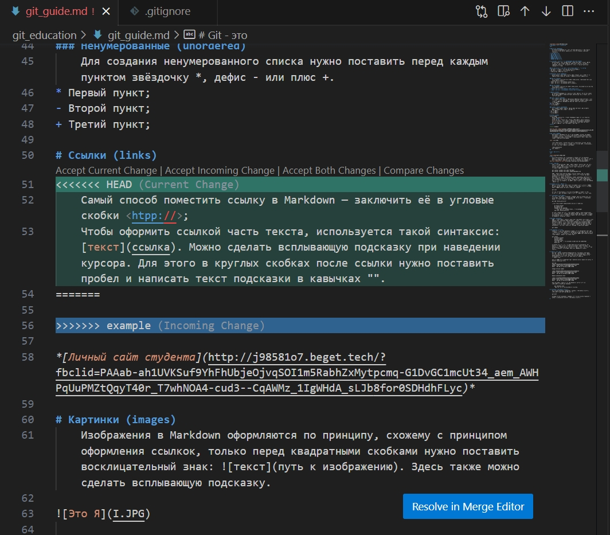

# Инструкция по работе с Markdown

## Введение 

Для начала необходимо знать следующие команды:
* git init - эта команда позволяет сделать из папки репозиторий, то есть он превратит обычную папку в такую, где работает программа Git: изенения отслеживаются, можно работать с ветками и много чего еще.

* git status - показывает состояние проекта, не проводились ли изменения, надо ли их сохранять

* git log - показывает все сохраненные изменения и коммантарии к ним (коммиты)

* git log --graph - показывает все коммиты и при этом рисует структуру, на какой ветке они выполнялись

* git add - добавляет файл к отслеживанию Гитом

* git commit -m "text" - сохраняет изменения с комментарием

* git commit -am "text" - после того, как документ уже был добавлен к ослеживанию командой git add можно упростить сохранение новых изменений и использовать такую компактную команду (добавить + закомитить с комментарием)

* git branch - просмотр, какие ветки есть в проекте

* git branch branchName - создает новую ветку

* git branch -d branchName - удаляет слитую ветку

* git branch -D branchName - удаляет не слитую ветку

* git checkout - позволяет переключаться между разными коммитами, то есть возвращаться в то состояние файла, которое было, когда записался коммит. Для этого нужно ввести от 4 первых цифр номера коммита. Еще эта же команда позволяет переключаться между ветками, если дописать имя ветки (с пробелом)

* git merge - команда для того, чтобы влить данные из ветки в ту ветку, в которой вы сейчас находитель (например, чтобы добавить данные в мастер, сначала нужно переключиться на ветку мастер)

Команды для работы с удаленным репозиторием на GitHub
* git clone - копирует на твой ПК репозиторий, который ты нашел на сайте
* git push - переносит изменения, внесенные на твоем ПК, в удаленный репозиторий
* git pull - стягивает изменения, внесенные на удаленном репозитории, в репозиторий, который находится на твоем ПК

Для того, чтобы внести изменения в чужой проект, найденный на GutHub, нужно нажать:
* на кнопку Fork
* сделать клон репозитория на своем ПК
* добавить новую ветку
* после работы в этой новой ветке сохранить изменения и перенести их в свою форкнутую версию проекта (push)
* запросить pull request у автора проекта на сайте GitHub

## Выделение текста 

Чтобы выделить текст курсивом, необходимо обрамить его звездочками (*) или знаком нижнего подчеркивания (_). Например, *вот так* или _вот так_.

Чтобы выделить текст полужирным, необходимо обрамить его двойными звездочками (**) или двойным знаком нижнего подчеркивания (__). Например, **вот так** или __вот так__.

Альтернативные способы выделения текста жирным или курсивом нужны для того, чтобы мы могли совмещать оба этих способа. Например, текст может быть выделен *курсивом и при этом быть __полужирным__*.

## Заголовки

Чтобы добавить заголовок, необходимо поставить хэштэг (и пробел) перед желаемым заголовком. Один # ставится для заголовка первого уровня, два ## - для заголовка второго уровня и так далее до 6 уровня (и шести хэштэгов).

## Списки

Чтобы добавить список без нумерации, необходимо выделить пункты звездочкой с пробелом (* ). Например, вот так:
* Элемент один
* Элемент два
* Элемент три

Чтобы добавить пронумерованный список, пункты следует пронумеровать (1. ) (с пробелом). Например, вот так:
1. Первый пункт
2. Второй пункт

## Изображения
Чтобы вставить изображение в текст, достаточно написать восклицательный знак[имя файла в квадратных скобках](имя файла в круглых скобках):

Кстати, вот скрин конфликта ;-)

## Ссылки

Добавить ссылку проще простого. Ее можно вставить прямиком в текст. Например, вот так: https://ru.wikipedia.org/wiki/Markdown. 

А еще любой текст можно превратить в кликабельную ссылку. Для этого текст, в который вы хотите добавить ссылку, нужно обрамить [квадратными скобками], сразу после без пробела необходимо скопировать ссылку, обрамив ее (круглыми скобками). 

Например:
[Маркдаун](https://ru.wikipedia.org/wiki/Markdown) - это такой язык разметки.

## Цитаты

Чтобы добавить цитату, перед каждой строкой цитаты нужно поставить правую угловую скобку. Например, вот так:

>«Аккуратный программист — быстрый программист»

>Билл Гейтс.

*P.S. Сарочка передает привет и наилучшие пожелания*
