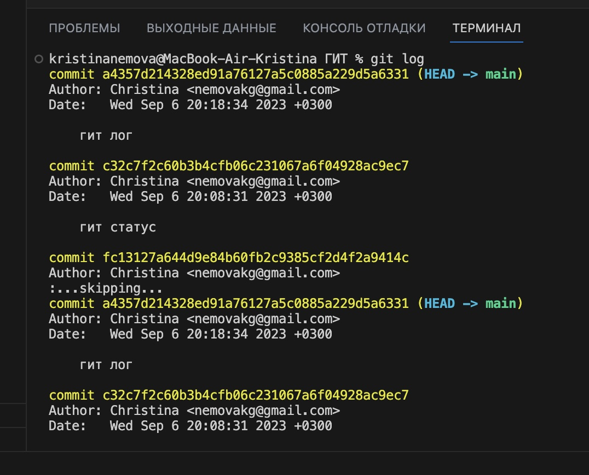
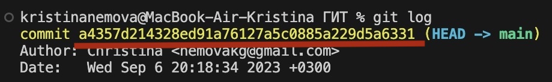
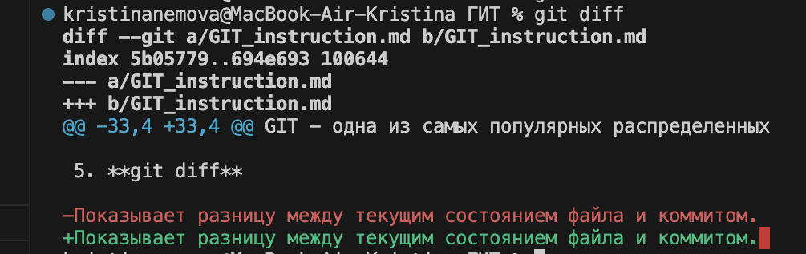

# Инструкция по работе с GIT

## Что такое GIT?
GIT - одна из самых популярных распределенных систем контроля версий. Работает как в локальном репозитории, так и в удаленном.
Система GIT была разработана в 2005 году Линусом Торвальдсом — создателем ядра операционной системы Linux. 

## Начало работы с GIT

Для начала работы с системой контроля версий GIT необходимо создать репозиторий (папку), в которой будут храниться файлы с записями всех изменений (скрытая папка ".git"). Для создания репозитория нужно выполнить в терминале команду *git init*.

Далее мы создаем файл, изменения в котором будем отслеживать. Чтобы система начала отслеживание изменений в этом файле, его необходимоq добавить используя команду *git add <имя файла>*.

## Основные команды для работы с GIT

- **git commit** 

Данная команда используется для сохранения текущего состояния файла (коммит). Дополнительно можно описать сделанные изменения с помощью флага  *-m*. Например: *git commit -m "комментарий"*.

- **git status** 

Это команда позволяет посмотреть состояние репозитория, увидеть наличие или отсутсвие изменений в отслеживаемом файле.

- **git log**

Эта команда используется для просмотра всех коммитов.

Пример команды *git log*

- **git checkout**

Данная команда используется для перехода к любому из коммитов. В качестве параметра указывается номер коммита (на изображении выделен красным) или его первые четыре символа.

- **git diff**

Показывает разницу между текущим состоянием файла и коммитом. Пример команды *git diff*

- **git branch**

Позволяет создать новую ветку проекта. Пример команды: *git branch \<name of new branch>, где name of new branch - имя новой ветки.
Если ввести команду без имени новой ветки, то система покажет список всех имеющихся на текущий момент веток проекта.

- **git merge**

Позволяет выполнить слияние текущей ветки проекта с любой указанной. Пример команды: *git merge \<name of branch>*, где name of new branch - имя ветки, из которой мы принимаем изменения/дополнения в текущую ветку.

## Команды для работы с удаленным репозиторием

Одним из самых популярных сервисов для организации работы удаленных репозиториев является Git Hub от компании Майкрософт.

- **git clone**

Позволяет скопировать внешний репозиторий на свой ПК. Пример команды: *git clone https://github.com/KroshkaKartoshka24/NEW_REPOSIT.git*.

- **git pull**

Позволяет получить изменения из ветки удаленного репозитория и слить их со своей текущей веткой.

- **git push**

Позволяет отправить в удаленный репозиторий сделанные Вами изменения проекта.

## Конец
