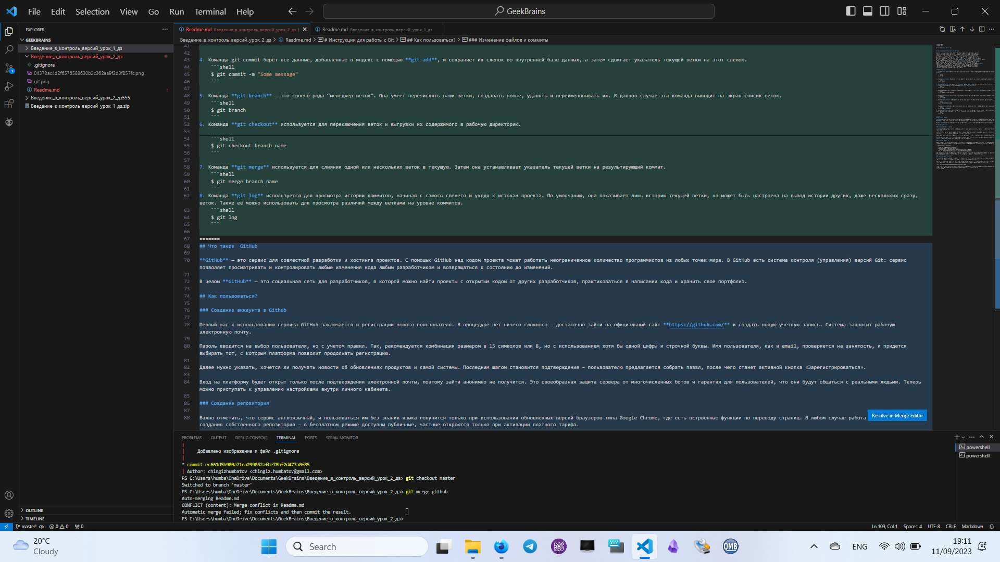
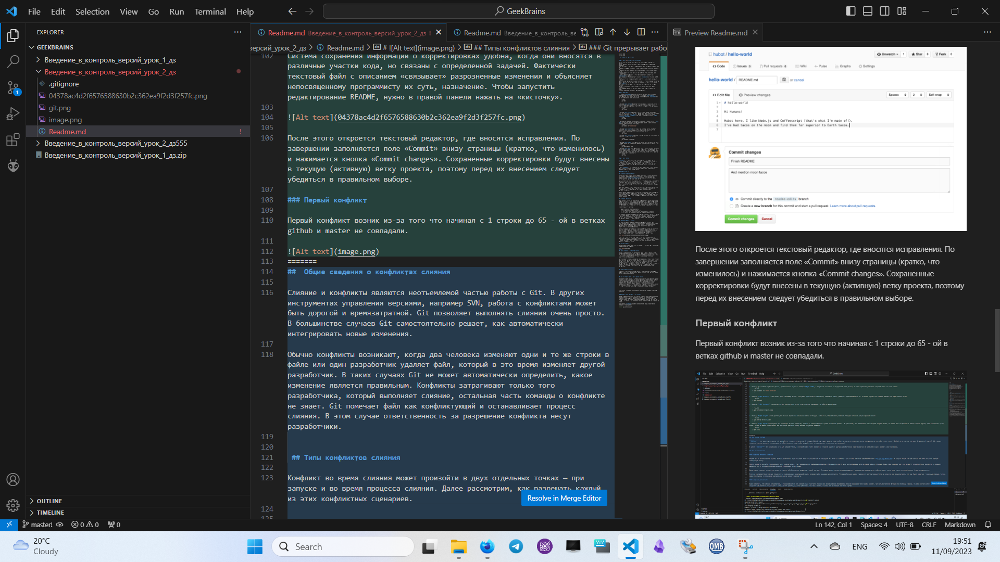
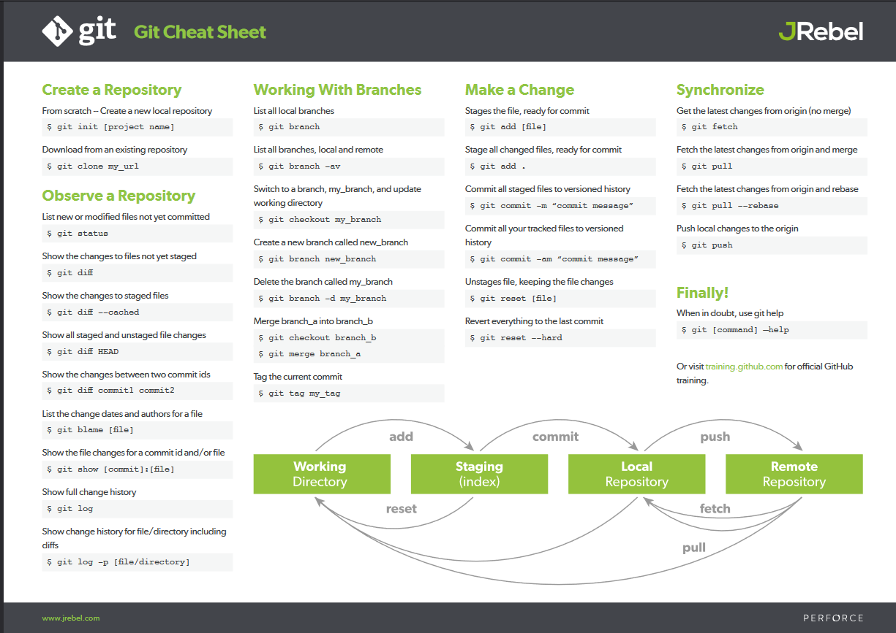
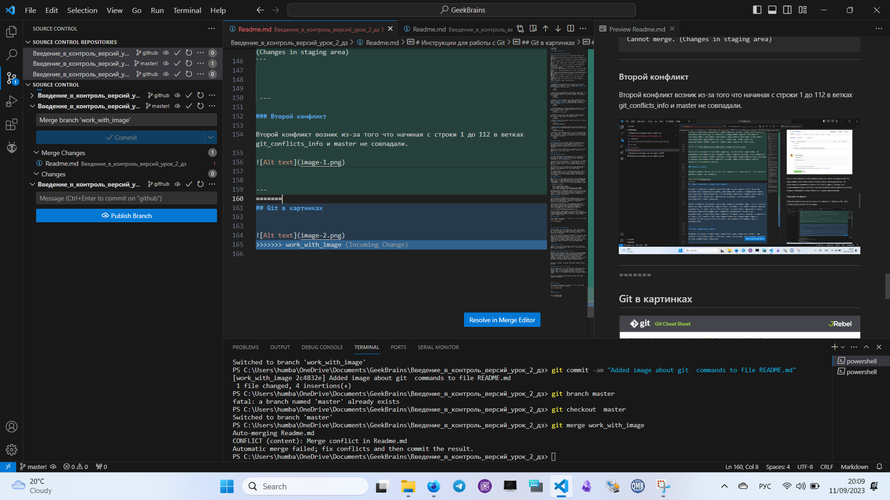
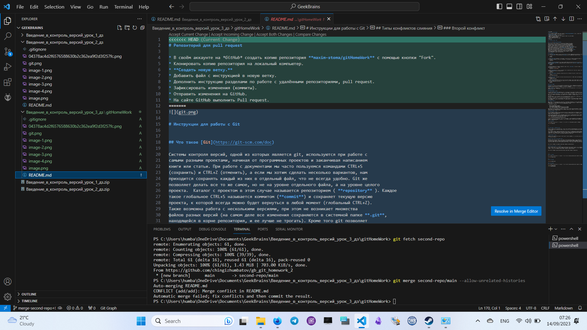

# Репозиторий для pull request

* В своём аккаунте на *GitHub* создать копию репозитория **maxim-stoma/gitHomeWork** с помощью кнопки "Fork".
* Клонировать копию репозитория на локальный компьютер.
* **Создать новую ветку.**
* Добавить файл с инструкцией в новую ветку.
* Дополнить инструкцию разделами по работе с удалёнными репозиториями, pull request.
* Зафиксировать изменения (коммиты).
* Отправить изменения на GitHub.
* На сайте GitHub выполнить Pull request.


# Инструкции для работы с Git


## Что такое [Git](https://git-scm.com/doc)

Системы контроля версий, одной из которых является git, используются при работе с
самыми разными проектами, начиная от программных проектов и заканчивая написанием
книги или статьи. При работе с документами мы часто пользуемся командами CTRL+S
(сохранить) и CTRL+Z (отменить), а если мы хотим сделать несколько вариантов, нам
приходится сохранять каждый из них в отдельный файл, что не всегда удобно. Git же
позволяет делать все то же самое, но не на уровне отдельного файла, а на уровне целого
проекта.  Каталог с проектом в этом случае называется репозиторием ( **repository** ). Каждое
такое глобальное CTRL+S называется коммитом (**commit**) и сохраняет текущую версию
проекта, к которой всегда можно будет вернуться в любой момент (глобальный CTRL+Z).
Также возможна работа с несколькими версиями, при этом не возникает множества
файлов разных версий (на самом деле все изменения сохраняются в системной папке **.git**,
находящейся в корне репозитория, и ее лучше не трогать). Кроме того git позволяет
работать с несколькими копиями репозитория, беря на себя все проблемы, связанные с
синхронизацией данных. Это не только предохраняет от потери данных, но и делает
возможным эффективную командную работу над проектом

## Инструкции Git

1.  Команда **git add** добавляет содержимое рабочей директории в индекс (staging area) для последующего коммита. По умолчанию **git commit** использует лишь этот индекс, так что вы можете использовать **git add** для сборки слепка вашего следующего коммита.

    ```shell
    $ git add
    ```

2. Команда **git status** показывает состояния файлов в рабочей директории и индексе: какие файлы изменены, но не добавлены в индекс; какие ожидают коммита в индексе. Вдобавок к этому выводятся подсказки о том, как изменить состояние файлов.
    ```shell
    $ git status
    ```

3. Команда **git diff** используется для вычисления разницы между любыми двумя Git деревьями. Это может быть разница между вашей рабочей директорией и индексом (собственно **git diff**), разница между индексом и последним коммитом (**git diff --staged**), или между любыми двумя коммитами (**git diff master branchB**).
    ```shell
    $ git diff
    ```

4. Команда git commit берёт все данные, добавленные в индекс с помощью **git add**, и сохраняет их слепок во внутренней базе данных, а затем сдвигает указатель текущей ветки на этот слепок.
    ```shell
    $ git commit -m "Some message"
    ```

5. Команда **git branch** — это своего рода “менеджер веток”. Она умеет перечислять ваши ветки, создавать новые, удалять и переименовывать их. В даннов случае эта команда выводит на экран списик веток.
    ```shell
    $ git branch
    ```
6. Команда **git checkout** используется для переключения веток и выгрузки их содержимого в рабочую директорию.

    ```shell
    $ git checkout branch_name
    ```

7. Команда **git merge** используется для слияния одной или нескольких веток в текущую. Затем она устанавливает указатель текущей ветки на результирующий коммит.
    ```shell 
    $ git merge branch_name
    ```
8. Команда **git log** используется для просмотра истории коммитов, начиная с самого свежего и уходя к истокам проекта. По умолчанию, она показывает лишь историю текущей ветки, но может быть настроена на вывод истории других, даже нескольких сразу, веток. Также её можно использовать для просмотра различий между ветками на уровне коммитов.
    ```shell
    $ git log
    ```

## Что такое  GitHub

**GitHub** — это сервис для совместной разработки и хостинга проектов. C помощью GitHub над кодом проекта может работать неограниченное количество программистов из любых точек мира. В GitHub есть система контроля (управления) версий Git: сервис позволяет просматривать и контролировать любые изменения кода любым разработчиком и возвращаться к состоянию до изменений.

В целом **GitHub** — это социальная сеть для разработчиков, в которой можно найти проекты с открытым кодом от других разработчиков, практиковаться в написании кода и хранить свое портфолио.

## Как пользоваться?

### Создание аккаунта в Github

Первый шаг к использованию сервиса GitHub заключается в регистрации нового пользователя. В процедуре нет ничего сложного – достаточно зайти на официальный сайт **https://github.com/** и создать новую учетную запись. Система запросит рабочую электронную почту.

Пароль вводится на выбор пользователя, но с учетом правил. Так, рекомендуется комбинация размером в 15 символов или 8, но с использованием хотя бы одной цифры и строчной буквы. Имя пользователя, как и email, проверяется на занятость, и придется выбирать тот, с которым платформа позволит продолжать регистрацию.

Далее нужно указать, хочется ли получать новости об обновлениях продуктов и самой системы. Последним шагом становится подтверждение – пользователю предлагается собрать паззл, после чего станет активной кнопка «Зарегистрироваться».

Вход на платформу будет открыт только после подтверждения электронной почты, поэтому зайти анонимно не получится. Это своеобразная защита сервера от многочисленных ботов и гарантия для пользователей, что они будут общаться с реальными людьми. Теперь можно приступать к управлению настройками внутри личного кабинета.

### Создание репозитория

Важно отметить, что сервис англоязычный, и пользоваться им без знания языка получится только при использовании обновленных версий браузеров типа Google Chrome, где есть встроенные функции по переводу страниц. В любом случае работа начинается с создания собственного репозитория – в бесплатном режиме доступны публичные, частные откроются только при активации платного тарифа.

Последовательность действий:

    Нажать на кнопку «Start a project».
    Ввести название и описание репозитория.
    Поставить галочку на «Initialize this repository with a README».
    Выбрать нужный тип лицензии и нажать на кнопку «Create project».

Тип лицензии (приватная или публичная) допускается заменить после, в процессе использования платформы. Единственная настройка, которую пользователи делают сразу, – это создание нескольких веток для размещения разных проектов. Например, для тестового кода и финальных релизов, чтобы не путать их при разработке и общении с другими кодерами.

### Изменение файлов и коммиты

Корректировка файлов на GitHub выполняется при помощи коммитов. Это непосредственно само исправление и краткое описание изменений. Такой подход позволяет «внешним» пользователям ориентироваться в нововведениях кода и упрощает контроль командной работы, когда один и тот же файл может редактироваться разными исполнителями.

Система сохранения информации о корректировках удобна, когда они вносятся в различные участки кода, но связаны с определенной задачей. Фактически текстовый файл с описанием «связывает» разрозненные изменения и объясняет непосвященному программисту их суть, назначение. Чтобы запустить редактирование README, нужно в правой панели нажать на «кисточку».


После этого откроется текстовый редактор, где вносятся исправления. По завершении заполняется поле «Commit» внизу страницы (кратко, что изменилось) и нажимается кнопка «Commit changes». Сохраненные корректировки будут внесены в текущую (активную) ветку проекта, поэтому перед их внесением следует убедиться в правильном выборе.

### Первый конфликт

Первый конфликт возник из-за того что начиная с 1 строки до 65 - ой в ветках github и master не совпадали.




---


##  Общие сведения о конфликтах слияния

Слияние и конфликты являются неотъемлемой частью работы с Git. В других инструментах управления версиями, например SVN, работа с конфликтами может быть дорогой и времязатратной. Git позволяет выполнять слияния очень просто. В большинстве случаев Git самостоятельно решает, как автоматически интегрировать новые изменения.

Обычно конфликты возникают, когда два человека изменяют одни и те же строки в файле или один разработчик удаляет файл, который в это время изменяет другой разработчик. В таких случаях Git не может автоматически определить, какое изменение является правильным. Конфликты затрагивают только того разработчика, который выполняет слияние, остальная часть команды о конфликте не знает. Git помечает файл как конфликтующий и останавливает процесс слияния. В этом случае ответственность за разрешение конфликта несут разработчики.


 ## Типы конфликтов слияния

Конфликт во время слияния может произойти в двух отдельных точках — при запуске и во время процесса слияния. Далее рассмотрим, как разрешать каждый из этих конфликтных сценариев.


### Git прерывает работу в самом начале слияния

Выполнение команды слияния прерывается в самом начале, если Git обнаруживает изменения в рабочем каталоге или разделе проиндексированных файлов текущего проекта. Git не может выполнить слияние, поскольку иначе эти ожидающие изменения будут перезаписаны новыми коммитами. Такое случается из-за конфликтов не с другими разработчиками, а с ожидающими локальными изменениями. Локальное состояние необходимо стабилизировать с помощью команд git stash, git checkout, git commit или git reset. Если команда слияния прерывается в самом начале, выдается следующее сообщение об ошибке:


```
error: Entry '<fileName>' not uptodate. Cannot merge. (Changes in working directory)
```

 ### Git прерывает работу во время слияния

Сбой В ПРОЦЕССЕ слияния говорит о наличии конфликта между текущей локальной веткой и веткой, с которой выполняется слияние. Это свидетельствует о конфликте с кодом другого разработчика. Git сделает все возможное, чтобы объединить файлы, но оставит конфликтующие участки, чтобы вы разрешили их вручную. При сбое во время выполнения слияния выдается следующее сообщение об ошибке:

```
error: Entry '<fileName>' would be overwritten by merge. Cannot merge. (Changes in staging area)
```


 ---

### Второй конфликт

Второй конфликт возник из-за того что начиная с строки 1 до 112 в ветках git_conflicts_info и master не совпадали.




---
## Git в картинках





### Третий конфликт

Третий конфликт возник из-за того что начиная с строки 1 до 168 в ветках git_conflicts_info и master не совпадали.




### Четвертый конфликт

Четвертый конфликт возник из-за того что начиная с строки 1 до 11 в ветках merge-second-repo и main не совпадали.


---

## Работа с удалёнными репозиториями

Удалённые репозитории представляют собой версии вашего проекта, сохранённые в интернете или ещё где-то в сети. У вас может быть несколько удалённых репозиториев, каждый из которых может быть доступен для чтения или для чтения-записи. Взаимодействие с другими пользователями предполагает управление удалёнными репозиториями, а также отправку и получение данных из них. Управление репозиториями включает в себя как умение добавлять новые, так и умение удалять устаревшие репозитории, а также умение управлять различными удалёнными ветками, объявлять их отслеживаемыми или нет и так далее. В данном разделе мы рассмотрим некоторые из этих навыков.

### Просмотр удалённых репозиториев

Для того, чтобы просмотреть список настроенных удалённых репозиториев, вы можете запустить команду **git remote**. Она выведет названия доступных удалённых репозиториев.

```shell
$ git remote
origin
```

Вы можете также указать ключ -v, чтобы просмотреть адреса для чтения и записи, привязанные к репозиторию:

```shell
$ git remote -v
origin	https://github.com/schacon/ticgit (fetch)
origin	https://github.com/schacon/ticgit (push)
```