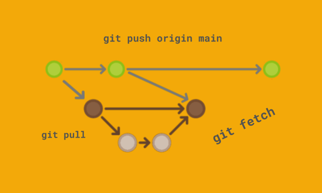

# Репозиторий для pull request

* В своём аккаунте на *GitHub* создать копию репозитория **maxim-stoma/gitHomeWork** с помощью кнопки "Fork".
* Клонировать копию репозитория на локальный компьютер.
* **Создать новую ветку.**
* Добавить файл с инструкцией в новую ветку.
* Дополнить инструкцию разделами по работе с удалёнными репозиториями, pull request.
* Зафиксировать изменения (коммиты).
* Отправить изменения на GitHub.
* На сайте GitHub выполнить Pull request.

## Работа с удалёнными репозиториями
Для того, чтобы внести вклад в какой-либо Git-проект, необходимо уметь работать с **удалёнными репозиториями**. 

Удалённые репозитории представляют собой версии проекта, сохранённые в интернете.

Взаимодействие с другими пользователями предполагает управление удалёнными репозиториями, а также отправку и получение данных из них.

### Для того, что создать удаленный репозиторий, необходимо:

1. Создадим пустую папку -> Открыть ее в VSC -> Открыть терминал.
2. Проверим, не является ли папка репозиторием при помощи команды *git status*.
3. Используем команду *git init* для отслеживания папки.
4. Создадим файл *README.md*.
5. Используем команды: *git add* и *git commit -m "..."*.
6. Заполним файл информацией (текстом).

7. Зайдем на [сайт GitHub](https://github.com) -> Создадим новый репозиторий (прописав только имя).

8. Далее придерживаемся инструкции ниже:
* Изменим имя ветки с *master* на *main* при помощи команды *git branch -M main*;
* Скопируем строку с ссылкой -> Зайдем в VSC и вставим ее в терминал.
* Скопируем строку "git push -u ..." -> Зайдем в VSC и вставим ее в терминал.

9. Заходим обратно на сайт GitHub и обновляем страницу (если это требуется).
10. Перед нами появялется наш удаленный репозиторий и теперь мы можем отправить *pull request*, нажав на кнопку **"<> Code"**, а затем на значок копирования ссылки на разделе *HTTPS*.

