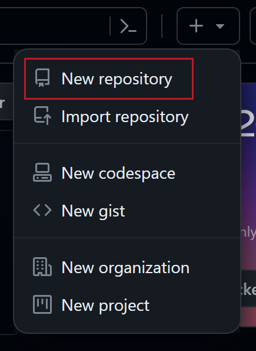
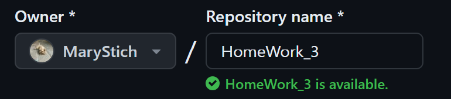
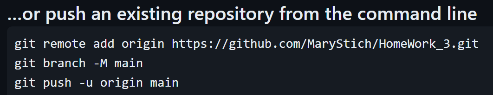
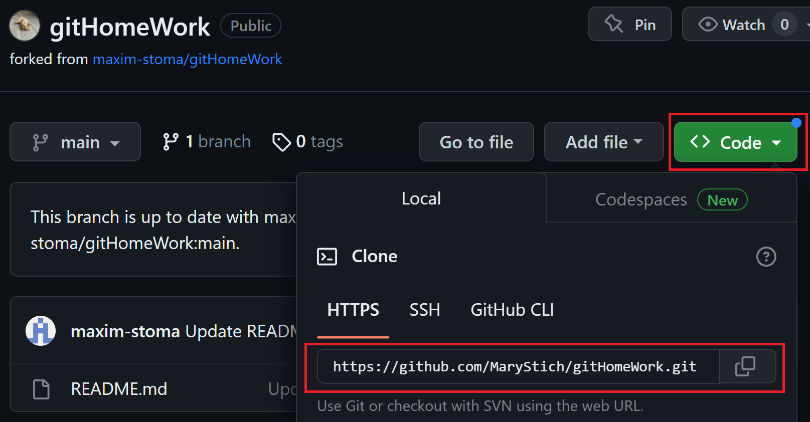

# GitHub

**GitHub** - is a platform and <u>cloud-based service for software development and version control using Git</u>, allowing developers to store and manage their code.

It is commonly used to host open source software development projects.

## Remote repository

To be able to collaborate on any Git project, you need to know how to manage your remote repositories. <u>Remote repositories are versions of your project that are hosted on the Internet</u> or network somewhere. You can have several of them.  Collaborating with others involves managing these remote repositories and pushing and pulling data to and from them when you need to share work. <u>Managing remote repositories includes knowing how to add remote repositories, remove remotes that are no longer valid, manage various remote branches</u> and more.

### Create

__1.__ Go to GitHub.com 

__2.__ In the upper-right corner of any page, use the  drop-down menu, and select New repository.

__3.__ Type a short, memorable name for your repository. For example, "HomeWork_3".

*NB! Optionally*
* *Add a description of your repository.* 
* *Choose a repository visibility.*
* *Select Initialize this repository with a README. Be aware, all project nnds to have README file (created automatically or mannualy). This file describes the project and shows "what's going on" for every person looking through the project for the first time.*

__4.__ Click Create repository.

Congratulations! You've successfully created your first repository. U can start be **creating new file** or uploading an existing.

__5.__ Following the GitHub instructions, It will help u to create/ upload an existing file.

__To upload an existing file:__

__6.__ Choose one of the options sujested by GitHub and copy-paste comand by comand to VS Code terminal. When done, update GitHub page. Ur file/local repository will appear.

 *for ex!*
 

### Fork

A fork is a new repository that shares code and visibility settings with the original “upstream” repository. Forks are often used to iterate on ideas or changes before they are proposed back to the upstream repository, such as in open source projects or when a user does not have write access to the upstream repository.

__1.__ Open the project page GitHub.com. In the top-right corner of the page, click **Fork** button.

*NB! Optionally*
* *By default, forks are named the same as their upstream repositories. Optionally, to further distinguish your fork, in the "Repository name" field, type a name.*

* *In the "Description" field, type a description of your fork.*

* *Select Copy the MAIN branch only. 
For many forking scenarios, such as contributing to open-source projects, you only need to copy the default branch. If you do not select this option, all branches will be copied into the new fork.*

__2.__ Click **Create fork**.

Right now, u have a fork of the repository, but you do not have the files in that repository locally on your computer. So now u need to **clone** it.

__3.__ Above the list of files, click **Code**. Copy the URL for the repository.

__4.__ Open VS Code and change the current working directory to the location where you want the cloned directory.

__5.__ Type git clone, and then paste the URL you copied earlier. Press Enter. Your local clone will be created.

### Push&pull

### Features

