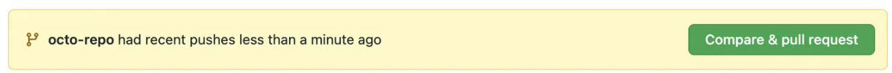

# GitHub

**GitHub** - is a platform and <u>cloud-based service for software development and version control using Git</u>, allowing developers to store and manage their code.

It is commonly used to host open source software development projects.

## Remote repository

To be able to collaborate on any Git project, you need to know how to manage your remote repositories. <u>Remote repositories are versions of your project that are hosted on the Internet</u> or network somewhere. You can have several of them.  Collaborating with others involves managing these remote repositories and pushing and pulling data to and from them when you need to share work. <u>Managing remote repositories includes knowing how to add remote repositories, remove remotes that are no longer valid, manage various remote branches</u> and more.

### Create

__1.__ Go to GitHub.com 

__2.__ In the upper-right corner of any page, use the  drop-down menu, and select New repository.

__3.__ Type a short name for your repository. For example, "HomeWork_3".

*NB! Optionally*
* *Add a description of your repository.* 
* *Choose a repository visibility.*
* *Select Initialize this repository with a README. Be aware, all project nnds to have README file (created automatically or mannualy). This file describes the project and shows "what's going on" for every person looking through the project for the first time.*

__4.__ Click Create repository.

Congratulations! You've successfully created your first repository. U can start be **creating new file** or uploading an existing.

__5.__ Following the GitHub instructions, It will help u to create/ upload an existing file.

__To upload an existing file:__

__6.__ Choose one of the options sujested by GitHub and copy-paste comand by comand to VS Code terminal. When done, update GitHub page. Ur file/local repository will appear.

 *for ex!*
 

### Fork

A fork is a new repository that shares code and visibility settings with the original “upstream” repository. Forks are often used to iterate on ideas or changes before they are proposed back to the upstream repository, such as in open source projects or when a user does not have write access to the upstream repository.

__1.__ Open the project page GitHub.com. In the top-right corner of the page, click **Fork** button.

*NB! Optionally*
* *By default, forks are named the same as their upstream repositories. Optionally, to further distinguish your fork, in the "Repository name" field, type a name.*

* *In the "Description" field, type a description of your fork.*

* *Select Copy the MAIN branch only. 
For many forking scenarios, such as contributing to open-source projects, you only need to copy the default branch. If you do not select this option, all branches will be copied into the new fork.*

__2.__ Click **Create fork**.

Right now, u have a fork of the repository, but you do not have the files in that repository locally on your computer. So now u need to **clone** it.

__3.__ Above the list of files, click **Code**. Copy the URL for the repository.

__4.__ Open VS Code and change the current working directory to the location where you want the cloned directory.

__5.__ Type git clone, and then paste the URL you copied earlier. Press Enter. Your local clone will be created.

### Push&pull

<u>**Git push**</u>

The **git push** command is used to transfer or push the commit, which is made on a local branch in your computer to a remote repository like GitHub.

To push the code in your local repository to GitHub use the command:

*git push -u origin master/main*

In the code, the *origin* is your default remote repository name, *'-u'* flag is upstream, which is equivalent to '-set-upstream.'. And the *master* is the branch, name.upstream is the repository that we have cloned the project.
If browser requests to log-in, fill in your GitHub username and password.

View your files in your repository hosted on GitHub.

<u>**Git pull**</u>

 The **git pull** updates your current local working branch, and all of the remote tracking branches. It's a good idea to run git pull regularly on the branches you are working on locally.

Without git pull, (or the effect of it,) your local branch wouldn't have any of the updates that are present on the remote.

 The simple command to PULL from a branch is:
 
 *git pull 'remote_name' 'branch_name'*

 *NB!*
 * *It is always a good idea to run **git status** - especially before **git pull**. Changes that are not committed can be overwritten during a **git pull**. Or, they can block the **git merge** portion of the git pull from executing.*

 ### Pull Request

 Pull requests let you tell others about changes you've pushed to a branch in a repository on GitHub. Once a pull request is opened, you can discuss and review the potential changes with collaborators and add follow-up commits before your changes are merged into the main branch.

 <u>Creating the pull request</u>

 __1.__ When the changes in forked repository been pushed to GitHub, above the list of files, in the yellow banner, click **Compare & pull request** to create a pull request for the associated branch.

__2.__ Use the base branch dropdown menu to select the branch you'd like to merge your changes into, then use the compare branch drop-down menu to choose the topic branch you made your changes in.

__3.__ Use the base branch dropdown menu to select the branch you'd like to merge your changes into, then use the compare branch drop-down menu to choose the topic branch you made your changes in.

__4.__ To create a pull request that is ready for review, click Create Pull Request. 

After initializing a **pull request**, you'll see a review page that shows a high-level overview of the changes between your branch (the compare branch) and the repository's base branch.

Once you've created a pull request, you can push commits from your topic branch to add them to your existing pull request. These commits will appear in chronological order within your pull request and the changes will be visible in the "Files changed" tab.

Other contributors can review your proposed changes, add review comments, contribute to the **pull request** discussion, and even add commits to the **pull request**.

*Thanks for watching!*
