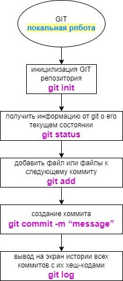
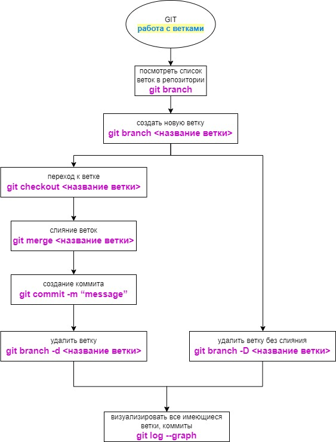
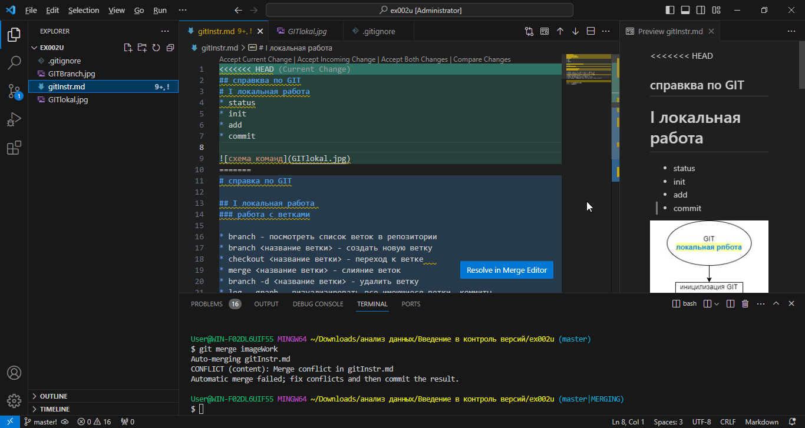
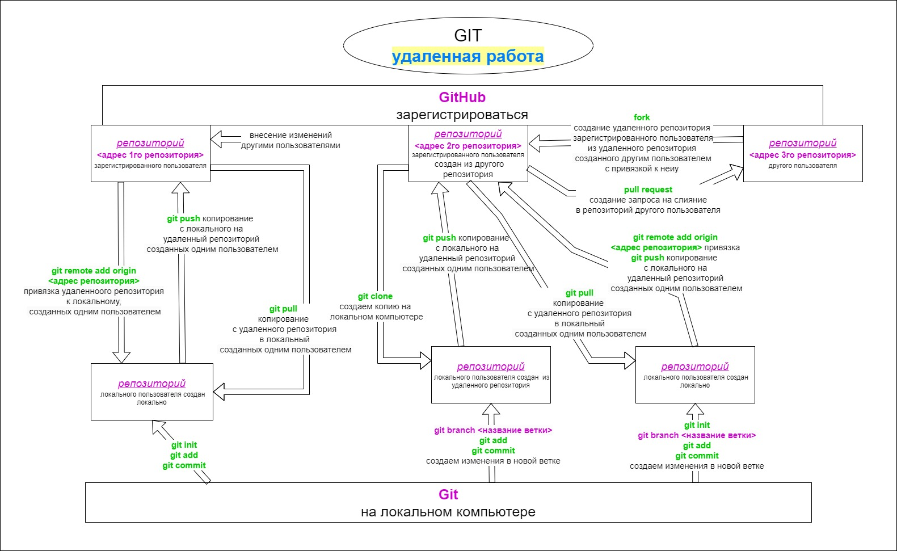

# справка по GIT
## введение
Установка Git для Windows, MAC, Linux: 
https://git-scm.com/downloads

При первом использовании Git необходимо представиться.  
Для этого нужно ввести в терминале 2 команды:
* git config --global user.name «Ваше имя английскими буквами»  
* git config --global user.email ваша почта@example.com
## локальная работа

### главные команды

* git init
инициализация локального репозитория
* git add
добавить файл или файлы к следующему коммиту
* git commit
создание коммита
 -m “message” - комментарий к commit
* git status
получить информацию от git о его текущем состоянии
*  git checkout
переход от одного коммита к другому
* git diff
увидеть разницу между текущим файлом и закоммиченным файлом
* git log 
 вывод на экран истории всех коммитов с их хеш-кодами

 
### работа с ветками

* branch - посмотреть список веток в репозитории

* checkout <название ветки> - переход к ветке

* merge <название ветки> - слияние веток

* branch -d <название ветки> - удалить ветку

* log --graph - визуализировать все имеющиеся ветки, коммиты

# обработка конфликта
выбрать один из пуктов в вверхнем меню открывшегося окна

* Accept Current Change

* Accept Incommig Change

* Assept Both Changes

# работа с GitHub

* git remote add origin <адрес репозитория>
привязка удаленноого репозитория к локальному

* git clone
создаем копию удаленного репозитория

* git push 
копирование с локального на удаленный репозиторий

* git pull 
копирование c удаленного репозитория в локальный
 
 