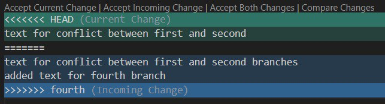

# Инструкция по  работе с Git

## Семинар 1

1. Базовые команды в Git

* git version
* git init
* git status
* git add
* git commit -m "message"
* git log
* git diff

* Прежде чем создавать репозиторий и инициализировать Git, проверим текущую установленную
версию пограммы. Для этого в терминале введём команду: *git version* 
Если Git установлен на компьютер, вы увидите его текущую версию.
Программа использует мнемонические команды, которые легко запомнить, если знать 
английский язык.

* команда git init - создаёт пустой или инициализирует существующий репозиторий Git. При инициализации он создаст скрытую папку. В ней содержатся все объекты и ссылки, которые Git использует и создаёт в истории работы над проектом.

* команда  git status - просмотреть статус нужного репозитория можно по ключевому слову status: его действие распространяется на подготовленные, неподготовленные и неотслеживаемые файлы.
* команда git add - добавляет содержимое рабочего каталога 
в индекс (staging area) для последующего коммита. Эта команда дается после добавления
файлов. Писать название целиком не обязательно: терминал дозаполнит данные автоматически.
* команда git commit -m "message" - команда берёт все данные, добавленные в индекс с помощью git add, и сохраняет их
слепок во внутренней базе данных, а затем сдвигает указатель текущей ветки на этот слепок. При создании коммита в репозитории можно добавить однострочное сообщение с помощью параметра commit с флагом -m. Само сообщение вводится непосредственно после флага, в кавычках. *git commit -m "Your short summary about the commit"*
* команда git log - просматривать изменения, внесённые в репозиторий, можно с помощью данной команды. Он отображает список последних коммитов в порядке выполнения. Кроме того, добавив флаг -p, вы можете подробно изучить изменения, внесённые в каждый файл.
* команда git checkout - переход от одного комита к другому 
* команда git  checkout master - вернуться к актуальному ссостоянию и продолжить работу
* команда git diff - просматривать список изменений, внесённых в репозиторий, можно спомощью данной команды. По умолчанию отображаются только изменения, не подготовленные для фиксации. Для просмотра подготовленных изменений необходимо добавить флаг *--staged*, *git diff --staged*. Также можно указать имя файла как параметр и просмотреть изменения, внесённые только в этот файл. *git diff somefile.js*

## Семинар 2

2. Основные команды по работе с ветками в Git

* git branch
* git branch branch_name
* git branch -a
* git checkout branch_name
* git merge
* git log --graph
* git branch -d branch name
* git branch -D branch name

2. 1 Для работы с изображениями в инструкции по Git

* Необходимо использовать следующую конструкцию:
![название изображения] (ссылка на изображение) * *Например,*

* В Git не принято добавлять файлы изображений, их хранят на сторонних носителях. Чтобы исключить ненужные файлы из загрузки, есть команда git ignore. Создаем файл .gitignore, добавляем в него наше изображение и фиклируем (commit).

2. 2 Порядок работы с ветками.

* Создать ветку можно командой *git branch*. Делать это надо в папке с репозиторием: ***Например, git branch (branch name).***
Чтобы просматсреть полный список веток, используем команду *git branch*. Команда отобразит все ветки, отметит текущую звёздочкой (*) и выделит её цветом.
* Также можно вывести список удалённых веток с помощью команды: *git branch -a*
* Если потребуется переключиться с одной ветки на другую, это можно сделать командой *git checkout (branch name)*
Дальше мы продолжим работу в этой ветке. Все изменения которые мы вносили в предыдущей ветке, в ветке в которую мы прешли, не отобразятся.

* Чтобы слить любую ветку с текущей, вызываем командой *git merge (branch name)*. После слияния веток, вся информация обоих веток будет прописана в текущей ветке.

* При работе в двух ветках одновременно может возникнуть ситуация, когда в одной и другой ветке мы по-разному изменили блок текста. Если затем мы попробуем слить эти ветки, Git сообщит о конфликте и предложит выбрать, какие же изменения записать. Область конфликта выделяется разными цветами. Как указано на рисунке: 
. 

* Нам необходимо: *Принять текущее изменение, принять входящее изменение, принять оба изменения, сравнить изменения*.

* Поэтому у проекта в репозитории должен быть один ответственный пользователь, наделённый правом проводить слияния и разрешать конфликты.
* Просмотреть историю коммитов в виде графика для текущей ветки можно с помощью команды *git log --graph*.

* Удалить ветку можно спомощью команды *git branch -d (branch name)*. Если вы завершили работу над веткой и объединили её с основной, можно её удалить без потери истории. Однако, если выполнить команду удаления до слияния — в результате появится сообщение об ошибке. Этот защитный механизм предотвращает потерю доступа к файлам.

* Для принудительного удаления ветки используется команда *git branch -D*. В этом случае ветка будет удалена независимо от текущего статуса, без предупреждений. В дальнейше удаленную ветку востанновить не получится.

## Семинар 3

3. Инструкция по работа с удаленным репозиторием (с репозиторием другого человека) на Github и основные команды Git.

* Для начала зарегистрируйтесь на *GitHub*: задайте логин, почту и придумайте пароль. После *Создать аккаунт* не забудьте проверить почту и подтвердить её.

* Чтобы добавить свои преложения в  существующий репозиторий *(в чужой)*. Для этого необходимо сделать следующее:

* В своём аккаунте на Github создаем копию удаленного репозитория с помощью кнопки *Fork*. *(рис.1)*

* Форк (Fork) — собственное ответвление (fork) какого-то проекта. Это означает, что GitHub создаст вашу собственную копию проекта, данная копия будет находиться в вашем пространстве имён, и вы сможете легко делать изменения путём отправки (push) изменений.

.

* Теперь клонируем копию репозиторий к себе на локальный компьютер. *(рис.2)*

.

* Клонируем репозиторий командой *git clone https://github.com/Andryi178/gitHomeWork.git* 

* Командой *cd gitHomeWork* мы преходим на репозиторий *gitHomeWork* и создаём отдельную ветку, в которой будем работать. 

* Сохранив *(commit)* все измения, отправляем свою версию репозитория во внешний репозиторий командой *git push*. При первом её использовании нужна авторизация. После данной команды появляется ошибка *(fatal)*.

* Почему произошёл *fatal*: просто команда *git push* предполагает, что ветка, которую отслеживает текущая локальная ветвь, уже существует на удалённом сервере. У нас ветка новая и была создана только локально, поэтому нам нужно её создать, указав --set-upstream. *Например, git push --set-upstream branch1. Наша ветка выгружвется на GitHub.

* Далее нам необходимо создать *Pull request* как указано на Git hub.
* Pull request PR (пиар, он же merge request MR(мр)) — предложение изменения кода в чужом репозитории. Нажимаем кнопку *«Create pull request» (рис. 3)*. Пишем описание, просматриваем ещё раз изменения. Если всё так, как нужно, ещё раз нажимаем *«Create pull request» (рмс. 4)*.

.

.

* На этом наша работа завершена. Ответственные за репозиторий посмотрят ваши изменения, примут их, или попросят что-то дописать, или отклонят изменения.
