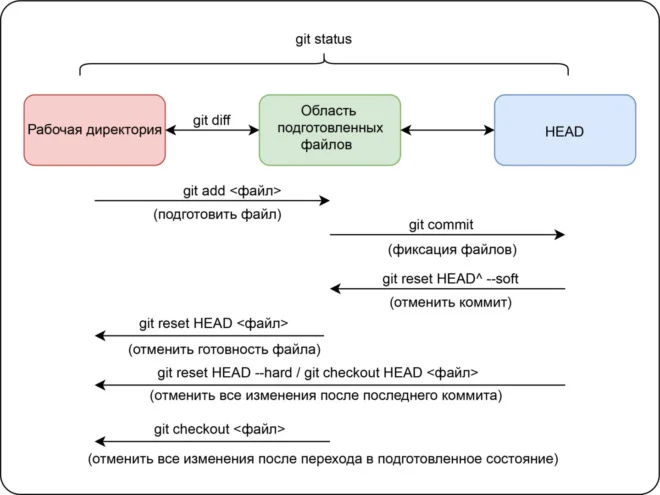
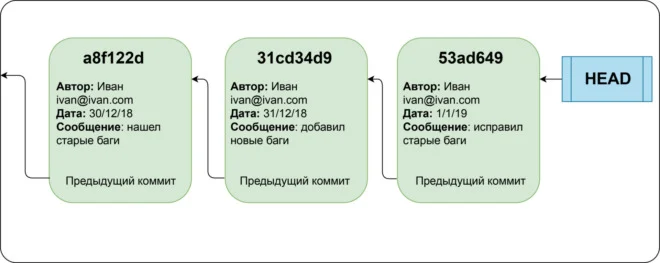
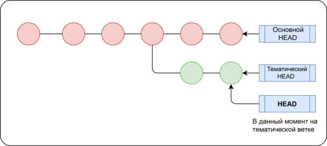
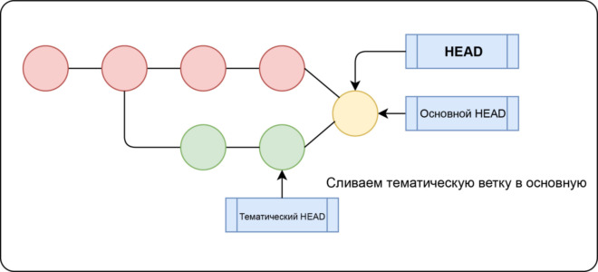
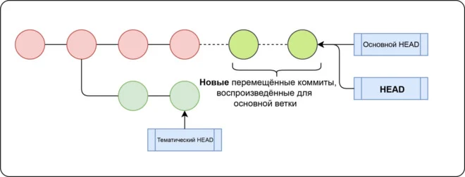

# Инструкция по использованию системы контроля версий - GIT

> GIT - это консольная утилита, для отслеживания и ведения истории изменения файлов, в вашем проекте. Чаще всего его используют для кода, но можно и для других файлов. Например, для картинок - полезно для дизайнеров.

## Установка и первоначальная настройка GIT

### Установка

Установить git на свою машину очень просто:

* Linux — нужно просто открыть терминал и установить приложение при помощи пакетного менеджера вашего дистрибутива. Для Ubuntu команда будет выглядеть следующим образом:

        sudo apt-get install git

* Windows — мы рекомендуем git for windows, так как он содержит и клиент с графическим интерфейсом, и эмулятор bash.
* OS X — проще всего воспользоваться homebrew. После его установки запустите в терминале:

        brew install git

> Если вы новичок, клиент с графическим интерфейсом(например GitHub Desktop и Sourcetree) будет полезен, но, тем не менее, знать команды очень важно.

### Настройка 

> Есть довольно много опций, с которыми можно играть, но мы настроим самые важные: наше `имя пользователя` и `адрес электронной почты`. Откройте терминал и запустите команды:

        git config --global user.name "My Name"
        git config --global user.email myEmail@example.com

**Теперь каждое наше действие будет отмечено именем и почтой. Таким образом, пользователи всегда будут в курсе, кто отвечает за какие изменения — это вносит порядок.**

Git хранит весь пакет конфигураций в файле `.gitconfig`, находящемся в вашем локальном каталоге. Чтобы сделать эти настройки глобальными, то есть применимыми ко всем проектам, необходимо добавить флаг `–global`. Если вы этого не сделаете, они будут распространяться только на текущий репозиторий.
Для того, чтобы посмотреть все настройки системы, используйте команду:

        git config --list
Для удобства и легкости зрительного восприятия, некоторые группы команд в Гит можно выделить цветом, для этого нужно прописать в консоли:

        git config --global color.ui true
        git config --global color.status auto
        git config --global color.branch auto

Если вы не до конца настроили систему для работы, в начале своего пути - не беда. Git всегда подскажет разработчику, если тот запутался, например:

> **Команда `git --help` - выводит общую документацию по git
Если введем `git log --help` - он предоставит нам документацию по какой-то определенной команде (в данном случае это - log)**

*Если вы вдруг сделали опечатку - система подскажет вам нужную команду*

*После выполнения любой команды - отчитается о том, что вы натворили*

*Также Гит прогнозирует дальнейшие варианты развития событий и всегда направит разработчика, не знающего, куда двигаться дальше*

## Основные команды

### Справочные команды

* git status - проверка состояния
* git log - просмотр истории коммитов с хэш-номерами каждого коммита
* git show hash-commit - просмотр всех изменений определённого коммита
* git diff - просмотр изменений и разницы между определёнными коммитами

#### Ярлыки состояния файлов

* U - (untracked) - файл не отслеживается
* A - (added) - файл добавлен и отслеживается
* M - (modified) - файл изменён

### Работа с файлами
* git init - инициализация репозитория
* git add "file-name" - добавление файла(ов) для отслеживания (имя файла указывается без кавычек)
* git reset "file-name" - убрать ненужный файл(ы), если вдруг добавили лишнего 
* git commit - создание "точки сохранения" нашего репозитория (есть несколько вариаций, но всегда необходимо указывать комментарий к коммиту)
    * -m "message" - позволяет написать сообщение вместе с командой, не открывая редактор (кавычки обязательны)
    * -a -m "message" - добавление файлов и комментария одновременно (позволяет пропустить команду git add)
    * -am "message" - сокращённая запись команды выше
    * -amend -m "new message" - позволяет заменить комментарий определённого коммита

> ***Коммиты хранят состояние файловой системы в определённый момент времени и указатели на предыдущие коммиты. Каждый коммит содержит уникальную контрольную сумму — идентификатор, который Git использует, чтобы ссылаться на коммит. Чтобы отслеживать историю, Git хранит указатель HEAD, который указывает на первый коммит (мы следуем по цепочке коммитов в обратном порядке, чтобы попасть к предыдущим коммитам).***

Мы можем ссылаться на коммит либо через его контрольную сумму, либо через его позицию относительно HEAD, например HEAD~4 ссылается на коммит, который находится 4 коммитами ранее HEAD.

### Работа с ветками

> Ветвление — это возможность работать над разными версиями проекта: вместо одного списка с упорядоченными коммитами история будет расходиться в определённых точках. Каждая ветвь содержит легковесный указатель HEAD на последний коммит, что позволяет без лишних затрат создать много веток. Ветка по умолчанию называется master, но лучше назвать её в соответствии с разрабатываемой в ней функциональностью.

#### Команды

* git checkout branch-name - перемещение между ветками
* git checkout hash-commit - переход к коммиту
* git branch - создание ветки
    * -d - модификатор позволяет удалить ветку
    * -D - позволяет принудительно удалить ветку
* git merge branch-name - слияние веток

#### Прятки и чистка

> Есть одна тонкость — при переключении веток Git требует, чтобы рабочее состояние было чистым, то есть все изменения в отслеживаемых файлах должны быть зафиксированы.

Однако порой у вас есть незавершённые изменения, которые нельзя фиксировать. В такой ситуации их можно сохранить и «спрятать» с помощью команды `git stash`. Чтобы вернуть изменения, используйте `git stash apply`.

#### Слияние 

***Ветку, в которую мы хотим слить изменения, будем называть основной, а ветку, из которой мы будем их сливать, — тематической.***

> Слиние включает в себя создание нового коммита, который основан на общем коммите-предке двух ветвей и указывает на оба HEAD в качестве предыдущих коммитов. Для слияния мы переходим на основную ветку и используем команду `git merge <тематическая ветка>`.

Если обе ветви меняют одну и ту же часть файла, то возникает конфликт слияния — ситуация, в которой Git не знает, какую версию файла сохранить, поэтому разрешать конфликт нужно собственноручно. Чтобы увидеть конфликтующие файлы, используйте `git status`.

#### Перемещение

> Вместо совмещения двух ветвей коммитом слияния, перемещение заново воспроизводит коммиты тематической ветки в виде набора новых коммитов базовой ветки, что выливается в более чистую историю коммитов.

Для перемещения используется команда `git rebase <основная ветка> <тематическая ветка>`, которая воспроизводит изменения тематической ветки на основной; HEAD тематической ветки указывает на последний воспроизведённый коммит.

#### Перемещение vs. слияние

> **После слияния лог с историей может выглядеть довольно беспорядочно. С другой стороны, перемещение позволяет переписать историю в нормальной, последовательной форме. Но перемещение — не панацея от запутанных логов: перемещённые коммиты отличаются от оригинальных, хотя и имеют одного и того же автора, сообщение и изменения.**

*Например, пойдем по такому сценарию:* 

* В своей ветке вы создаёте несколько коммитов и сливаете их в мастер-ветку.
* Кто-то ещё решает поработать на основе ваших коммитов.
* Вы решаете переместить ваши коммиты и отправить их на сервер.
* Когда кто-то попытается слить свою работу на основе ваших изначальных коммитов, в итоге мы получим две параллельные ветки с одним автором, сообщениями и изменениями, но разными коммитами.

> ***Перемещайте изменения только на вашей приватной локальной ветке — не перемещайте коммиты, от которых зависит ещё кто-то.***

#### Откат коммитов — revert и reset
> *Похожие дебаты по поводу того, что лучше использовать, возникают, когда вы хотите откатить коммит. Команда `git revert <коммит>` **создаёт новый коммит, отменяющий изменения, но сохраняющий историю**, в то время как `git reset <коммит>` **перемещает указатель HEAD, предоставляя более чистую историю (словно бы этого коммита никогда и не было).** Важно отметить, что это также означает, что **вы больше не сможете вернуться обратно к этим изменениям**, например, если вы всё-таки решите, что отмена коммита была лишней. Чище — не значит лучше!*

## Работа с удалёнными репозиториями

