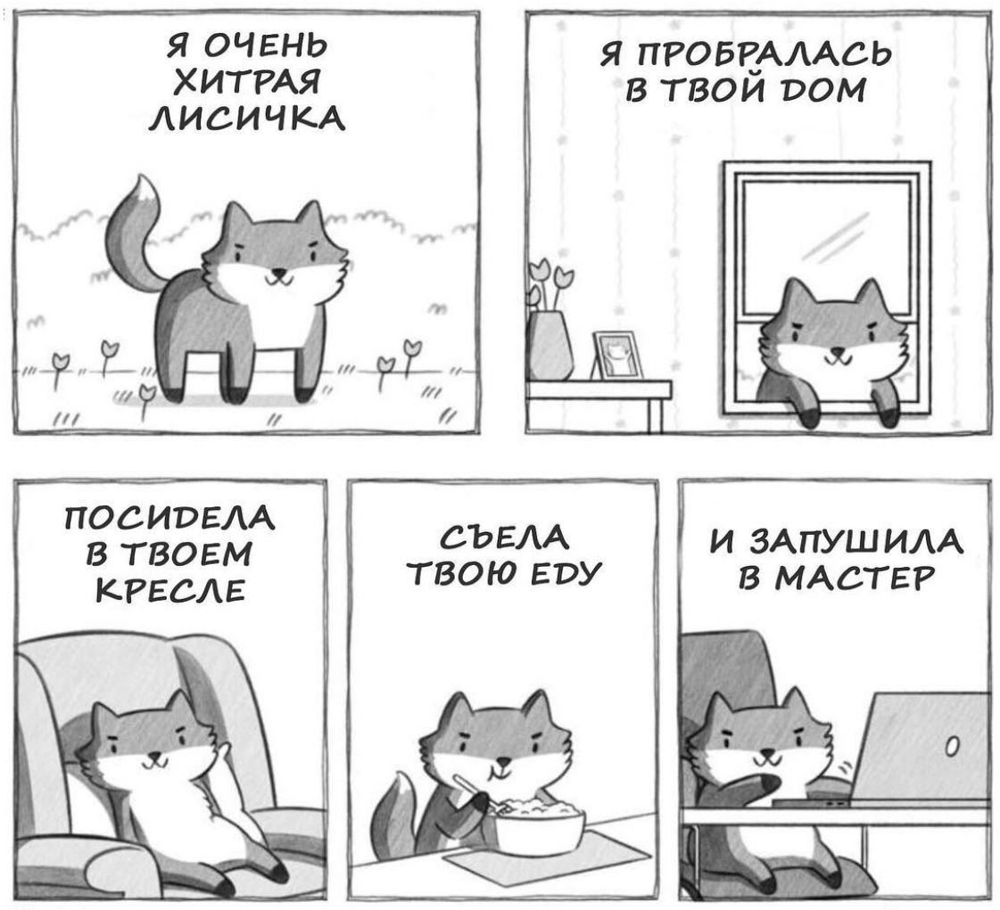

# Рассказ про милую лисичку

## Дополняем инструкцию разделом по работе с удалёнными репозиториями, pull request.
### Делаем копию репозитория
* Сделать это очень просто: на странице репозитория имеется кнопочка «Fork», которую и следует нажать.
* После чего, эту свою копию уже можно «стянуть» на свой компьютер по ссылке: https://github.com/AleksandrChikishev/gitHomeWork.git

### Делаем работу

* Итак, в этой точке мы уже можем править код и делать коммиты. Если вы сделали все предыдущие шаги, чтобы потом вернуть ваши изменения в оригинальный репозиторий, то я настоятельно советую делать всю работу в отдельной тематической ветви разработки. Полезность этого станет ясна на этапе посылки pull request'а. Пускай она будет называться feature.

### Возвращаем изменения: Pull request

* Итак, всё сделано. Вы написали код, он у вас в ветви feature как у вас на компьютере, так и на GitHub'е. Осталось только «заслать» его в оригинальный репозиторий.

* Идите на страницу вашей копии репозитория на GitHub, выбирайте ветвь feature и жмите кнопку Pull Request.

* Далее вы попадёте на предпросмотровую страницу, на которой сможете ввести название и описание ваших изменений (название потом попадёт в описание мёрдж-коммита и станет достоянием общественности, учтите это).

