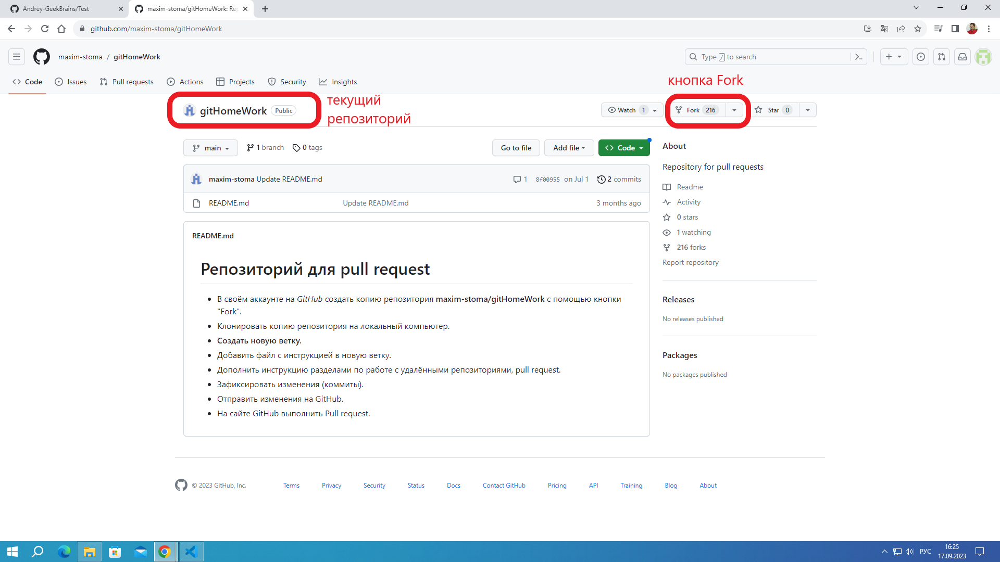
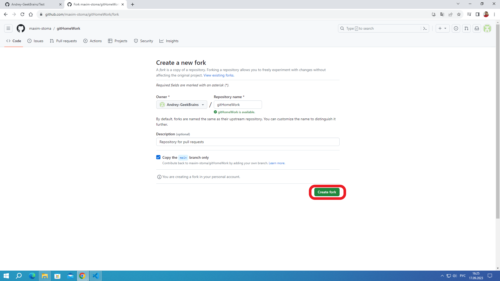
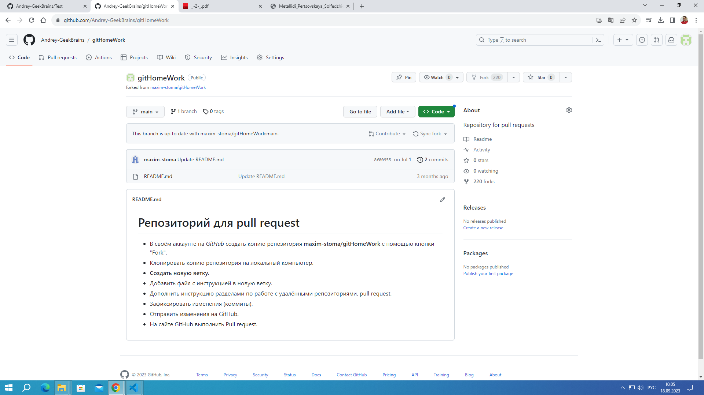
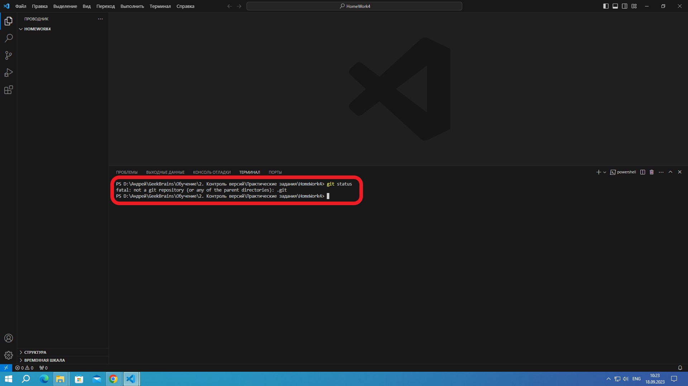
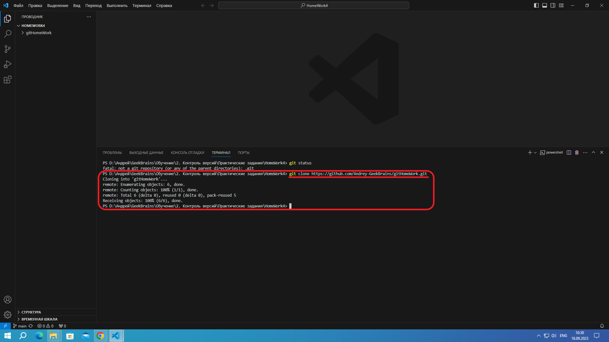
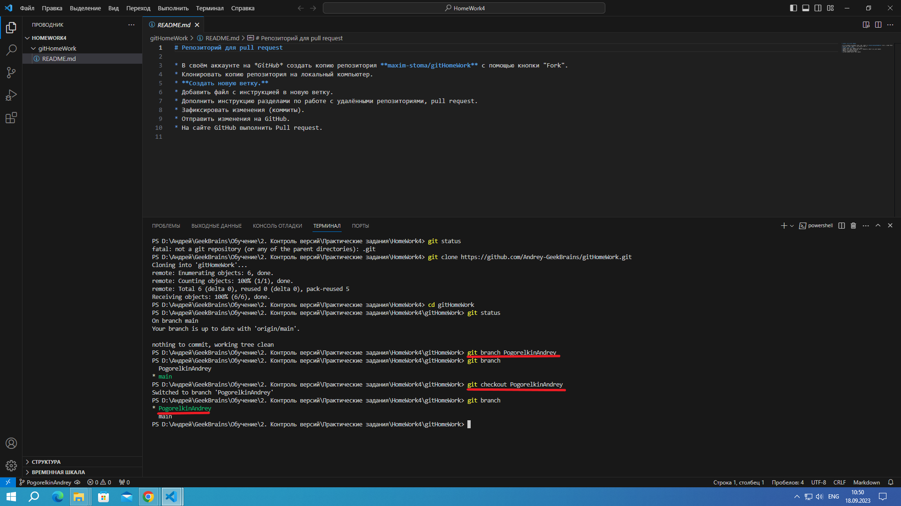

# Инструкция по работе с удаленными репозиториями

## Копирование удаленнго репозитория в локальную папку
1. Создаем копию удаленного репозитория (**fork**) в свой аккаунт на GitHUB\
для копирования заходим в интересующий на репоситорий и нажимаем кнопку **FORK""\

в появившемся окне нажимаем кнопку **CREATE FORK**\

в итоге получаем\

копируем ссылку на удаленный репоситорий и переходим в VisualStudioCode

2. Создание локальной копии удаленного репозитория (**clone**)
Создаем пустую папку на копьютере и открываем ее в VSCode\
Проверяем что в ней отсутствуют какие-либо репозитории коммандой **git status**\

Создаем копию удаленного репоситория в локальной папке\
**git clone <Сcылка cкопированная с GitHUB>**

Переходим в директорию со скопированным репозиторием
cd <имя директории>

## Создаем новую ветку и переходим в нее
 * **git branch** - просмотр существующих веток
 * **git branch <branch_name>** - создание ветки с именем *branch_name*
 * **git checkout <branch_name>** - переход в ветку с именем *branch_name*
