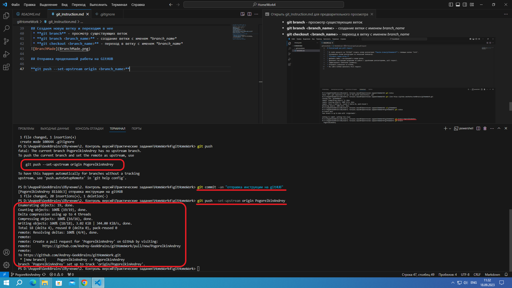
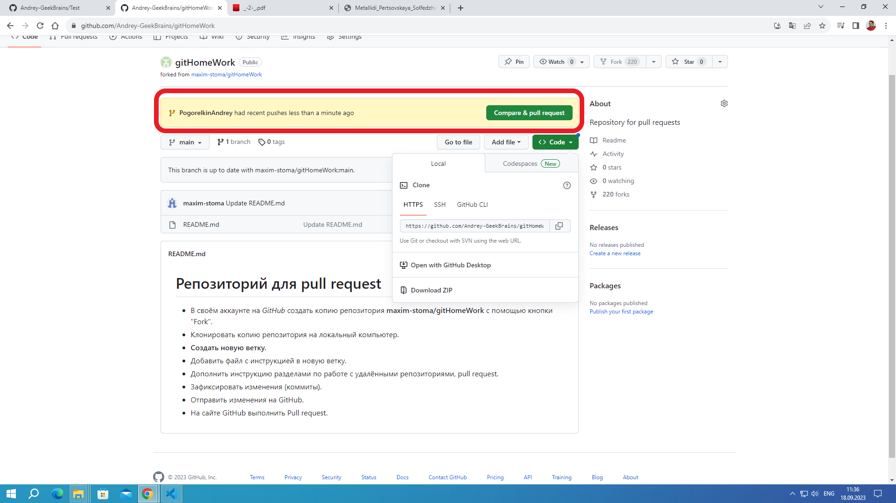

# Инструкция по работе с удаленными репозиториями

## Создание нового репозитория в командной строке

Созжание локального репозитория на копьютере\
**git init**   
Добавление фаила REAMME.md в репозиторий\
**git add README.md**  
Фиксируем первые изменения\
**git commit -m "первая фиксация"**\
Переименовываем ветку *master* в ветку *main*\
**git branch -M main**\
добывляем связку локального репозитория с удаленным репозиторием на github\
**git remote add origin https://github.com/Andrey-GeekBrains/Test.git**\
загружаем локальный репозиторий с удаленным\
**git push -u origin main**

## Копирование удаленнго репозитория в локальную папку
1. Создаем копию удаленного репозитория (**fork**) в свой аккаунт на GitHUB\
для копирования заходим в интересующий на репоситорий и нажимаем кнопку **FORK""\

в появившемся окне нажимаем кнопку **CREATE FORK**\

в итоге получаем\

копируем ссылку на удаленный репоситорий и переходим в VisualStudioCode

2. Создание локальной копии удаленного репозитория (**clone**)
Создаем пустую папку на копьютере и открываем ее в VSCode\
Проверяем что в ней отсутствуют какие-либо репозитории коммандой **git status**\

Создаем копию удаленного репоситория в локальной папке\
**git clone <Сcылка cкопированная с GitHUB>**

Переходим в директорию со скопированным репозиторием
cd <имя директории>

## Создаем новую ветку и переходим в нее
 * **git branch** - просмотр существующих веток
 * **git branch <branch_name>** - создание ветки с именем *branch_name*
 * **git checkout <branch_name>** - переход в ветку с именем *branch_name*

## Отправка проделанной работы на GitHUB

**git push --set-upstream origin <branch_name>**

Обновление информации на **gitHub**

