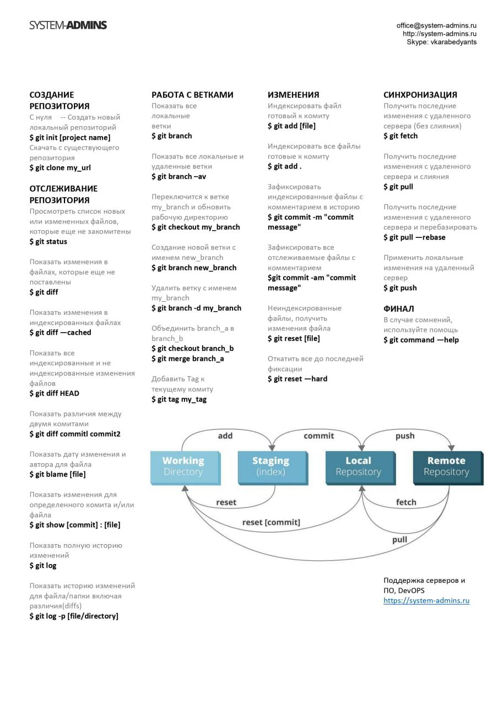
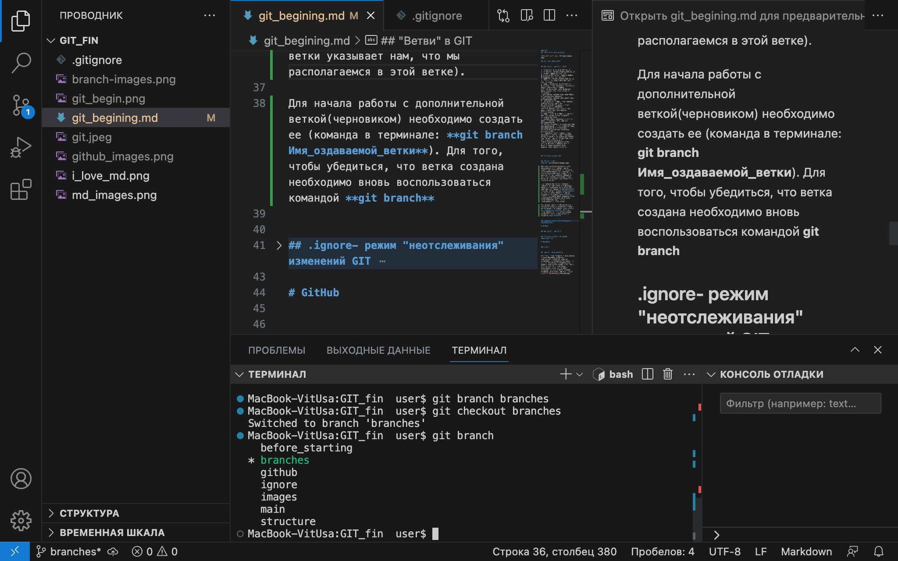
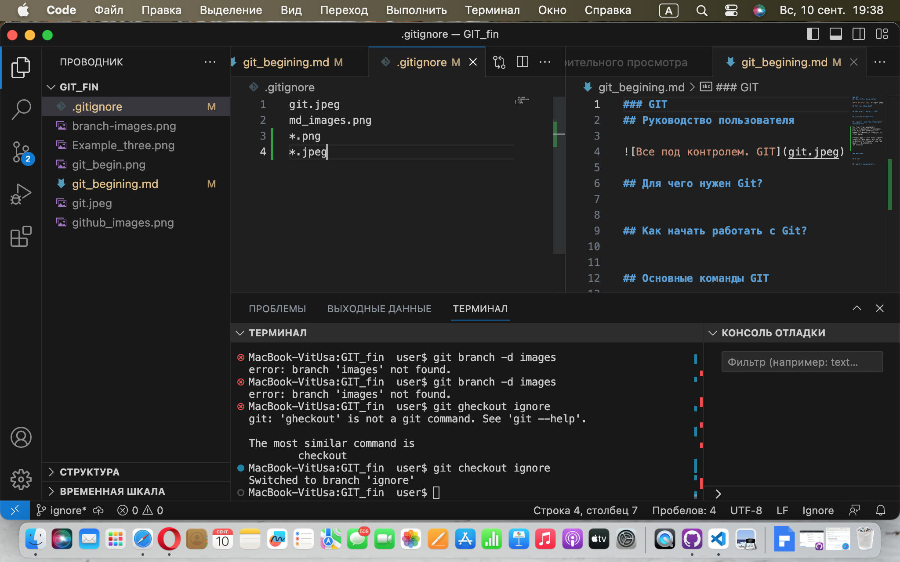
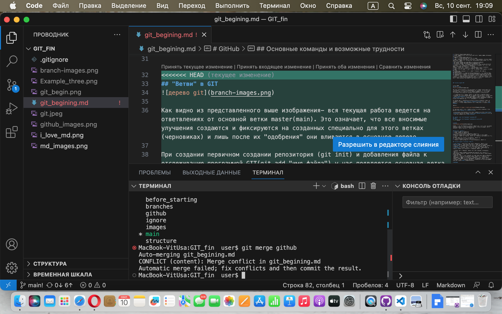
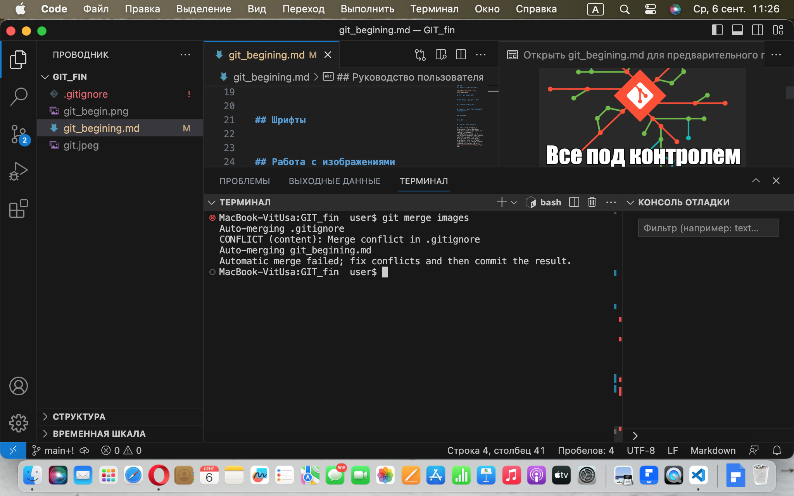

### GIT 
## Руководство пользователя

## Для чего нужен Git?

## Как начать работать с Git?

1. Установить программу GIT на ПК. 
2. Установить Visual_studio_code на ПК.
3. Создать папку для контроля программой GIT (если требуемой папки, подлежащей контролю еще нет).
4. Запустить Visual_studio_code на ПК.
5. Открыть терминал используя меню- вид- терминал.
6. Теперь необходимо представиться программе, чтобы изменения, вносимые в файлы, находящиеся в папке, контролируемой GIT, были подписаны Вашим именем. Для этого вводим в терминале:
* git config --global user.name «Ваше имя английскими буквами»
* git config --global user.email ваша почта@example.com
7. На начальном этапе, чтобы избегать дополнительной работы по периодическому сохранению, стоит воспользоваться функцией "автосохранение". Для этого в меню Файл- ставим галочку у пункта Автосохранение.
***Важно: следует знать и помнить, что git управляет только сохраненными версиями, а не теми, что находятся в процессе редактирования.
8. Теперь можно приступать к работе с GIT. Для начала вводим команду в терминале git init.
9. Создаем файл, изменения в котором будет отслеживать GIT, например git_begining.md.
10. Вводим команду в терминале git add git_begining.md  - т.е. добавляем файл git_begining.md к отслеживанию вносимых пользователем изменений программой GIT.
11. Озаглавим текст в файле. Любые изменения в тексте требуют фиксации. Вводим команду в терминале git commit -am "Начало работы". В кавычках может быть любой комментарий к осуществленной фиксации(коммиту), который поможет в будущем быстро понять- какие изменения были зафиксированы данным коммитом.

## Основные команды GIT

* **git status** - показывает, какие изменения были внесены с помощью команд git add и git commit

* **git init** - команда "включающая" функцию отслеживания программой GIT

* **git add имяфайла** - добавления файла к отслеживанию внесенных изменений или индексирование файла

* **git commit -m "Комментарий к коммиту"** - команда для записи индексированных изменений в репозиторий Git, а для улучшения восприятия коммита в будущем оставляем сообщение, что какие именно изменения записаны данным коммитом.

* **git commit -am "Коментарий к коммиту"** - составная команда, состоящая из двух: git add и git commit. Применима лишь к файлам, котрорые были уже раннее проиндексированы.

* **git diff** - используется для выявления разницы между любыми двумя Git деревьями. Это может быть разница между вашей рабочей директорией и индексом (собственно git diff), разница между индексом и последним коммитом (git diff --staged), или между любыми двумя коммитами (git diff main branchB)

* **git log** - вызов журнала коммитов

* **git log --graph** - вызов журнала коммитов с изображением ветвей

* **git log --all --graph** - вызов журнала **всех** коммитов с изображением ветвей

* **git log --all --graph --oneline** - вызов журнала всех коммитов с изображением ветвей и выводом номеров коммитов в одну строку

* **git checkout имя_ветки** - переход на другую ветку

* **git checkout номер_коммита** - переход к другому коммиту (т.е. вызов состояние файла, который существовал к моменту совершения коммита)

* **git branch** - перечень созданных ветвей репозитория

* **git branch имя_ветки** - создание новой ветки

* **git restore** - отказ от индексации внесенных изменений и возвращение к состоянию последнего совершенного коммита

* **git branch -d имя_ветки** - удаление ветки с одновременной проверкой на возможность такого удаления без потери информации

* **git branch -D имя_ветки** - безусловное удаление ветки

* **git clone ссылка** - копирование удаленного репозитория на локальный

* **git push** - выполняет отправку недавних коммитов c компьютера локального репозитория на сервер с удаленным репозиторием

* **git pull** - это способ выполнить комбинированную операцию git fetch и git merge с помощью одной команды. «Pull” означает, что пользователь пытается извлечь что-то из хранилища
* **git merge имя_ветки** - слияние веток: той из которой вводится команда с той которая указана в команде

* **git fetch** - pагружает коммиты, файлы и ссылки из удаленного репозитория в ваш локальный репозиторий. Команда позволяет увидеть прогресс в центральном репозитории, но при этом не вынуждает вас выполнять слияние изменений с вашим репозиторием

## "Ветви" в GIT

Как видно из представленного выше изображения- вся текущая работа ведется на ответвлениях от основной ветки master(main). Это означает, что все вносимые улучшения создаются и фиксируются на созданных специально для этого ветках(черновиках) и лишь после их "одобрения" они вливаются в основное дерево.

При создании первичном создании репозитория (git init) и добавления файла к отслеживанию программой GIT(git add "имя файла") у нас появляется основная ветка с именем **main(master)**. В этом легко убедиться набрав команду в терминале **git branch**, ответом терминала будет указание ветки * main(master) (звездочка у имени ветки указывает нам, что мы располагаемся в этой ветке). 

Для начала работы с дополнительной веткой(черновиком) необходимо создать ее (команда в терминале: **git branch Имя_оздаваемой_ветки**). Для того, чтобы убедиться, что ветка создана необходимо вновь воспользоваться командой **git branch**. 

Например,

.

Для дальнешей работы с вновь созданной веткой (черновиком) необходимо в нее перейти (**git checkout имя_созданной_ветки**).

 На изображении, представленном выше, видим создание новой ветки (**git branch branches**), переход на созданную ветку (**git checkout branches**) и вывод на экран всех созданных веток (**git branch**). 

Для того чтобы изменения в некоторых файлах не отслеживались программой GIT необходимо это указать в специально созданном для этого файле.

Создаем файл с расширением .ignore.
Добавляем туда файлы, которые нет необходимости отслеживать или типы файлов с определенными разрешениями. Например, im_gitignore.png или *.png (для всех файлов с расширением .png)

### Кофликт при слияниях

При слияние веток в локальном репозитории (команда **git merge** при локальной работе), а также при работе с удаленными репозиториями (**git pull**) могут возникать конфликты. 

Программа GIT предлагает три пути разрешения возникшего конфликта: оставить текущую версию, принять входящие изменения или оставить обе версии, т.е. текущую и входящие изменения.

## .ignore- режим "неотслеживания" изменений программой GIT 

# GitHub

GitHub - это по сути удаленное хранилище репозиториев, в котором при разрешении владельца репозитория и при желании пользователя возможно предлагать внести изменения в данные хранящиеся в репозитории.

## Как начать работать?
1. Создать аккаунт на GitHub.com
2. Создать локальный репозиторий
3. “Подружить” ваш локальный и удалённый репозитории. 
GitHub при создании нового репозитория подскажет, как это можно сделать
4. Отправить (push) ваш локальный репозиторий в удалённый (на GitHub), при этом, возможно, 
вам нужно будет авторизоваться на удалённом репозитории.
5. Провести изменения “с другого компьютера”.
6. "Выкачать" (pull) актуальное состояние из удалённого репозитория

## Основные команды и возможные трудности

* **fork**- действие по копированию информации с чужого удаленного репозитория на свой удаленный репозиторий. Данное действие - это первый шаг для планируемого создания **pull request**
* **git clone** - осуществляет копирование с удаленного репозитория на локальный. Например, *git clone вводим адрес, скопированный на github*
* **git pull** - команда, позволяющая скачать информацию из текущего репозитория и выполнить слияние с версией, с которой производится локальная работа.
* **git push** - команда, с помощью которой, информация, расположенная на локальном репозитории, отправляется в удаленный репозиторий, с которой локальный репозиторий авторизован.

При начале работы с удаленным репозиторием могут возникнуть определенные трудности.
* Так после создания аккаунта на github.com необходимо "авторизоваться" с использованием  локального репозитория. Это происходит при первом использовании команды git push.
* Следующая трудность может возникнуть при копировании информации из удаленного репозитория в локальный (команда git clone). Ввиду того что изначально мы располагаемся в папке, которая программой git не отслеживается, а при "клонировании" создается копия папки, которая располагалась на удаленном репозитории и которая отслеживается git, то необходимо перейти в отслеживаюмую программой git папку, используя команду **cd** (change directory).
* следует помнить, что если сразу скопировать ссылку в чужом репозитории GITHUB и выполнить команду **git clone** в терминале - это усложнит задачу по предложению внесенных изменений (pull request), из-за того что невозможно отправить внесенные изменения (**git push**) на чужой удаленный репозиторий без согласия администрат**ора этого репозитория.

# MarkDown

## Шрифты

## Работа с изображениями 

Для того, чтобы "добавить" изображение в языке MarkDown необходимо использовать следующую знаковую комбинацию: восклицательный знак[...] (....), где после восклицательного знака в квадратных кобках стоит текст, который говорит о содержании изображения, если оно не будет отображаться, а в круглых скобках: ИмяФайла.расширение. Например, 

