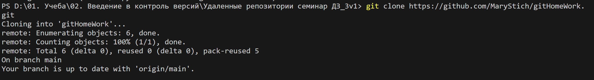

# Git. Краткий обзор возможностей.

## 1. Что такое Git
Git - это консольная утилита, для отслеживания и ведения истории изменения файлов, в вашем проекте. Чаще всего его используют для кода, но можно и для других файлов. Например, для картинок - полезно для дизайнеров. 

С помощью Git-a вы можете откатить свой проект до более старой версии, сравнивать, анализировать или сливать свои изменения в хранилище на локальном компьютере или в сети. Это хранилище называется репозиторий (*repository*). 

Каждая точка сохранения вашего проекта носит название коммит (*commit*). У каждого *commit* есть *hash* (уникальный id) и комментарий. Из таких *commit* собирается ветка. Ветка — это история изменений. У каждой ветки есть свое название. Репозиторий может содержать в себе несколько веток, которые создаются из других веток или вливаются в них.

## 2. Принцип работы
Если посмотреть на картинку, то становиться чуть проще с пониманием. Каждый кружок, это *commit*. Стрелочки показывают направление, из какого *commit* сделан следующий. Например, **C3** сделан из **С2** и т. д. Все эти *commit* находятся в ветке под названием *main*. Это основная ветка, чаще всего ее называют *master* . Прямоугольник *main** показывает в каком *commit* мы сейчас находимся, проще говоря указатель.


## 3. Установка
Чтобы установить Git на Windows, необходимо пройти по ссылке:

https://git-scm.com/download/win

Выбрать тип ОС: 32 или 64 битную, скачать и установить.

## 4. Настройка
Чтобы пользоваться Git необходимо его настроить. При создании *commit* указываться автор, поэтому, в первую очередь, необходимо авторизоваться. 

Открываем терминал (консоль) и вводим следующие команды:

Установка имени пользователя:

```
git config --global user.name "<ваше_имя>"
```
 
Установка email. Принцип тот же:
```
git config --global user.email "<адрес_почты@email.com>" 
```

## 5. Создание репозитория
Теперь вы готовы к работе с Git локально на компьютере. 

Создадим наш первый репозиторий. Для этого пройдите в папку вашего проекта (например в папке *С://MyProject*) с помощью терминала: 

```
cd <путь_к_вашему_проекту>
```
 
Инициализация/создание репозитория 
``````
git init
``````
 
Теперь Git отслеживает изменения файлов вашего проекта.

## 6. Основные команды

- **git add**

добавиление в проект файлов с определенным расширением. Можно добавить все файлы по одному, но лучше использовать _*.<имя_расширения>_, чтобы включить все файлы с этим расширением.

---
- **git clean**

очищает терминал от всех строк для удобства ввода новых команд.

---
- **git commit**

создать коммит.

---
- **git status**

посмотреть статус коммитов (их количество, внесенные изменения).

---
- **git branch**

название ветки – создать новую ветвь.

---
- **git checkout** <название ветки>

переключиться на другую ветвь.

---
- **git merge**

название ветки – объединить выбранную ветвь с той, к которой подключен пользователь. То есть сначала надо сделать checkout, а потом merge.


## 7. Конфликт при слиянии. Способы решения
Git прерывает работу во время слияния.
Сбой В ПРОЦЕССЕ слияния говорит о наличии конфликта между текущей локальной веткой и веткой, с которой выполняется слияние. Это свидетельствует о конфликте с другой веткой. Git сделает все возможное, чтобы объединить файлы, но оставит конфликтующие участки, чтобы вы разрешили их вручную.
В приведённом ниже скрине экрана можно увидеть два варианта одного и того же файла с инструкцией и предложение системы выбрать способ решения:
* Accept Current Change - принять текущую редакцию. На изображении она выделена зелёным цветом. Это редакция основной ветки.
* Accept Incoming Change - принять входящую редакцию. На изображении она выделена зелёным цветом. Это редакция сливаемой ветки.
* Accept Both Changes - принять обе редакции.
* Compare Changes - сравнить изменения.


## 8. Работа с удалёнными репозиториями
Когда мы создаём *commit* он хранится репозитории в конкретной папке на нашем PC, т.е. он лоальный. Однако для совместной работы над проектом, удобнее пользоваться сервисом для хранения репозитория в интернете.
Наиболее распространённым сервисом для предоставления хостинка Git, является GitHub. С его помощью, мы можем обеспечить доступ к результататам своей работы другим участникам проекта.

### 8.1. Рассмотрим некоторые команды

Например, нам надо подключиться к удалённому новому репозиторию, который мы создаём на GitHub и импортировать в него наш существующий локальный репозиторий. GitHub создаёт ссылку на удалённый репозиторий и мы в локальном, с помощью команды, указываем ссылку на удалённый репозиторий и связываем их вместе.

Порядок действий:
```
git remote add origin https://github.com/name/project.git
Эта команда связывает репозитории. В данном случае копирует локальный на удалённый.
```
```
git branch -M main
Команда переименовывает основную ветку в main
```
```
git push -u origin main
Отправка изменений из локального в удалённый репозиторий
```

В дальнейшем, для отправки изменений из локального репозитория в удалённый достаточно набрать команду `git push`.
___
Мы можем скопировать на PC существующий удалённый репозиторий и работать с ним локально. Ссылку на удалённый репозиторий мы копируем из GitHub



Далее, на локальном репозитории выполняем команду клонирования:

```
git clone https://github.com/name/project.git
```
после клонирования необходимо переместиться в клонированную папку из текущей с помощью команды `cd`, т.к. в текущей локальной папке нет репозитория.

---
Если мы внесли изменения в репозитории на GitHub и хотим, чтобы эти изменения появились в локальном репозитории (подтянуть изменения), то для этого в локальном репозитрии необходимо выполнить следующую команду:
```
git pull
```
Эта команда составная. Она помимо копирования изменений попытается слить ветки, поэтому нужно быть готовым к решению возникших конфликтов.

### 8.2. Работа со сторонним проектом
Для работы с чужим проектом мы в GitHub делаем *fork* (ответвление) данного проекта. Т.е. копируем его себе на страницу GitHub и далее, с помощью знакомой команды `git clone` можем клонировать его на локальный репозиторий для работы.

Важно понимать, что наша работа над чужим проектом должна выполняться не в основной ветке. Поэтому сразу после клонирования, мы создаём новую ветку (например с именем "branch_name) и уже в ней проводим все изменения в файлах.

Чтобы добавить изменения в файлах на fork-репозиторий, т.к. мы это делаем не из основной ветки, а из дополнительной, то первоначально набираем команду:
```
git push --set-upstream origin <branch_name>
```
После синхронизации, в удалённом репозитории появляется кнопка __"Compare & pull request"__.


Это означает "сравнить и запросить изменения". Т.е. мы предлагаем автору оригинального репозитория, fork которого мы сделали, принять наши изменения в проект. Сравнение на конфликты делает GitHub. Нам остаётся только добавить комментарий для автора и ждать его ответа.