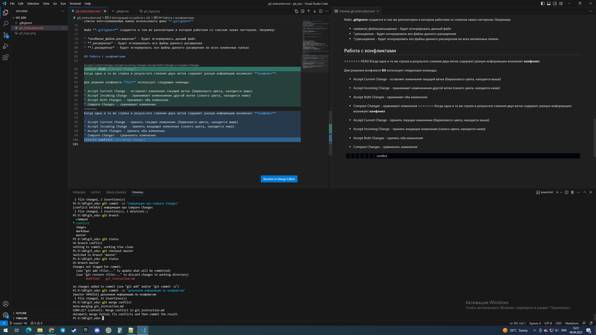

# Инструкция по работе с системой контроля версий Git

## Введение
Система контроля версий **Git** - это консольная утилита, необходимая для отслеживания и ведения истории изменения файлов в практически в любом проекте, будь то создание программного продукта, дизайнерский проект или написание книги. Git позволяет нескольким разработчикам одновременно работать над одним продуктом.

*Для создания данного руководства будем использовать язык разметки Markdown. Markdown — язык текстовой разметки, созданный писателем Джоном Грубером. Он предназначен для создания красиво оформленных текстов в обычных файлах формата TXT.*
[Подробнее о Markdown тут.](https://ru.wikipedia.org/wiki/Markdown)

## Основные команды

Взаимодействие с Git происходит с помощью определенных команд.

* Команда **git init** создает (инициализирует) локальный репозиторий.
* Команда **git status** позволяет получить информацию от git о его текущем состоянии.
* Чтобы добавить файл или файлы к следующему коммиту используется команда **git add <имя файла>**.
* После добавления файла с помощью команды git add, создается непосредственно коммит, т.е. фиксируются все изменения, произведенные с файлом. Для этого вводится команда **git commit -m "new massage"**. *"new massage"* - это коментарий, в котором отражен краткий смысл изменений.
* Команда **git log** выводит на экран истории всех коммитов с их хэш-кодами.
* Чтобы перемещаться между коммитами и при необходимости откатить файл до определенной версии, используется команда **git checkout**. Для этого вводится *git checkout "первые 4 цифры хэш-кода коммита"*.
* Команда **git checkout master** позволяет вернуться к актуальному состоянию и продолжить работу.
* Для того, чтобы увидеть разницу между текущим и закоммиченным файлами, вводится команда **git diff**.

## Работа с ветками

Ветвление необходимо для того, чтобы над одним проектом могли работать несколько человек.

+ Чтобы создать новую ветку используем команду **git branch branch_name**.
+ Команда **git branch** выводит список созданных веток. 
+ Переключаемся между ветками с помощью команды **git checkout branch_name**.
+ Удалить ветку можно двумя командами: **git branch -d branch_name** и **git branch -D branch_name**. Команда с использованием -d позволит Git выполнять удаление только тогда, когда у нас эта ветка полностью объединена с другой и удаление ничего не поломает. Удаление с использованием -D удалит ветку в любом случае.
+ Команда **git log --graph** позволяет видеть историю в виде дерева.
+ Для слияния веток используем команду **git merge branch_name**. Важно понимать, что эта команда добавит в *текущую* ветку информацию из ветки, имя которой указано в команде. При этом, если данные в одной и той же строке не совпадают, возникает кофликт.

Разрешить конфликт можно оставив текущие изменения, приняв входящие или и те, и другие.
 
 ## Работа с удаленными репозиториями

 Для работы с репозиторием, находящимся не в твоем компьютере, используем сервис GitHub (предварительно на нем зарегистрировавшись и связав со своим локальным Git).
 

* Для начала в своем аккаунте на GitHub с помощью кнопки **Fork** создаём копию чужого репозитория.
 * Затем копируем его на свой ПК, используя команду **git clone <url-адрес репозитория>**.