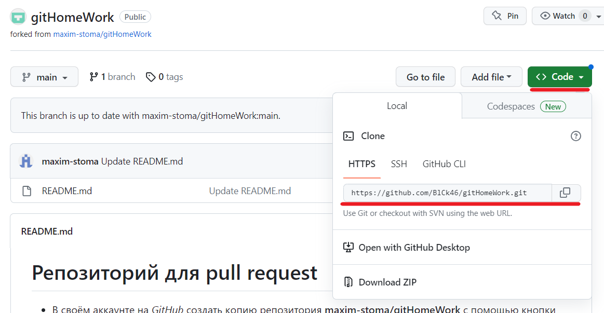

# **Инструкция по работе с системой контроля версий git.**

## Установка _git_

1. Загрузите **установщик** *git* с официального сайта: **https://git-scm.com/downloads**;
2. Запустите *установщик* и установите программу. Параметры оставьте по умолчанию, или настройте по своему усмотрение;
3. Завершите установку, ярлык программы должен появится на Вашем рабочем столе;
4. Проверьте работоспособность программы:   
    - Запустите программу, или терминал в *VSCode*;  
    - Введите команду *git --version*.     

    Если терминал выдал версию *git* без ошибок, значит установка прошла успешно.

## Начало работы

Для начала работы с **_git_**, вам необходимо "представиться" системе, то есть указать Ваше **имя** и **эл.почту**.

В терминале *VSCode* введите команды:
* _**git config --global user.name "Name"**_.  
Замените "Name" на ваше имя пользователя (без кавычек);
* _**git config --global user.email "email"**_  
Замените "email" на ваш адрес электронной почты (без кавычек).

Далее необходимо выполнить команду _**git init**_, чтобы инициализировать репозиторий.

## Несколько базовых команд

### **git version**

Данная команда предназначена для проверки версии установленной системой контроля версий.

### **git init**

Данная команда предназначена для инициализации репозитория.

### **git status**

Данная команда показывает статус (текущее состояние) *git*, есть ли изменения, зафиксированы ли эти изменения.

### **git add**

Данная команда предназначена для сохранения изменений в файле.

### **git commit**

Данная команда позволяет зафиксировать и закомментировать сохранения.

### **git log**

Данная команда показывает журнал изменений.

### **git checkout**

Данная команда позволяет переключаться между версиями (коммитами). А чтобы вернуться в актуальную версию, необходимо выполнить команду *git checkout **master***.

### **git diff**

Данная команда показывает разницу между текущим файлом и сохранённым.

## Синтаксис языка **Markdown**

### Выделение текста

* **Жирный текст** — __**__

* *Курсивный текст* - __*__
* ~~Зачеркнутый текст~~ — __~~__
* Заголовок первого уровня - __#__
* Заголовки последующих уровней - __##, ###, ####, ..__

### Списки
* Нумерованные Списки —  __1, 2, 3__ (обычные цифры)

* Ненумерованные Списки — __*__ в начале строки
* Вложенные Списки — _выполняем отступы_

### Цитаты

> Для обозначения цитат достаточно поставить знак __>__ в начале строки

### Ссылки

Чтобы оформить ссылкой часть текста, используется такой синтаксис:  
* _[GeekBrains] (https://gb.ru/)_ - без подсказки 
* _[GeekBrains] (https://gb.ru/ "GeekBrains")_ - с подсказкой

Выглядит так:

* [GeekBrains](https://gb.ru/)  
* [GeekBrains](https://gb.ru/ "GeekBrains")

### Картинки

Изображения оформляются также, как и ссылки, с одним отличием: в начале записи используется знак **!**

*![Изображение] (https://upload.wikimedia.org/wikipedia/commons/thumb/4/48/Markdown-mark.svg/1920px-Markdown-mark.svg.png "Логотип Markdown")*

Выглядит так:  

## Работа с удалёнными репозиториями

 Удаленные репозитории - это репозитории, которые находятся не на локальной, а на удаленной машине, например, на сервере.

 Существует сервис _**GitHub**_, который позволяет организовать работу удаленных репозиториев.

 _**GitHub**_ - не единственный, но самый популярный сервис _*git*_.

 

 ### Скачивание из текущего репозитория и слияние со своей версией

 * Копировать внешний репозиторий на свой ПК можно командой _**git clone**_.  
 Команда *git clone* составная: она не только загружает все изменения, но и пытается слить все ветки на локальном компьютере и в удаленном репозитории. 

 * _**git pull**_ - эта команда позволяет скачать все из текущего репозитория и автоматически сделать *merge* с нашей версией.

 * _**git push**_ - эта команда позволяет отправить свою версию репозитория во внешний репозиторий. При первом её использовании нужна авторизация

### Настройка совместной работы

1. Создать аккаунт на GitHub.com;

2. Создать локальный репозиторий;
3. Связать ваш локальный и удалённый репозитории. **GitHub** при создании нового репозитория подскажет, как это можно сделать;
4. Отправить (push) ваш локальный репозиторий в удалённый (на **GitHub**), при этом, возможно, вам нужно будет авторизоваться на удалённом репозитории;
5. Провести изменения “с другого компьютера”;
6. Выкачать (pull) актуальное состояние из удалённого репозитория;

### pull request 

Эта команда для предложения изменений/запрос на вливание изменений в репозиторий.  

В больших компаниях один ответственный за проект создает аккаунт. Другие пользователи дают
команду pull request. Предлагать изменения на GitHub нужно в отдельной ветке. Сначала пользователь копирует репозиторий на свой компьютер, делает fork репозитория, затем клонирует версию на своём ПК, создаёт ветку с предлагаемыми изменениями, отправляет изменения командой push в свой аккаунт на GitHub и даёт команду pull request. 

Как сделать *pull request*:  
1. Делаем **fork**(ответвление) репозитория;

2. Делаем *git clone* своей версии репозитория;
3. Создаем новую ветку и в нее вносим свои изменения;
4. Фиксируем изменения (делаем коммиты);
5. Отправляем свою версию в свой **GitHub**;
6. На сайте GitHub нажимаем кнопку **pull request**

