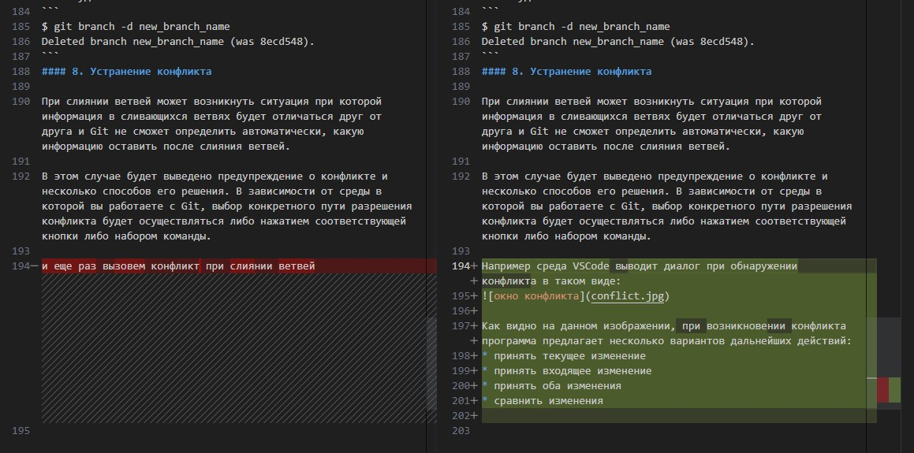

# Инструкция по работе с системой контроля версий Git 


## Общее описание
Git - это одна из систем контроля версий. На данный момен Git является наиболее популярной и востребованной из своего класса программ. Начало в разработке Git было положено, уже ставшим легендарной личностью Линусом Торвальдсом, который разработал эту систему для создания ядра ОС Linux.

Контроль версий в широком смысле это отслеживание изменений, вносимых в цифровой документ, будь то текстовой файл с курсовой работой или диссертацией или програмным кодом. Чаще всего данный класс программ, конечно используется при разработке програмного обеспечения, особенно когда это разработка осуществляется группой программистов.

Программа контроля версий отслеживает все вносимые изменения в цифровой код и позволят разработчику вернуться назад при обнаружении ошибки к исходному состоянию кода в опеределенную ключевую точку, исключая таким образом возможность обрушения работы всего проекта.

Кроме того, контроль версий позволяет решать такую задачу, как паралельная работа над большим проектом одновременно нескольким разработчикам в разных ветках, с последующим внедрением написанного ими кода в основной программный код.

Использование какой-либо системы управления версиями, в современных реалиях, является обязательной частью работы команды разработчиков программного обеспечения.

## Установка Git

Загрузите и установите Git с официального сайта (https://git-scm.com/downloads) в зависимости от вашей операционной системы.

## Настройка Git

Откройте терминал или командную строку и задайте свое имя и адрес электронной почты с помощью следующих команд:
```
git config --global user.name "Your Name"
git config --global user.email "youremail@example.com"
```

## Создание репозитория Git:

Перейдите в каталог вашего проекта и инициализируйте новый репозиторий Git с помощью команды:
```
git init
```

### Основные команды

#### 1. Определение состояния

Команда *__status__* выводит информацию об актуальном состоянии репозитория: в какой ветке в данный момент идет работа над проектом, есть ли незафиксированные ("незакоммитченные") данные с обозначением имени измененного файла и другое:
```
$ git status
On branch master
Changes not staged for commit:
  (use "git add <file>..." to update what will be committed)
  (use "git restore <file>..." to discard changes in working directory)
        modified:   git_instruction.md

no changes added to commit (use "git add" and/or "git commit -a")
```
#### 2. Подготовка файлов

Команда *__add__* говорит программе Git, изменения в каком файле или файлах мы хотим закоммитить. Для этого после команды *__add__*, необходимо указать имя файла или если следует подготовить все файлы в репозитории добавить модификатор *__-a__*

```
$ git add git_instruction.md
```
Для ускорения ввода имени файла в Git существует функция автозаполнения, которая вызывается клавишей *__Tab__* после того как вы набрали несколько букв с которых начинается имя файла в репозитории. Соответственно если в репозитории находится несколько файлов, которые начинаются с одинаковой комбинации букв, перед нажатаем *__Tab__* необходимо набрать комбинацию букв, которая однозначно определит какой файл из репозитория вы имеете в виду.
```
$ git add -a
```

#### 3. Фиксация изменений

Фиксация изменений файла или добавление коммита происходит с помощью команды *__commit -m "new message"__*, в кавычках, которые следуют за командой *__commit__* с модификатором *__-m__*, необходимо написать коментарий к создаваемому коммиту (например кратко описать внесенные в файл изменения), для последующей навигации по дереву коммитов. 

```
$ git commit -m "добавлены пункты оперделение состояния и подготовка файлов"
[master 597bd0b] добавлены пункты оперделение состояния и подготовка файлов
 1 file changed, 48 insertions(+), 11 deletions(-)
 ```
 Существуют также команды объединяющие *__add -a__* и *__commit -m__* в одну строку:
 ```
$ git commit -a -m "new message"
 ```
 ```
 $ git commit -am "new message"
 ```
#### 4. Просмотр списка коммитов
 Для просмотра всех созданных коммитов существует команда *__log__*. При этом на экран выводится список коммитов с коментариями к ним и указанием хэша.
 ```
 $ git log
commit 26c79041e40e0050852cde8529f6e9327f148c1e (HEAD -> master)
Author: KirillKZ <kuzmin.kir@gmail.com>
Date:   Tue Aug 8 21:17:13 2023 +0300

    добавлен пункт фиксация изменений

commit 597bd0b7fc93617dc4a86e621448848847080d1a
Author: KirillKZ <kuzmin.kir@gmail.com>
Date:   Tue Aug 8 21:03:53 2023 +0300

    добавлены пункты оперделение состояния и подготовка файлов
```
Для выхода из списка или дерева коммитов необходимо нажать клавишу *__Q__*

#### 5. Просмотр определенного коммита

Для просмотра определенного коммита существует команда *__checkout__*, после которой нужно указать первые 4 знака из хэша требуемого коммита.
```
$ git checkout 597b
Note: switching to '597b'.

You are in 'detached HEAD' state. You can look around, make experimental
changes and commit them, and you can discard any commits you make in this
state without impacting any branches by switching back to a branch.

If you want to create a new branch to retain commits you create, you may
do so (now or later) by using -c with the switch command. Example:

  git switch -c <new-branch-name>

Or undo this operation with:

  git switch -

Turn off this advice by setting config variable advice.detachedHead to false

HEAD is now at 597bd0b добавлены пункты оперделение состояния и подготовка файлов
```

Для возврата к последнему сохраненному состоянию вашего файла наберите команду *__checkout master__*
```
$ git checkout master
Previous HEAD position was 597bd0b добавлены пункты оперделение состояния и подготовка файлов
Switched to branch 'master'
```
#### 6. Просмотр разницы между последним сохраненным состоянием файла и последним коммитом.

Если вам необходимо просмотреть изменения внесенные и сохраненные (Git работает только с сохранеными изменениями файла!) в ваш файл после добавления последнего коммита, то воспользуйтесь командой *__diff__*. Изменения будут выедены в следующей форме:
```
$ git diff
diff --git a/git_instruction.md b/git_instruction.md
index 81bd197..db66627 100644
--- a/git_instruction.md
+++ b/git_instruction.md
@@ -94,11 +94,39 @@ Date:   Tue Aug 8 21:03:53 2023 +0300
 5. Просмотр определенного коммита

 Для просмотра определенного коммита существует команда *__checkout__*, после которой нужно указать первые 4 знака из хэша требуемого коммита.
+```
+$ git checkout 597b
+Note: switching to '597b'.
+
+You are in 'detached HEAD' state. You can look around, make experimental
+changes and commit them, and you can discard any commits you make in this
+state without impacting any branches by switching back to a branch.
+
+If you want to create a new branch to retain commits you create, you may
+do so (now or later) by using -c with the switch command. Example:
+
+  git switch -c <new-branch-name>
```
Где плюсами будет указана информация добавленная к файлу, а минусами удаленная из файла по сравнению с последним коммитом.


#### 7. Ветвление

При внесение каких либо изменений в уже существующий и функционирующий продукт, удобно создать отдельную ветвь на основе основного проекта со своей собственной историей коммитов. 

* Для создания новой ветви используется команда *__branch__*, после которой указывается имя создаваемой ветви
```
$ git branch new_branch_name
```
* Для перехода на какую-либо ветвь используйти команду *__checkout__*, после которой укажите имя необходимой ветви.
```
$ git checkout new_branch_name 
Switched to branch 'new_branch_name'
```
* Для возврата в основную ветвь, после команды *__checkout__*, набрите *__master__*
```
$ git checkout new_branch_name 
Switched to branch 'new_branch_name'
```
* После завершения и проверки вновь написанного блока, его можно добавить в основную ветвь проекта. Происходит это с помощью команды *__merge__*, после которой указывается имя ветви для слияния.
При вызове этой команды вы должны находится в той ветви, **в которую**  вливается указанная в команде *__merge__* ветвь.
```
$ git merge new_branch_name 
Updating 1f3da92..8ecd548
Fast-forward
 git_instruction.md | 25 +++++++++++++++++++++++++
 1 file changed, 25 insertions(+)
 ```
* После того как информация из ветви будет перенесена в другой ветвью, ненужную ветвь можно удалить с помощью команды *__branch__* с добавлением модификатора *__-d__* и указанием имени удаляемой ветви.
```
$ git branch -d new_branch_name 
Deleted branch new_branch_name (was 8ecd548).
```
#### 8. Устранение конфликта

При слиянии ветвей может возникнуть ситуация при которой информация в сливающихся ветвях будет отличаться друг от друга и Git не сможет определить автоматически, какую информацию оставить после слияния ветвей.

В этом случае будет выведено предупреждение о конфликте и несколько способов его решения. В зависимости от среды в которой вы работаете с Git, выбор конкретного пути разрешения конфликта будет осуществляться либо нажатием соответствующей кнопки либо набором команды.

Например среда VSCode выводит диалог при обнаружении конфликта в таком виде:


Таким образом VSCode отображает содержание конфликтующих строк. В зеленом поле отображается информация в текущей ветви, а в синем поле информация из ветви, которая сливается с текущей ветвью.

Как видно на данном изображении, при возникновении конфликта программа предлагает несколько вариантов дальнейших действий:
* принять текущее изменение
* принять входящее изменение
* принять оба изменения
* сравнить изменения

Первые 3 пункта не нуждаются в объяснении и говорят сами за себя.
4 пункт выводит более подробную информация о сливающихся ветвях.



## Работа с удаленным репозиторием

Сохранение своего проекта на удаленном сервере позволяет не только иметь постоянный доступ к своему проекту с разных устройств и локаций, но так же позволяет команде разработчиков работать над одним проектом удаленно.

Самым крупным Git репозитарем в мире на данный момент являтся GitHub. Для того чтобы загрузить свой проект на GitHub необходимо зарегестрироваться на сайте GitHub и в своем аккаунте создать репозиторий. Ниже дается подробное описание того процесса.

### Создание аккаунта:

1. Откройте веб-сайт GitHub по адресу https://github.com/.
2. Нажмите на кнопку "Зарегистрироваться" в правом верхнем углу страницы.
3. Введите свое имя пользователя, адрес электронной почты и пароль.
4. Нажмите кнопку "Зарегистрироваться".
5. Подтвердите свой адрес электронной почты, следуя инструкциям, отправленным на вашу почту.

### Создание репозитория:

1. После успешного входа в аккаунт, нажмите на кнопку "Создать репозиторий" на главной странице.
2. Введите имя репозитория и опциональное описание.
3. Выберите публичный или приватный репозиторий.
4. Нажмите кнопку "Создать репозиторий".

### Подключение к удаленному репозиторию:

После успешного создания аккаунта и репозитория мы можем загрузить в него свой проект.
Но сначала нужно к репозиторию подключиться. Чтобы связать наш локальный репозиторий с репозиторием на GitHub, необходимо выполнить несколько команд, которые можно скопировать с сайта GitHub при создании репозитория:
```
git remote add origin [ссылка на свой репозиторий на GitHub]
git branch -M main
git push -u origin main
```
При первом подключении к репозторию, потребуется прохождение авторизации с введением логина и пароля на GitHub. 

### Отправка изменений на сервер

После того как мы поработаем в локальном репозитории, внесем ряд изменений в файлы, нам будет необходимо обновить данные в удаленном репозитории.
Делается это с помощью команды:
```
git push
```
### Запрос изменений с сервера

После внесения изменений в проект, хранящийся на сервере вам может понадобится актуализировать файлы проекта на другом компьютере или возможно внесенные вами изменения могут понадобится другим участникам вашей команды при работе над общим проектом.
Для этого существует команда:
```
git pull
```
## Внесение своего вклада в проекты на GitHub

### Создание ответвлений (fork)
Если вам понадобится внести свой посильный вклад в уже существующие проекты, для начала создайте своё собственное ответвление (fork) проекта. При этом GitHub создаст вашу собственную копию проекта, данная копия будет находиться в вашем репозитории и вы сможете легко изенять эту копию путём отправки изменений через команду push.


### Клонирование репозитория:

После создания ответвления в своем репозитории, вам нужно создать копию проекта в своем локальном репозитории. Ниже описана последовательность действий для этого:

1. Найдите ссылку клонирования репозитория на его странице.
2. В открытой командной строке вашего компьютера выполните команду "git clone [ссылка репозитория]", заменив "[ссылка репозитория]" на актуальную ссылку.
3. Перейдите в локальную папку репозитория с помощью команды "cd [имя папки]".
4. Создайте собственную ветвь и перейдите в нее с помощью команды:
```
git checkout -b [имя ветви]
```
После этого вы можете создавать сколько понадобится вам коммитов.

### Отправка изменений на удаленный репозиторий:

Когда ваше дополнение к стороннему проекту будет готово, вам потребуется для начала сохранить эти изменения на удаленном репозитории в GitHub. Для этого используйте команду:

```
git push --set-upstream origin [ветка]
```
где [ветка] - это имя вашей ветки.

Ваши изменения сохраняться в репозитории GitHub после чего в соответствующем репозитории на вашем аккаунте в GitHub появится кнопка, нажав на которую вы сможете отправить ваше дополнение/изменение разработчику основного проекта для оценки и решения о принятии или непринятии ваших изменний. 


