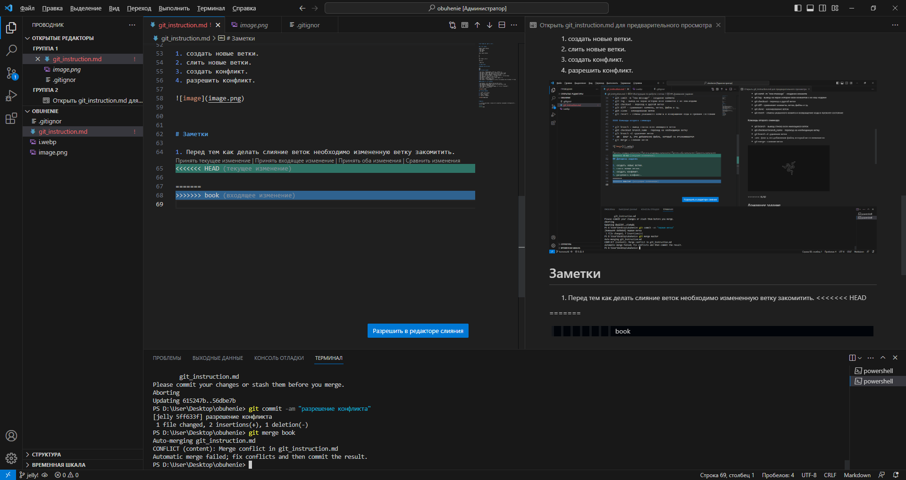
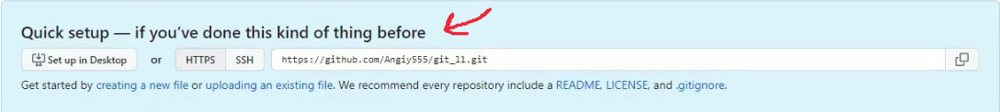
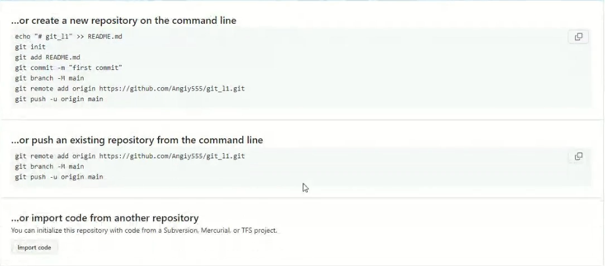

# Инструкция по работе с гитом

## Первый раздел

Ненумерованные списки
* Git init
* Git status
* Git add

Нумерованные списки

1.
2.
3.

Как сделать курсив

*Курсив*

Полужирный 

**Полужирный**

***полужирный курсив***

### Основные команды

* git init - инициализация локального репозитория
* git status - дает информацию о текущем состоянии от git
* git add - добавить файл или файлы к следующему коммиту *(добавляет файлу версионность в локальном репозитории)*
* git comit -m "new message" - создание коммита (фиксация изменения в репозитории)
* git log - вывод на экран истории всех коммитов с их хеш-кодами
* git checkout - переход к дургой ветке *(команда позволяет перемещаться между сохранениями)*
* git diff - сравнивает коммиты, ветки, файлы и тд. *(команда позволяет увидеть разницу между текущей и зафиксированной версией файла)* **(diff - разница)**
* git clone - локальная копия удаленного репозитория.
* git revert - отмена указанного комита и воя бы звращение кода в прежнее состояние

#### Команды второго семинара 

* git branch - вывод списка всех имеющихся веток
* git checkout branch_name - переход на необходимую ветку
* git branch -d -удаление ветки
* -am - флаг а, это добавление файла, который не отслеживается
* git merge - слияние веток
* git merge lists - в текущую ветку добавит информацию из ветки lists

## Домашнее задание

1. создать новые ветки.
2. слить новые ветки.
3. создать конфликт.
4. разрешить конфликт.

# Заметки

1. Перед тем как делать слияние веток необходимо измененную ветку закомитить.
2. Чтобы создать конфликт необходимо внести в одну из веток изменение, закомитить его и слить необходимые ветки. 
3. Копию чужого репозитория называют - fork

git add — добавляет любой файл, который у тебя есть в репозитории, неотслеживаемый он или модифицированный
git commit -a -m "message" (флаг -а) — добавляет только те файлы, которые уже отслеживаются git'ом
Пока файл untracked (ярлык состояния U) — только git add

*второй конфликт.

Знакомство с языками программирования (лекции)

Урок 2. Знакомство с функциями и массивами

# Семинар 3
Работа с удаленными репозиториями в Git - GitHub

* git pull - помогает стянуть/выкачать все изменения из удаленного репозитория на свой компьютер
* git push - отправляет изменения в удаленный репозиторий

Особенности команды push:

1 - git должен знать адрес удаленного репозитория;

2 - git должен быть "авторизован" на внесение изменений в удаленном репозитории

* fork - копия чужого репозитория

# Инструкция по работе с удаленным репозиторием
Заметка:

При создании репозитория всегда нужно обращать внимание на то, что сделали до того, как создать удаленный репозиторий. Возможно ты уже что-то сделал в локальном репозитории, а возможно ты еще ничего не сделал и сделал сразу удаленный репозиторий.
Теперь смотрим на надпись Quick setup - if you've done this kind of thing before

*Тут нам дается ссылка на тот самый адрес удаленного репозитория, на который будет ссылаться твой проект.*

При привязке локального репозитория к удаленному, есть 3 варианта:

 * **Полный вариант - *or create a new repository on the command line (или создай новый репозиторий в командной строке)***

 Здесь ты можешь просто скопировать, вставить в свой терминал в VSCODE и все будет работать.

 **НО ПЕРЕД ТЕМ КАК ВСТАВИТЬ, ДАВАЙ РАЗБЕРЕМ ЭТОТ ВАРИАНТ ПО СТРОЧКАМ**

1 строчка - Создание файла README.md

2 строчка - инициируем репозиторий

3 строчка - Добавляем файл README.md в репозиторий на отслеживание

4 строчка - совершаем первый комит

5 строчка - переименовываем ветку master на main

6 строчка - тут прописана ссылка где мы связываем удаленный репозиторий с локальным

7 строчка - команда git push с флагом -u позволяет толкнуть изменения с нашего локального репозитория в главную ветку удаленного репозитория origin который мы прописали в 6 строчке

* **Второй вариант - or push an existing repository from the command line (или запусти существующий репозиторий из командной строки)**

* **Третий вариант -  or import code from another repository (или импортируй код из другого репозитория)**
