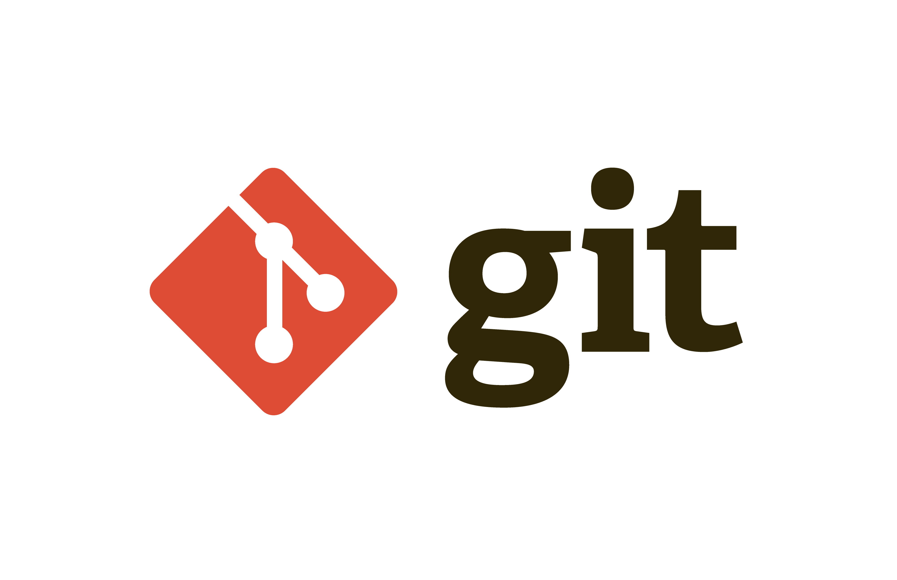

# _*Инструкция по Git*_

## Инструкция по подготовке системы контроля версий Git

### Установка Git

#### Шаг 1:
Перейдите на [официальный сайт Git](https://git-scm.com/downloads) и скачайте установочный файл актуальной  версии программы

#### Шаг 2:

Запустите файл установщик Git, оставьте параметры установки по умолчанию.

#### Шаг 3:

После завершения установки, откройте командную строку Windows (нажмите Win + R, введите "cmd" и нажмите Enter) или используйте Git Bash, или терминал непосредственно в VSCode.

Введите команду **`git --version`**, и если вы видите версию Git без ошибок, значит, установка прошла успешно.

### Настройка программы

Для начала работы с Git необходимо “представиться” системе контроля версий, то есть объявить Ваше имя и Вашу электронную почту. Это поможет идентифицировать автора коммитов в репозиториях при дальнейшей работе.
#### 1. Ввод имени пользователя:

Откройте Git Bash или терминал в VSCode, и выполните следующую команду, чтобы указать свое имя пользователя:

```
git config --global user.name "Your Name"
```

Замените "Your Name" на ваше реальное имя пользователя (без кавычек). Эта информация будет использоваться в коммитах для указания автора изменений.

#### 2. Ввод адреса электронной почты:

Выполните следующую команду, чтобы указать свой адрес электронной почты:

```
git config --global user.email "your.email@example.com"
```

Замените "your.email@example.com" на ваш действительный адрес электронной почты (без кавычек). Адрес электронной почты будет использоваться в коммитах для связи с автором изменений.

#### 3. Проверка настроек:

Вы можете выполнить команду

```
git config --list
```

чтобы проверить ваши текущие настройки Git. Убедитесь, что ваше имя и адрес электронной почты правильно отображаются в списке (в самом конце выведенной на экран информации в терминале).

Также, чтобы проверить имя пользователя Git, выполните следующую команду в командной строке (или Git Bash):

```
git config user.name
```

Эта команда выведет имя пользователя Git, которое было настроено в вашей системе. Если вывод пустой, это означает, что имя пользователя не было установлено.

Если вы хотите проверить глобальное имя пользователя (которое будет использоваться по умолчанию для всех репозиториев), добавьте флаг **`--global`**:

```
git config --global user.name
```

Если имя пользователя уже настроено, оно будет отображено в выводе команды.

Чтобы проверить адрес электронной почты пользователя Git, выполните следующую команду в командной строке (или Git Bash):

```
git config user.email
```

Эта команда выведет адрес электронной почты, который был настроен для пользователя Git в вашей системе. Если вывод пустой, это означает, что адрес электронной почты не был установлен.

Если вы хотите проверить глобальный адрес электронной почты (который будет использоваться по умолчанию для всех репозиториев), добавьте флаг **`--global`**:

```
git config --global user.email
```

Если адрес электронной почты уже настроен, он будет отображен в выводе команды.

### Удаление Git

Иногда по неизвестной причине Git устанавливается некорректно (теряются какие-либо .dll библиотеки, не настраивается путь или происходят иные сбои). На начальном этапе эти проблемы проще решить переустановкой Git.

#### Шаг 1: Откройте "Панель управления"

Нажмите правой кнопкой мыши на кнопку "Пуск" в левом нижнем углу рабочего стола и выберите "Панель управления" из контекстного меню.

#### Шаг 2: Выберите "Программы" или "Программы и компоненты"

В "Панели управления" найдите раздел "Программы" или "Программы и компоненты" и щелкните по нему.

#### Шаг 3: Найдите Git в списке установленных программ

В разделе "Программы" или "Программы и компоненты" найдите Git в списке установленных программ. Обычно он будет называться "Git" или "Git for Windows".

#### Шаг 4: Выберите опцию удаления

Щелкните правой кнопкой мыши на записи Git в списке программ и выберите "Удалить" или "Изменить/Удалить". Может появиться окно с запросом подтверждения.

При необходимости подтвердите удаление Git, следуя инструкциям в диалоговом окне удаления. Обратите внимание, что удаление Git также удалит все локальные репозитории, так что убедитесь, что у вас есть резервные копии важных данных.

#### Шаг 5: Дополнительные шаги (при необходимости)

В некоторых случаях может потребоваться выполнить дополнительные шаги, чтобы полностью удалить Git. Например, вы можете удалить остатки Git-каталогов вручную или очистить переменные среды, связанные с Git.

Обратите внимание, что процесс удаления может отличаться в зависимости от версии Git и конфигурации вашей операционной системы.


## Начало работы в Git

### Создание репозитория

Для начала создайте папку где будет храниться ваш проект.

Теперь создадим наш первый _**репозиторий**_. Для этого пройдите в папку вашего проекта.
```
#Для Linux и MacOS путь может выглядеть так /Users/UserName/Desktop/MyProject
#Для Windows например С://MyProject
cd <путь_к_вашему_проекту>
```

**`git init`** - это команда для инициализации/создания репозитория

Теперь Git отслеживает изменения файлов вашего проекта. Но, так как вы только создали репозиторий в нем нет вашего кода. Для этого необходимо создать **`commit`**`.
```
#Добавим все файлы проекта в наш будующий commit
git add .
#Или так
git add --all

#Если хотим добавить конкретный файл то можно так
git add <имя_файла> 

#Теперь создаем commit. Обязательно указываем комментарий.
#И не забываем про кавычки
git commit -m "<комментарий>"
```

Отлично. Вы создали свой первый репозиторий и заполнили его первым commit.

### Основные команды, кторые помугут вам в работе с Git:

**`git status`** - Для того чтобы посмотреть текущее состояние, например, какие файлы добавлены или не добавлены для создания commit, можно выполнить данную команду.


**`git add`** и **`git commit`** - выполняйте данные команды после каждого внесения изменений в ваш проект чтобы была возможность вернуться к предыдущей версии.

Создавайте **`comit`**, когда:

* Создан новый функционал
* Добавлен новый блок на верстке
* Исправлены ошибки по коду
* Вы завершили работу и ушли на перерыв

Так вы будете видеть историю изменений по каждому нововведению в вашем проекте.


### Основные команды по работе с ветками:

Ветки в Git, как и коммиты, невероятно легковесны. Это просто ссылки на определённый коммит. Удобнее и проще разбивать свою работу на много маленьких веток, чем хранить все изменения в одной огромной ветке.

**`git branch`** Команда вывода списка имеющихся веток

**`git branch "branch_name"`** Команда для создания ветки. Вместо "branch_name" введите имя новой ветки без кавычек.

**`git checkout branch_name`** Команда перехода в указанную ветку. Перед переходом в другую ветку, не забудьте закомитить изменения!

**`git checkout -b [yourbranchname]`** можешь создать новую ветку и переключиться на неё с помощью одной команды

**`git log --graph`**  Команда вывода всех Коммитов во всем веткам

**`git merge "branch_name"`** Команда слияния двух веток. Oчень удобно создать ветку, сделать свою часть работы в ней и потом объединить изменения из своей ветки с общими.

**`git branch -d "branch_name"`** Команда удаления ненужной ветки (Аккуратное удаление). Если что-то не сохранено и может быть потеряно в удаляемой ветки, то Git выдаст ошибку.

**`git branch -D "branch_name"`** Команда принудительного удаления несмотря на возможные потери информации.

# Работа с изображениями в Git

Говорят, одна картинка стóит тысячи слов. Давайте научимся добавлять различные изображения


Для добавления изображения в проект необходимо использовать следующую конструкцию:


В квадратных скобках вы можете указать имя файла картинки или коментарий к изображению для удобства использования другими пользователями.

Также можно вставить картинку с удалённого репозитория, например на GitHub. Для этого используем следующую конструкцию:


{username} — ваш ник на ГитХабе;
{repository} — репозиторий, где хранятся картинки;
{ветвь} — ветка репозитория;
{path} — путь к месту нахождения картинки.

# Работа с конфликтом слияния веток


Конфликты регулярно возникают при слиянии ветвей или при отправке чужого кода. Иногда конфликты исправляются автоматически, но обычно с этим приходится разбираться вручную — решать, какой код остается, а какой нужно удалить.

При слиянии получаем сообщение об ошибке:

CONFLICT (content): Merge conflict in git_instruction.md
Automatic merge failed; fix conflicts and then commit the result.

You have unmerged paths.
  (fix conflicts and run "git commit")
  (use "git merge --abort" to abort the merge)

Unmerged paths:
  (use "git add <file>..." to mark resolution)
        both modified:   git_instruction.md

Система не смогла разрешить конфликт автоматически, значит, это придется сделать разработчикам. Приложение отметило строки, содержащие конфликт.

Над разделителем ======= мы видим последний (HEAD) коммит, а под ним - конфликтующий. Таким образом, мы можем увидеть, чем они отличаются и решать, какая версия лучше, или вовсе написать новую.

Для сохранения нужной версии можно воспользоваться командами в верхней части ошибки:

* *Accept Current Change* - Оставить текущую ветку без изменений

* *Accept Incoming Change* - Принять изменения из новой ветки

* *Accept Both Change* - Принять оба варианта

* *Compare Change* - Сравнить изменения

Когда все готово, нужно закоммитить изменения, чтобы закончить процесс.

Многие разработчики предпочитают использовать для разрешения конфликтов клиенты с графическим интерфейсом. (Для запуска нужно набрать git mergetool).

# Настройка .gitignore


В большинстве проектов есть файлы или целые директории, в которые мы не хотим (и, скорее всего, не захотим) коммитить. Мы можем удостовериться, что они случайно не попадут в *git add -A* при помощи файла **.gitignore**

1. Создайте вручную файл под названием .gitignore и сохраните его в директорию проекта.

2. Внутри файла перечислите названия файлов/папок, которые нужно игнорировать, каждый с новой строки.

3. Файл .gitignore должен быть добавлен, закоммичен и отправлен на сервер, как любой другой файл в проекте.

Вот хорошие примеры файлов, которые нужно игнорировать:

* Логи
* Артефакты систем сборки
* Папки node_modules в проектах node.js
* Папки, созданные IDE, например, Netbeans или IntelliJ
* Разнообразные заметки разработчика.

Файл .gitignore, исключающий все перечисленное выше, будет выглядеть так:

`**.log`

`build/`

`node_modules/`

`**.jpg`

`.idea/`

`my_notes.txt**`

Символ слэша в конце некоторых линий означает директорию (и тот факт, что мы рекурсивно игнорируем все ее содержимое). Звездочка, как обычно, означает шаблон.

# Работа с удалёнными репозиториями

Репозиторий, хранящийся в облаке, на стороннем сервисе, специально созданном для работы с git имеет ряд преимуществ. Во-первых - это своего рода резервная копия вашего проекта, предоставляющая возможность безболезненной работы в команде. А еще в таком репозитории можно пользоваться дополнительными возможностями хостинга. К примеру -визуализацией истории или возможностью разрабатывать вашу программу непосредственно в веб-интерфейсе.

## Клонирование

`git clone "Ссылка на удалённый репозиторий (без кавычек)"`

Клонирование - это когда вы копируете удаленный репозиторий к себе на локальный ПК. Это то, с чего обычно начинается любой проект. При этом вы переносите себе все файлы и папки проекта, а также всю его историю с момента его создания. Чтобы склонировать проект, сперва, необходимо узнать где он расположен и скопировать ссылку на него. 

При клонировании в текущий каталог, там будет создана папка, в которую поместятся все проектные файлы и скрытая директория .git, с самим репозиторием, или с необходимой информацией о нем. В такой ситуации, для клонируемого репозитория, по умолчанию, будет создана папка с одноименным названием, но его можно залить и в другую директорию, например:

`git clone "Ссылка на удалённый репозиторий (без кавычек)" new-folder`

## Подключение к удаленному репозиторию

Чтобы загрузить что-нибудь в удаленный репозиторий, сначала нужно к нему подключиться. Регистрация и установка может занять время, но все подобные сервисы предоставляют хорошую документацию.
Чтобы связать наш локальный репозиторий с репозиторием на GitHub, выполним следующую команду в терминале. Обратите внимание, что нужно обязательно изменить URI репозитория на свой.

`This is only an example. Replace the URI with your own repository address.`

`$ git remote add origin "Ссылка на удалённый репозиторий (без кавычек)"`

Проект может иметь несколько удаленных репозиториев одновременно. Чтобы их различать, мы дадим им разные имена. Обычно главный репозиторий называется origin.

##  Отправка изменений на сервер

Сейчас самое время переслать наш локальный коммит на сервер. Этот процесс происходит каждый раз, когда мы хотим обновить данные в удаленном репозитории.
Команда, предназначенная для этого - `git push` . Она принимает два параметра: имя удаленного репозитория (мы назвали наш origin) и ветку, в которую необходимо внести изменения (master(main) — это ветка по умолчанию для всех репозиториев).

## Запрос изменений с сервера

Если вы сделали изменения в вашем удаленном репозитории, другие пользователи могут скачать изменения при помощи команды `git pull`


