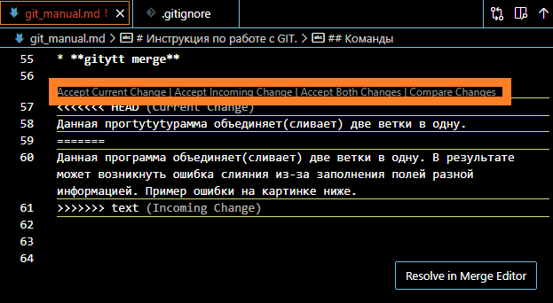

# Инструкция по работе с Git.

## Вступление

Git — это набор консольных утилит, которые отслеживают и фиксируют изменения в файлах. Изначально Git был создан Линусом Торвальдсом при разработке ядра Linux. Однако инструмент так понравился разработчикам, что в последствии, он получил широкое распространение и его стали использовать в других проектах. С его помощью можно сравнивать, анализировать, редактировать, сливать изменения и возвращаться назад к последнему сохранению. Этот процесс называется контролем версий.

## Команды

* **git config --global user.name "Ваше имя"\
git config --global user.email "Ваша почта"**

После установки требуется добавить в систему контактные данные пользователя. Эти две команды позволяют добавить имя и адрес электронной почты. 

* **git --help**

Данная команда выводит общую документацию по Git. Если введем git log --help - он предоставит нам документацию по какой-то определенной команде (в данном случае это - log)

* **git init**

Git хранит свои файлы и историю прямо в папке проекта. Чтобы создать новый репозиторий, нам нужно открыть терминал, зайти в папку нашего проекта и выполнить команду init. Это включит приложение в этой конкретной папке и создаст скрытую директорию .git, где будет храниться история репозитория и настройки.

* **git status**

Это еще одна важнейшая команда, которая показывает информацию о текущем состоянии репозитория: актуальна ли информация на нём, нет ли чего-то нового, что поменялось, и так далее.

* **git add**

Данная команда добавляет файлы проекта в работу, в **коммит.**\
Если хотим добавить конкретный файл используется команда **git add <имя_файла>**

* **git commit -m "Ваш текст"**

Данная команда создает непосредственно сам коммит.\
Флажок -m задаст commit message - комментарий разработчика. Он необходим для описания закоммиченных изменений. 

* **git log**

Для просмотра всех выполненных фиксаций можно воспользоваться историей коммитов. Она содержит сведения о каждом проведенном коммите проекта. Запросить ее можно при помощи этой команды.\
*git log --graph*  данный пораметр позволяет визуализировать движение по веткам.

* **git checkout**

Данна комtytyанда позволяет переключатся на более ранние версии **коммита**. Так же она пееключает на другие ветки проекта.

* **git diff**

С помощью данной команды можно сравнить разные версии коммитов или изменения по веткам.

* **git branch**

Данная команда требуется для работы и переходов между  ветками.\
*git branch "Название новой ветки"* - создание новой ветки.\
*git branch -d* - удаление ветки.  

* **git merge**

Данная программа объединяет(сливает) две ветки в одну. В результате может возникнуть ошибка слияния из-за заполнени одних и тех же полей в разных ветках отличающейся информацией. Пример ошибки на картинке ниже.  

В данной ситуации есть 4 варианта решения, котрые обведенены на изображении красным цветом.

1. Accept Current Change - оставить текущие изменения
2. Accept Incoming Change - принять входящие изменения 
3. Accept Both Changes - принять оба изменения
4. Compsre Changes - показать и сравнить изменения

* **git clone**

Данная команда clone копирует существующий репозиторий Git. Полученная «рабочая копия» представляет собой полноценный репозиторий Git с собственной историей и файлами, полностью обособленный от исходного репозитория.
Для удобства в процессе клонирования автоматически создается удаленный доступ к исходному репозиторию (такое соединение называется origin).

* **git pull**

Данная команда используется для извлечения и загрузки содержимого **из** удаленного репозитория и немедленного обновления локального репозитория этим содержимым.

* **git push**

Данная команда используется для выгрузки содержимого локального репозитория **в** удаленный репозиторий. Она позволяет передать коммиты **из** локального репозитория **в** удаленный.

## Pull request

Пул-реквест это запрос (англ. request — «запрос») на интеграцию изменений из одной ветки в другую. Причем в ветке может быть всего один коммит одного разработчика, а может быть несколько коммитов разных авторов. В большинстве случаев пул-реквест используется для интеграции нового функционала или для исправления бага в основной ветке проекта.
Пул-реквест также содержит короткое описание изменений и причин, по которым эти изменения вносятся.

Простыми словами:
1. Крутой программер создал репозиторий.
2. Вы сделали форк его репозитория (т.е. скопировали к себе).
3. Вы сделали какие-то крутые изменения в своём репозитории.\
Теперь если вы хотите, чтобы крутой дядя внёс ваши крутые изменения в свой крутой код. И вы просите, чтобы он взял ваши изменения, т.е. сделал git pull. Это и называется pull request

## Полезные ссылки!

[Git](https://git-scm.com/)

[VS Code](https://code.visualstudio.com/)

[С. Чакон, Б. Штауб. Git для профессионального программиста](https://gbcdn.mrgcdn.ru/uploads/asset/4245110/attachment/d4eb8c232f8f2bdf4e42ba7cb49e0c50.pdf)

[Git для начинающих](https://gb.ru/posts/soveti-pro-git)

[Инструкция по подготовке системы контроля версий Git](https://fir-dead-aeb.notion.site/Git-7251e6ce25634c81be2e89cccff9252c)

[Github](https://github.com/AndreiDobriakov/GitManual)
