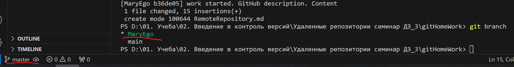

# Инструкция по GIT

## Что такое репазиторий GIT

Репозиторий GIT - это виртуальное хранилище проекта. В нем можно хранить версии кода для доступа по мере необходимости.

## Иницизализция нового репазитория нужна команда *git init*

 Для создания нового репозитория используется команда **git init**. Команду **git init** выполняют только один раз для первоначальной настройки нового репозитория. Выполнение команды приведет к созданию нового подкаталога .*git* в вашем рабочем каталоге. Кроме того, будет создана новая главная ветка.

 ## Фиксация изменений

 ### Как сделать коммит: *git add* и *git commit*

  Для сохранения изменений, их необходимо закоммитить. Но сначала, мы должны обозначить эти файлы для *git*, при помощи команды *git add name_folder* 

  Потом создаем непосредственно сам коммит: *git commit -m "messege"* 

  Или же можно объединить эти две команды: *git commit -am "messege"*, при условии, что вы ранее уже в этом файле использовали команду *git add* и *git commit -m* по отдельности.

  ## Проверка репозитория: *git status*, *git log*

  С помощью **git status** можно увидеть информацию о текущем состоянии репозитория: актуальна ли информация на нём, нет ли чего-то нового, что поменялось, и так далее. Это одна из важнейших команд. 

 Запуск *git status на нашем свежесозданном репозитории должен выдать:
  
Для просмотра все выполненных фиксаций можно воспользоваться историей коммитов Она содержит сведения о каждом проведенном коммите проекта. Запросить ее можно при помощи команды:**git log**:

В ней содержится вся информация о каждом отдельном коммите, с указанием его хэша, автора, списка изменений и даты, когда они были сделаны. фото

## Ветки в Git
### Создание новой ветки в Git: *git branch*

Чтобы посмотреть все существующие ветки  на какой мы находимся в данный момент команда **git branch** , актуальная ветка загорается зеленым:

Для работы нам требуются несколько веток, чтобы использовать их в качестве черновика или разделять обязанности, для этого мы создаем новые веткм. Чтобы создать новую ветку используем команду **git branch branch_name**>

Чтобы перейти из одной ветки на другую **git checkout brunch_name** >

### Как слить две ветки: *git merge*

Чтобы слить две ветки вам нужно находиться на той ветке, куда вы ходитет переместить все изменения. Например, ветка master, находясь на ветке **master**  пишем **git merge brunch_name** (название той ветки, которую вам нужно слить с основной).>

### Удаление ветки: *git branch -d* или *git branch -D*

Чтобы удалить уже слитую вам ветку достаточно вести **git branch branch-name*, не важно на какой ветки вы сейчас находитесь.

Если ветка не слитая, вы ее хотите удалить без сохранения при вводе команды с маленькой -d, *git* откажет в удалении, поэтому не слитую ветку мы удаляем через заглавную -D, то есть **git branch -D branch_name* >

# Инструкция по GIT

## Что такое репазиторий GIT

Репозиторий GIT - это виртуальное хранилище проекта. В нем можно хранить версии кода для доступа по мере необходимости.

## Иницизализция нового репазитория нужна команда *git init*

 Для создания нового репозитория используется команда **git init**. Команду **git init** выполняют только один раз для первоначальной настройки нового репозитория. Выполнение команды приведет к созданию нового подкаталога .*git* в вашем рабочем каталоге. Кроме того, будет создана новая главная ветка.

 ## Фиксация изменений

 ### Как сделать коммит: *git add* и *git commit*

  Для сохранения изменений, их необходимо закоммитить. Но сначала, мы должны обозначить эти файлы для *git*, при помощи команды *git add name_folder* 
   

  Потом создаем непосредственно сам коммит: *git commit -m "messege"* 

  Или же можно объединить эти две команды: *git commit -am "messege"*, при условии, что вы ранее уже в этом файле использовали команду *git add* и *git commit -m* по отдельности.
   

  ## Проверка репозитория: *git status*, *git log*

  С помощью **git status** можно увидеть информацию о текущем состоянии репозитория: актуальна ли информация на нём, нет ли чего-то нового, что поменялось, и так далее. Это одна из важнейших команд. 

 Запуск *git status на нашем свежесозданном репозитории должен выдать:

 
  
Для просмотра все выполненных фиксаций можно воспользоваться историей коммитов Она содержит сведения о каждом проведенном коммите проекта. Запросить ее можно при помощи команды:**git log**:

В ней содержится вся информация о каждом отдельном коммите, с указанием его хэша, автора, списка изменений и даты, когда они были сделаны.

## Ветки в Git
### Создание новой ветки в Git: *git branch*

Чтобы посмотреть все существующие ветки  на какой мы находимся в данный момент команда **git branch** , актуальная ветка загорается зеленым:

Для работы нам требуются несколько веток, чтобы использовать их в качестве черновика или разделять обязанности, для этого мы создаем новые веткм. Чтобы создать новую ветку используем команду **git branch branch_name**

Чтобы перейти из одной ветки на другую **git checkout brunch_name** 

### Как слить две ветки: *git merge*

Чтобы слить две ветки вам нужно находиться на той ветке, куда вы ходитет переместить все изменения. Например, ветка master, находясь на ветке **master**  пишем **git merge brunch_name** (название той ветки, которую вам нужно слить с основной).

### Удаление ветки: *git branch -d* или *git branch -D*

Чтобы удалить уже слитую вам ветку достаточно вести **git branch -d branch-name*, не важно на какой ветки вы сейчас находитесь.

Если ветка не слитая, вы ее хотите удалить без сохранения при вводе команды с маленькой -d, *git* откажет в удалении, поэтому не слитую ветку мы удаляем через заглавную -D, то есть **git branch -D branch_name* >

## Конфликты слияния в Git

Слияние и конфликты являются неотъемлемой частью работы с Git.  Git позволяет выполнять слияния очень просто. В большинстве случаев Git самостоятельно решает, как автоматически интегрировать новые изменения.

## Типы конфликтов слияния

### Git прерывает работу в самом начале слияния

Выполнение команды слияния прерывается в самом начале, если Git обнаруживает изменения в рабочем каталоге или разделе проиндексированных файлов текущего проекта. Git не может выполнить слияние, поскольку иначе эти ожидающие изменения будут перезаписаны новыми коммитами. Такое случается из-за конфликтов не с другими разработчиками, а с ожидающими локальными изменениями. Локальное состояние необходимо стабилизировать с помощью команд git stash, git checkout, git commit или git reset. Если команда слияния прерывается в самом начале, выдается следующее сообщение об ошибке.

### Git прерывает работу во время слияния

Сбой В ПРОЦЕССЕ слияния говорит о наличии конфликта между текущей локальной веткой и веткой, с которой выполняется слияние. Это свидетельствует о конфликте с кодом другого разработчика. Git сделает все возможное, чтобы объединить файлы, но оставит конфликтующие участки, чтобы вы разрешили их вручную. Данный вид конфликта рассмотрим поподробнее т.к., мы сталкивались с ним на лекциях.  При сбое во время выполнения слияния выдается следующее сообщение об ошибке:

А в самом тексте вы увидите два варинта, сравнение, из двух веток. Входящие изменения высветятся синим, а текущие зеленым.

У вас есть четрые варинта настойки текста, которая предлагает вам Git: *Принять текущее изменение* (то есть вы оставляте один варинат, тот вариант, который у вас был на даннай ветке, в которой вы находитесь),

*Принять входящее изменение* (то есть оставляете один варинт, и это будет из той ветку, которую вы хотите слить), 

*Принять оба варианта*(то есть оставляете оба варинат из двух веток, и редактируете потом вручную)

*Сравнить изменения*, но этот пункт ни к чему, потому что уже наглядно видна разница.

Далее нужно сохранить изменения и создать коммит о слиянии веток. 
