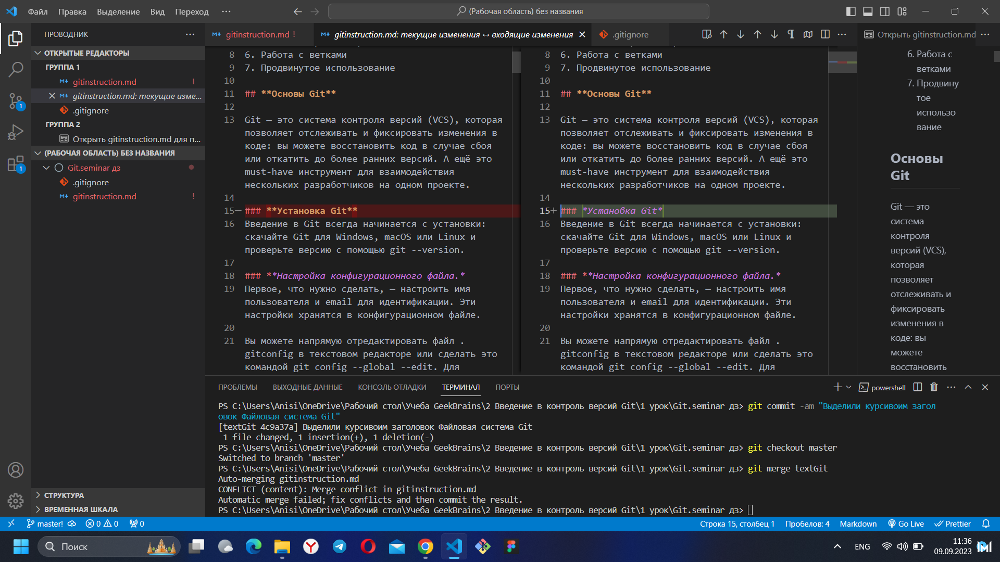

# _**Инструкция по Git**_

1. **Основы Git**
2. **Коммиты**
3. **Файловая система**
4. **Просмотр изменений**
5. **Удалённые репозитории**
6. **Работа с ветками**
7. **Продвинутое использование**

## **Основы Git**

**Git — это система контроля версий (VCS), которая позволяет отслеживать и фиксировать изменения в коде: вы можете восстановить код в случае сбоя или откатить до более ранних версий. А ещё это must-have инструмент для взаимодействия нескольких разработчиков на одном проекте.**

### **Установка Git**
Введение в Git всегда начинается с установки: скачайте Git для Windows, macOS или Linux и проверьте версию с помощью git --version.

### **Настройка конфигурационного файла.*
### Установка Git

Введение в Git всегда начинается с установки: скачайте Git для Windows, macOS или Linux и проверьте версию с помощью git --version.

### Настройка конфигурационного файла.

Первое, что нужно сделать, — настроить имя пользователя и email для идентификации. Эти настройки хранятся в конфигурационном файле.

**Вы можете напрямую отредактировать файл .gitconfig в текстовом редакторе или сделать это командой git config --global --edit. Для отдельных полей это git config --global <поле> <значение> — поля user.name и user.email.**

Также можно настроить текстовый редактор для написания сообщений коммитов, используя поле core.editor. А вот поле commit.template позволяет указать шаблон, который будет использоваться при каждом коммите. Ещё одно полезное поле — alias, которое привязывает команду к псевдониму. Например, git config --global alias.st "status -s" позволяет использовать git st вместо git status -s

Команда git config --list выведет все поля и их значения из конфигурационного файла.

### *Создаём Git-репозиторий*

Для инициализации нового репозитория .git подойдёт git init или, если хотите скопировать существующий, git clone <адрес репозитория>.

## *Коммиты*

**Основы работы с Git предполагают понимание коммитов. Команда git commit откроет текстовый редактор для ввода сообщения коммита. Также эта команда принимает несколько аргументов**:

-m позволяет написать сообщение вместе с командой, не открывая редактор. Например git commit -m "Пофиксил баг";

-a переносит все отслеживаемые файлы в область подготовленных файлов и включает их в коммит (позволяет пропустить git add перед коммитом);

--amend заменяет последний коммит новым изменённым коммитом, что бывает полезно, если вы неправильно набрали сообщение последнего коммита или забыли включить в него какие-то файлы.

## *Советы для эффективного введения в Git*:

Коммитьте как можно чаще.

Одно изменение — один коммит: не помещайте все не связанные между собой изменения в один коммит, разделите их, чтобы было проще откатиться.

**Формат сообщений: заголовок должен быть в повелительном наклонении, меньше 50 символов в длину и должен логически дополнять фразу this commit will \_\_\_(this commit will fix bugs — этот коммит исправит баги). Сообщение должно пояснять, почему был сделан коммит, а сам коммит показывает, что изменилось.**

Если у вас много незначительных изменений, хорошим тоном считается делать небольшие коммиты при разработке, а при добавлении в большой репозиторий объединять их в один коммит.

## *Файловая система Git*

Git отслеживает файлы в трёх основных разделах:
рабочая директория (файловая система вашего компьютера);

область подготовленных файлов (staging area, хранит содержание следующего коммита);

**HEAD (последний коммит в репозитории).**
**Все основные команды по работе с файлами сводятся к пониманию того, как Git управляет этими тремя разделами. Существует распространённое заблуждение, что область подготовленных файлов только хранит изменения. Лучше думать об этих трёх разделах как об отдельных файловых системах, каждая из которых содержит свои копии файлов.**

## Просмотр изменений в файловых системах

Команда git status отображает все файлы, которые различаются между тремя разделами. У файлов есть 4 состояния:

Неотслеживаемый (untracked) — находится в рабочей директории, но нет ни одной версии в HEAD или в области подготовленных файлов (Git не знает о файле).

Изменён (modified) — в рабочей директории есть более новая версия по сравнению с хранящейся в HEAD или в области подготовленных файлов (изменения не находятся в следующем коммите).

Подготовлен (staged) — в рабочей директории и области подготовленных файлов есть более новая версия по сравнению с хранящейся в HEAD (готов к коммиту).

Без изменений — одна версия файла во всех разделах, т. е. в последнем коммите содержится актуальная версия.

Мы можем использовать опцию -s для команды git status, чтобы получить более компактный вывод (по строке на файл). Если файл не отслеживается, то будет выведено ??; если он был изменён, то его имя будет красным, а если подготовлен — зелёным.

Чтобы посмотреть сами изменения, а не изменённые файлы, можно использовать следующие команды:

git diff — сравнение рабочей директории с областью подготовленных файлов;

git diff --staged — сравнение области подготовленных файлов с HEAD.

Если использовать аргумент <файл/папка>, то diff покажет изменения только для указанных файлов/папок, например git diff src/.

## Просмотр изменений

Для просмотра истории предыдущих коммитов в обратном хронологическом порядке можно использовать команду git log. Ей можно передать разные опции:

-p показывает изменения в каждом коммите;

--stat показывает сокращённую статистику для коммитов, например изменённые файлы и количество добавленных/удалённых строк в каждом их них;

-n показывает n последних коммитов;

--since=**_ и --until=_** позволяет отфильтровать коммиты по промежутку времени, например --since="2019-01-01" покажет коммиты с 1 января 2019 года;

--pretty позволяет указать формат логов (например, --pretty=oneline), также можно использовать --pretty=format для большей кастомизации, например --pretty=format:"%h %s";

--grep и -S фильтруют коммиты с сообщениями/изменениями кода, которые содержат указанную строку, например, git log -S имя_функции позволяет посмотреть добавление/удаление функции;

--no-merges пропускает коммиты со слиянием веток;
ветка1..ветка2 позволяет посмотреть, какие коммиты из ветки 2 не находятся в ветке 1 (полезно при слиянии веток). Например, git log master..test покажет, каких коммитов из ветки test нет в master (о ветках поговорим чуть позже).

--left-right ветка1...ветка2 показывает коммиты, которые есть либо в ветке 1, либо в ветке 2, но не в обеих; знак < обозначает коммиты из ветка1, а > — из ветка2. Обратите внимание: используется три точки, а не две;

-L принимает аргумент начало,конец:файл или :функция:файл и показывает историю изменений переданного набора строк или функции в файле.

## **Удаленные репозитории**

Пока что мы обсуждали использование Git только на локальной машине. Однако мы можем хранить историю коммитов удалённых репозиториев, которую можно отслеживать и обновлять. git remote -v выводит список удалённых репозиториев, которые мы отслеживаем, и имена, которые мы им присвоили.

При использовании команды git clone <url репозитория> мы не только загружаем себе копию репозитория, но и неявно отслеживаем удалённый сервер, который находится по указанному адресу и которому присваивается имя origin.

Наиболее употребляемые команды:

git remote add <имя> <url> — добавляет удалённый репозиторий с заданным именем;

git remote remove <имя> — удаляет удалённый репозиторий с заданным именем;

git remote rename <старое имя> <новое имя> — переименовывает удалённый репозиторий;

git remote set-url <имя> <url> — присваивает репозиторию с именем новый адрес;

git remote show <имя> — показывает информацию о репозитории.

Следующие команды работают с удалёнными ветками:

git fetch <имя> <ветка> — получает данные из ветки заданного репозитория, но не сливает изменения;

git pull <имя> <ветка> — сливает данные из ветки заданного репозитория;

git push <имя> <ветка> — отправляет изменения в ветку заданного репозитория. Если локальная ветка уже отслеживает удалённую, то можно использовать просто git push или git pull.

Таким образом несколько людей могут запрашивать изменения с сервера, делать изменения в локальных копиях и затем отправлять их на удалённый сервер, что позволяет взаимодействовать друг с другом в пределах одного репозитория.

## Работа с ветками

Ветвление — это возможность работать над разными версиями проекта: вместо одного списка с упорядоченными коммитами история будет расходиться в определённых точках. Каждая ветвь содержит легковесный указатель HEAD на последний коммит, что позволяет без лишних затрат создать много веток. Ветка по умолчанию называется master, но лучше назвать её в соответствии с разрабатываемой в ней функциональностью.

Итак, есть общий указатель HEAD и HEAD для каждой ветки. Переключение между ветками предполагает только перемещение HEAD в HEAD соответствующей ветки.

Команды:

git branch <имя ветки> — создаёт новую ветку с HEAD, указывающим на HEAD. Если не передать аргумент <имя ветки>, то команда выведет список всех локальных веток;

git checkout <имя ветки> — переключается на эту ветку. Можно передать опцию -b, чтобы создать новую ветку перед переключением;

git branch -d <имя ветки> — удаляет ветку.

## **Продвинутое использование**

Интерактивная подготовка
Вы можете с удобством управлять областью подготовленных файлов (например при фиксации нескольких небольших коммитов вместо одного большого) с помощью интерактивной консоли, которую можно запустить с git add -i. В ней есть 8 команд:

status — показывает для каждого файла краткое описание того, что (не)подготовлено;

update — подготавливает отслеживаемые файлы;

revert — убрать один или несколько файлов из подготовленной области;

add untracked — подготавливает неотслеживаемый файл;

patch — подготавливает только часть файла (полезно, когда вы, например, изменили несколько функций, но хотите разбить изменения на несколько коммитов). После выбора файла вам будут показаны его фрагменты и представлены возможные команды: Stage this hunk [y,n,q,a,d,j,J,g,/,e,?]?. Можно ввести ?, чтобы узнать, что делает каждая команда;

diff — показывает список подготовленных файлов и позволяет посмотреть изменения для каждого из них;

quit — выходит из интерактивной консоли;

help — показывает краткое описание каждой команды.

> **_Отсутсвие свободного времени и большой обьем работы, не позволяют выполнять домашние задания с должным усердием и тчательностью!_**
> Студент.

## _Полезные ссылки_:

[ccылка на статью по git](https://tproger.ru/translations/beginner-git-cheatsheet/)

[шпаргалка по markdown разметке](https://developer.donnoval.ru/cheat-sheet-markdown-syntax-examples/)

## Конфликты в Git и их разрешение:

### Что такое конфликт в Git?

Большую часть слияний система Git способна обрабатывать самостоятельно с помощью функций автоматического слияния. Конфликт возникает, когда в двух ветках была изменена одна и та же строка в файле или когда некий файл удален в одной ветке и отредактирован в другой. Как правило, конфликты возникают при работе в команде.

Наглядный приммер возникновения конфликта в git:

#### При возникновении конфликта в ходе слияния веток предлагается 4 варианта решения на интерактивных кнопках выше областей конфликта:

1. Принять текущие изменения

Сохраняет только текущие изменения

2. Принять входящие изменения

Сохраняет только входящие изменения

3. Принять все изменения

Сохраняет и текущие и входящие изменения

4. Сравнить изменения

Выводит консоль для сравнения изменения, для визуального удобства сравнения изменения

Наглядный пример консоли при выборе 4 варианта и сравнения изменений:

#### Ссылки на полезную информацию по разрешению конфликтов в Git:

[Разрешение конфлитка Git1](https://docs.github.com/ru/pull-requests/collaborating-with-pull-requests/addressing-merge-conflicts/resolving-a-merge-conflict-using-the-command-line)

[Разрешение конфлитка Git2](https://habr.com/ru/articles/323234/)

[Разрешение конфлитка Git3](https://techrocks.ru/2022/05/06/merge-conflicts-resolving/)

[Разрешение конфлитка Git4](https://ru.stackoverflow.com/questions/437456/%D0%9A%D0%B0%D0%BA-%D1%80%D0%B0%D0%B7%D1%80%D0%B5%D1%88%D0%B0%D0%B5%D1%82%D1%81%D1%8F-%D0%BA%D0%BE%D0%BD%D1%84%D0%BB%D0%B8%D0%BA%D1%82-%D0%B8%D0%B7%D0%BC%D0%B5%D0%BD%D0%B5%D0%BD%D0%B8%D0%B9-%D0%BF%D1%80%D0%B8-%D1%81%D0%BB%D0%B8%D1%8F%D0%BD%D0%B8%D0%B8-%D0%B2%D0%B5%D1%82%D0%B2%D0%B5%D0%B9)

