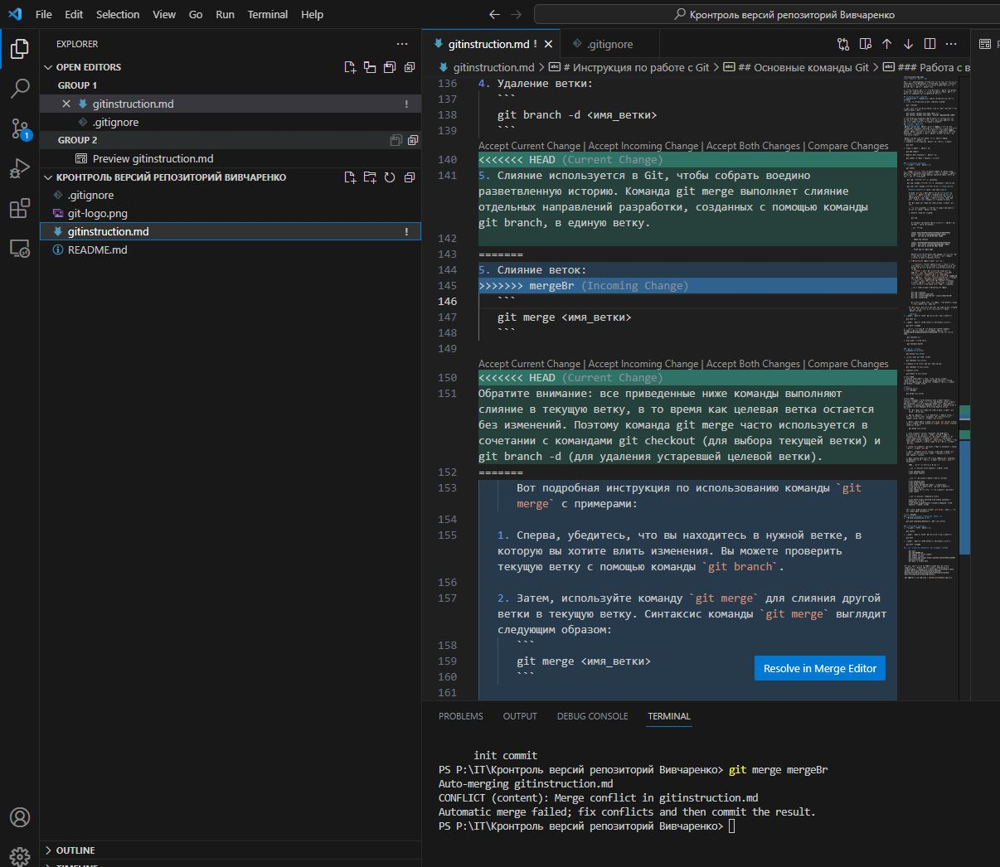

# Инструкция по работе с Git

Git - это распределенная система контроля версий, которая широко используется для управления и отслеживания изменений в исходном коде проектов. Вот некоторые консольные команды Git, которые помогут вам в работе с репозиторием.

*Простыми словами: Git - это твой помощник в работе с проектами. Он поможет тебе не потерять ничего на каждой стадии работы. И абсолютно незаменим для коммандных проектов.*

## Установка и настройка Git
1. Скачайте Git с официального сайта и установите его на свою систему.
2. Проверьте, установлен ли Git, выполнив команду:
   ```
   git --version
   ```
3. Настройте свое имя пользователя и адрес электронной почты для использования в Git.:
   ```
   git config --global user.name "Ваше имя"
   git config --global user.email "ваша-почта@exampleNO LINKS"
   ```
*После установки необходимо «представиться» системе контроля версий. Это нужно сделать всего один раз, и git запомнит вас. Для этого нужно ввести в терминале 2 команды*
## Основные команды Git
### Создание репозитория
Репозиторий Git или репозиторий — это папка, в которую Git отслеживает изменения. На компьютере может быть любое количество репозиториев, каждое из которых хранится в собственной папке. Каждый репозиторий Git в системе является независимым, поэтому изменения, сохраненные в одном репозитории Git, не влияют на содержимое другого.

Репозиторий Git содержит каждую версию каждого файла, сохраненного в репозитории.
1. Создайте новый локальный репозиторий с помощью команды:
   ```
   git init
   ```
2. Добавьте файлы в репозиторий:
   ```
   git add <файлы>
   ```
3. Зафиксируйте изменения в репозитории:
   ```
   git commit -m "Ваше сообщение о коммите"
   ```

### Отслеживание изменений
1. Отобразить статус репозитория:
   ```
   git status
   ```
2.  Показать историю всех сохраниний commit. В случае когда список всех изменений не помещается в окно терминала, требуется пролистать список до конца (Нажимая клавишу пробел). Выход из меню - "q" (от слова quit)
    ```
    git log  //выводит историю изменений

    git log --graph //выводит историю изменений в виде дерева

    git log --all --graph //выводит дерево со всеми ветвями
    ```
     <details><summary>Подробнее о git log</summary>

      Команда `git log` используется для просмотра истории коммитов в репозитории Git. Она позволяет просмотреть список коммитов в обратном хронологическом порядке, а также получить информацию о каждом коммите, такую как автор, дата и время создания, и сообщение коммита.

      Вот подробная инструкция по использованию команды `git log`:

      1. Откройте командную строку или терминал и перейдите в директорию вашего репозитория Git.

      2. Введите следующую команду:

         ```
         git log
         ```

         Это покажет вам полный список коммитов в репозитории, начиная с самого последнего.

         Пример вывода:

         ```
         commit 3e4a1c63e295cf4f0c7c62f0b5c5ac4973f9d9a3
         Author: John Doe <johndoe@exampleNO LINKS>
         Date:   Tue Feb 16 15:30:00 2021 +0300

            Added new feature

         commit c8c9f9b81d927b6a2e83a237b13d18a279bdff54
         Author: Jane Smith <janesmith@exampleNO LINKS>
         Date:   Mon Feb 15 10:45:00 2021 +0300

            Fixed bug in login page
         ```

         Каждый коммит представлен информацией, которая включает в себя хеш коммита, автора, дату и время создания коммита, а также сообщение коммита.

      3. Дополнительные опции команды `git log`:

         - `--oneline`: выводит каждый коммит в одной строке, содержащей только хеш коммита и сообщение коммита. Это удобно для просмотра большого количества коммитов на экране.
         - `--author`: фильтрует коммиты по имени автора. Например, `git log --author="John Doe"` отобразит только коммиты, сделанные автором "John Doe".
         - `--since` и `--until`: фильтруют коммиты по диапазону дат. Например, `git log --since="2021-02-15"` отобразит только коммиты, сделанные после указанной даты.
         - `--grep`: фильтрует коммиты по тексту в сообщении коммита. Например, `git log --grep="bug"` отобразит только коммиты, содержащие слово "bug" в сообщении.

         Примеры использования дополнительных опций:

         ```
         git log --oneline
         git log --author="John Doe"
         git log --since="2021-02-15" --until="2021-02-20"
         git log --grep="bug"
         ```

         Вы можете комбинировать эти опции, чтобы получить более точный и нужный вам результат.

      Это подробное руководство поможет вам использовать команду `git log` для просмотра истории коммитов в вашем репозитории Git.

      </details>
3. Показать различия между рабочей директорией и индексом:
   ```
   git diff ключ
   ```
4. Показать различия между индексом и последним коммитом:
   ```
   git diff --staged
   ```
5. Проверить состояние по сохранённому статусу (commit). Атрибуты - первые 4 цифры ключа commit, например ключ c362f8316d79c7e18833cb479ae777ffd2e7ec80, достаточно ввести: c362.
    ```
    git checkout ключ
    ```
6. Возвращает в ветку мастер
    ```
    git checkout master
    ```
   
### Работа с ветками
1. Создание новой ветки:
   ```
   git branch <имя_ветки>
   ```
2. Переключение на другую ветку:
   ```
   git checkout <имя_ветки>
   ```
3. Создание новой ветки и переключение на нее:
   ```
   git checkout -b <имя_ветки>
   ```
4. Удаление ветки:
   ```
   git branch -d <имя_ветки>
   ```
5. Слияние веток:
   ```
   git merge <имя_ветки>
   ```

      Вот подробная инструкция по использованию команды `git merge` с примерами:

   1. Сперва, убедитесь, что вы находитесь в нужной ветке, в которую вы хотите влить изменения. Вы можете проверить текущую ветку с помощью команды `git branch`.

   2. Затем, используйте команду `git merge` для слияния другой ветки в текущую ветку. Синтаксис команды `git merge` выглядит следующим образом:
      ```
      git merge <имя_ветки>
      ```

   3. Если конфликты слияния возникнут, Git попытается автоматически их разрешить. Однако, иногда требуется вмешательство пользователя для разрешения конфликтов. Вы можете использовать команду `git status`, чтобы увидеть, какие файлы вызывают конфликты. 



      Для разрешения конфликта слияния вручную требуется переместиться на предложенный фрагмент текста и выбрать одно из действий:  
      * Accept Curent changes - Принять версию из текущей ветви
      * Accept Incomming changes - Принять версию из входящей ветви
      * Accept Both changes - Оставить оба варианта 
      * Compare changes - Слиять изменения

   4. Когда все конфликты разрешены, добавьте изменения в индекс с помощью команды `git add`.

   5. Затем, сделайте коммит слияния, используя команду `git commit`. Git автоматически создаст сообщение коммита с информацией о слиянии.

   6. Ваше слияние завершено! Вы можете опубликовать изменения на удаленный сервер с помощью команды `git push`, если это необходимо.

      Теперь рассмотрим несколько примеров:

      Пример 1: Слияние ветки feature в текущую ветку
      ```
      $ git checkout main
      $ git merge feature
      ```

      Пример 2: Разрешение конфликтов перед слиянием
      ```
      $ git checkout main
      $ git merge feature
      $ git status (показывает файлы с конфликтами)
      $ vim file.txt (редактируете, разрешая конфликты)
      $ git add file.txt
      $ git status (проверяете, что все конфликты разрешены)
      $ git commit
      ```

      Пример 3: Слияние с удаленной веткой
      ```
      $ git fetch origin (получаете последние изменения с удаленного сервера)
      $ git merge origin/feature (сливаете удаленную ветку feature в текущую ветку)
      ```

   *Это основы использования команды `git merge`. Надеюсь, эта инструкция будет полезной!*


### Отслеживание изменений
1. Отобразить статус репозитория:
   ```
   git status
   ```
2. Показать различия между рабочей директорией и индексом:
   ```
   git diff
   ```
3. Показать различия между индексом и последним коммитом:
   ```
   git diff --staged
   ```
## Пример команд для удалённой синхронизации с GitHub
      
      git init
      git add README.md
      git commit -m "first commit"
      git branch -M main
      git remote add origin https://github.com/ArtemFilosofGB/gitinstruction.git
      git push -u origin main

  ## Отправка изменений в удаленный репозиторий
 
  ### Чтобы синхронизировать локальный репозиторий и резиторий на вашем аккаунте GitHub
  1. Создать и войти в аккаунт на GitHub
  2. Создать репозиторий на GitHub (При этом GitHub подскажет инструкцию по соединению репозиториев п.4)
  3. Создать локальный репозиторий
  4. "Подружить" ваш локальный и удалённый репозитории. Потребуется авторизация внутри локально среды к аккаутну GitHub.  
  5. Отправить (git push) локальный репозиторий в удалённый (на GitHub).
  6. Выкачать (git pull) актуальное состояние из удалённого репозитория 

  ### Чтобы предложить изменние в проект пренадлежащий другому пользователи GitHub (pull request)

  1. Найти интересующий проект на GitHub
  2. Сделать Fork интересующего проекта на свой аккаунт (при этом создаётся удалённый репозиторий). Копируем ссылку своего репозитория (Code, раздел http).
  3. Локально создаём папу и открываем ещё через среду (Visual Studio Code). 
  4. С помощью команды _git clone <ссылка Code>_  делаем копию удалённого репозитория в локальную папку.
  5. Чтобы войти в дерикторию репозитория локально изпользовать _cd <имя папки>_. Рекомендуется использовать git status чтобы понять что работа с репозиторием началась.
  6. Создать новую ветку с помощью 
      ```
      git branch <имя новой ветки>
      ```
  7. Перейти в новую ветку 
      ```
      git chechout  <имя новой ветки>.
      ```
  8. Вносим изменения в проект, фиксируем изменения с помощью _git commit -am "Описание изменений"
  9. Отправляем измения на GitHub (git push) при этом среда сама подскажет нужный синтаксис команды 
      ``` 
      git push --set-upstream origin description 
      ```
  10. На сайте GitHub нажать кнопку <Compare and Pull Request>. Также Можно пройти по предложений ссылке из терминала с помощью _Ctrl + клик_

  ## Подробное описание комманд  git для работы с удалённым репозиторием

1. Отправка изменений на сервер:
   ```
   git push <название_удаленного_репо> <имя_ветки>
   ```    
2. Клонировать репозиторий. Чтобы клонировать существующий репозиторий с удаленного сервера на локальный компьютер, используйте команду «git clone», за которой следует URL-адрес репозитория. Например:
   ```
   git clone httpsNO LINKSgithubNO LINKS/имя пользователя/repository.git
   ```

3. Перейдите к репозиторию. Используйте команду `cd` для перехода в каталог клонированного репозитория:
   ```
   компакт-диск репозиторий
   ```

4. Внесите изменения. Откройте проект в своем любимом редакторе кода и внесите необходимые изменения или дополнения в файлы.

5. Стадия изменений: используйте команду `git add`, чтобы подготовить изменения для фиксации. Эта команда добавляет измененные файлы в промежуточную область.
   ```
   git добавить.
   ```

6. Зафиксируйте изменения. Используйте команду `git commit`, чтобы создать фиксацию с описательным сообщением, объясняющим внесенные вами изменения.
   ```
   git commit -m "Добавить новую функцию"
   ```

7. Отправьте изменения. Чтобы загрузить свои коммиты в удаленный репозиторий, используйте команду `git push`, за которой следует URL-адрес репозитория:
   ```
   git push origin имя ветки
   ```

8. Извлечение изменений. Если другие участники внесли изменения в репозиторий с момента вашего последнего обновления, вы можете получить и применить эти изменения с помощью команды `git pull`:
   ```
   git pull origin имя ветки
   ```

9. Создайте запрос на включение. Если вы хотите внести свои изменения в репозиторий, к которому у вас нет прямого доступа, вы можете создать запрос на включение. Посетите репозиторий в своем веб-браузере, нажмите кнопку «Новый запрос на включение», выберите соответствующие ветки и укажите описательный заголовок и сообщение, объясняющее ваши изменения. После отправки специалисты по сопровождению репозитория смогут просмотреть и объединить ваши изменения.

Помните, что репозиторий, в который вы вносите свой вклад, должен быть размещен на платформе, поддерживающей запросы на включение, например GitHub, GitLab или Bitbucket.


 Это лишь некоторые из доступных команд Git. Вы можете ознакомиться с полным списком команд и дополнительной документацией в официальной документации [Git](https://docs.github.com/ru/get-started/writing-on-github/getting-started-with-writing-and-formatting-on-github/basic-writing-and-formatting-syntax).

 Или записаться на обучение в [GeekBrains](https://gb.ru/).

Автор инструкции: afilosof1@gmail.com

При поддержке: Влеленский цифровой ум №4 

<image src="https://api.wakool.id/images/thumb200/20200716030745git_1623730694.png" alt="Logo по ссылке">
