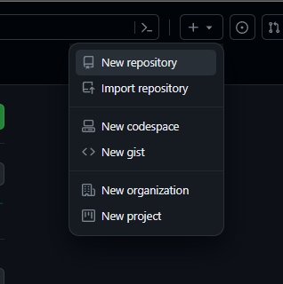
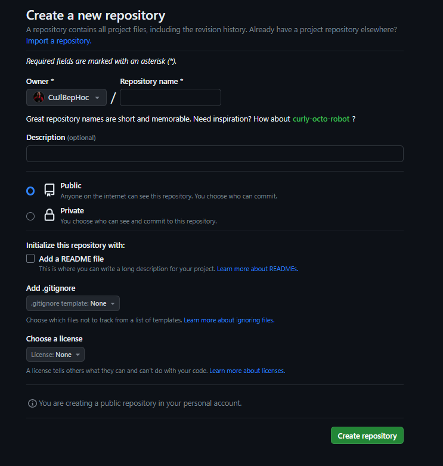
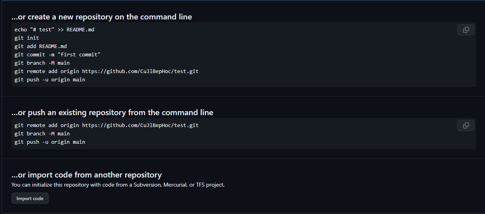
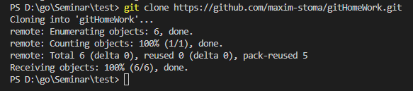
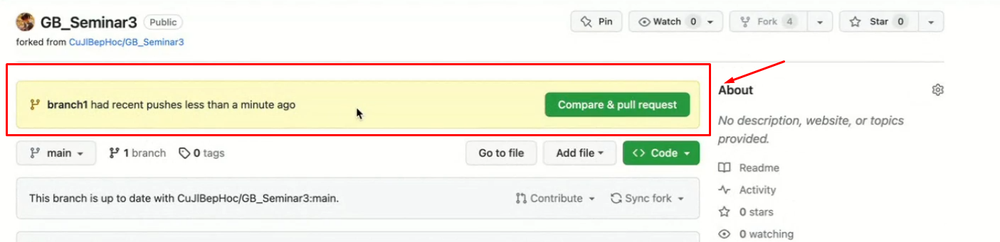
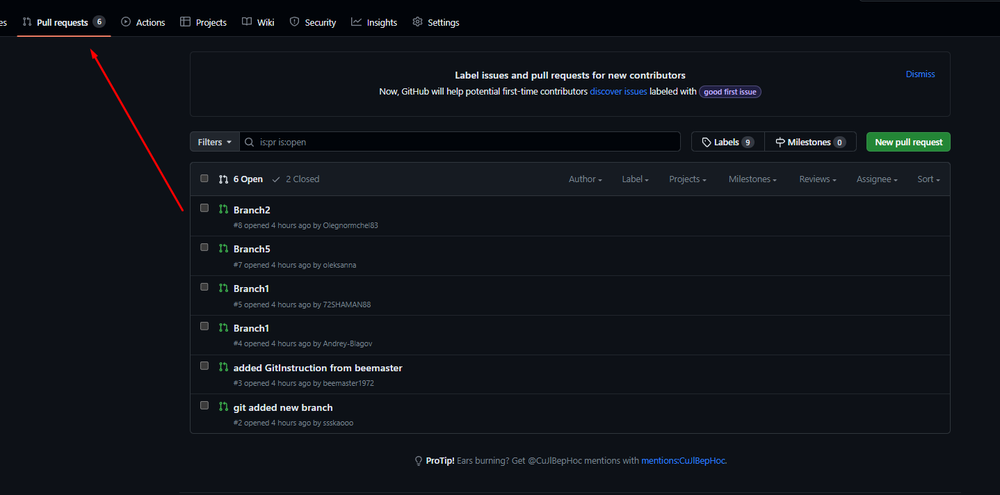
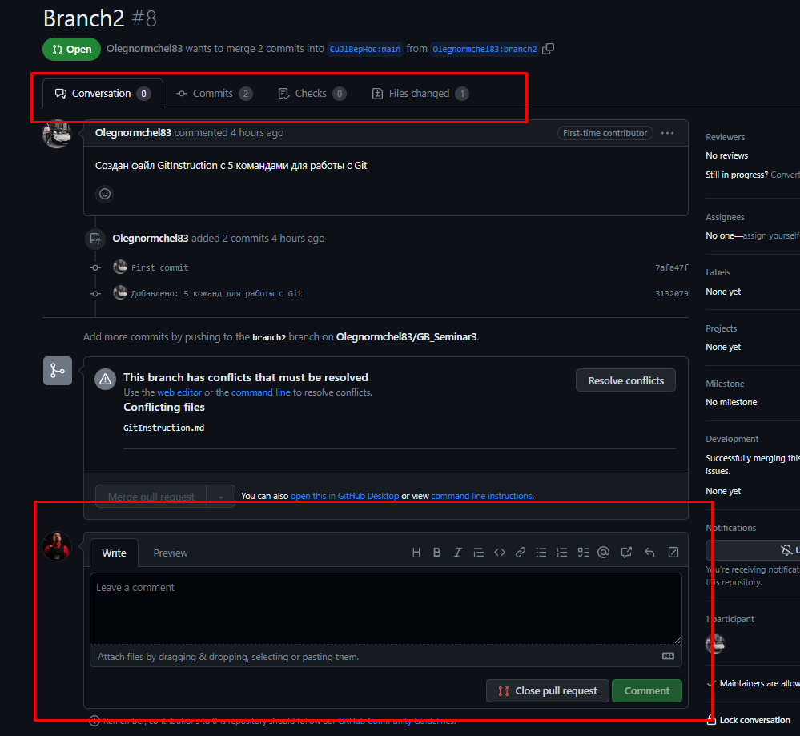

# Добро пожаловать на инструкция по GIT

## Установка Git на операционную систему
Перейдите на [сайт Git](https://git-scm.com/download/win) и выберите свою операционную систему. 

Скачайте удобный для вас установочный файл.

Далее следуя инструкциям, установите его на свою систему.

---

## Первые шаги
Для работы с Git, вам потребуется авторизоваться, чтобы когда вы создавали commit, указывался автор, кто его создал.

В терминале вашей IDE или операционной системе пропишите следующие команды:

1. **git config --global user.name "<ваше_имя>"**
> Вместо <ваше_имя> можно ввести, например, Grisha_Popov.
> Кавычки оставляем.
2. **git config --global user.email "<адрес_почты@email.com>"**
>Принцип заполнения тот же.

---

## Создание репозитория и первый коммит
Теперь можно приступать к работе c Git локально на компьютере.
Для начала нужно перейти в папку где лежит ваш проект с помощью команды: 

* **`cd` <путь_к_вашему_проекту>**

И сделать инициализацию командой:

* **git init**

Теперь Git отслеживает изменения вашего проекта, но репозиторий который был создан сейчас пустой. Поэтому следующим вашим действием будет:

* **gid add <имя_файла>**
> Если у вас длинное наименование файла, достаточно написать начало файла и нажать `Tab` терминал сам допишет его.

> Для добавления всех документов в папке используйте "`gid add .`" или "`gid add --all`"

Теперь вы готовы сделать свой первый commit:

* **git commit -m "комментарий"**
> Обязательно указываем комментарий. При просмотре журнала изменений вам или другим пользователям будет понятно что было сделано.

---

## Взаимодействия с репозиторием.
Проверить текущее состояние файлов можно использовать команду:
* **git status**

Команда *git status* выводит информацию о следующем:

1. Наименование текущей ветки.
2. Список изменённых файлов, которые ещё не добавлены в индекс.
3. Список добавленных в индекс, но ещё не зафиксированных (закоммиченных) изменений.
4. Информацию о неразрешенных конфликтах слияния (если такие есть).
5. ополнительную информацию о состоянии веток и других аспектах репозитория.

Для переключения между ветками репозитория используется команда:

* **git checkout <имя_ветки>**
>Имя ветки должно содержать первые 4 символа хэш-коммита или название созданной ветки, для главной ветки - master(main)

Найти номера хэш-коммитов можно вызвав команду:
* **git log** 

Команда git log используется для просмотра истории коммитов в репозитории Git и выводит следующую информацию:

1. Хэш коммита (SHA-1): Уникальный идентификатор каждого коммита в Git.
2. Автор и электронная почта: Имя и адрес электронной почты человека, совершившего коммит.
3. Дата коммита: Дата и время, когда был совершен коммит.
4. Сообщение коммита: Краткое описание изменений, сделанных в данном коммите.
5. Изменения: Список файлов, которые были изменены в данном коммите
---

## Ветки (branch)
Ветки в Git - создаются командой:

* **git branch <имя_ветки>**
> Запись команды без имени `"git branch"` отобразит наименование всех веток в репозитории.

И предназначены для:
1. Изолировать разработку: Вы можете создавать отдельные ветки для работы над различными функциями или исправлениями без влияния на другие части проекта.
2. Параллельную разработку: Разработчики могут одновременно работать над разными ветками, что ускоряет разработку и избегает конфликтов.
3. Историю изменений: Ветки сохраняют историю изменений, делая возможным отслеживание и возврат к предыдущим состояниям проекта.
4. Объединение (мердж): После завершения работы в ветке, изменения могут быть объединены с другой веткой, что интегрирует новый код в основную линию разработки.
5. Эксперименты и исправления ошибок: Ветки позволяют безопасно экспериментировать и исправлять ошибки, не затрагивая стабильную версию проекта.

Чтобы поддерживать чистоту репозитория и избежать конфликтов, после слияния веток их рекомендуется удалять. Все логи будут отображаться в ветке, с которой производилось слияние, как это будет рассмотрено в следующем разделе.

Удаление ветки производится командой:

* git branch -d <имя_ветки>

Флаг `-d` означает "удалить ветку с указанным именем". Однако, важно заметить, что при использовании этого флага возможна ошибка, если:

1. Данная ветка выбрана в качестве активной (текущей).
2. Не было слияния (мержа) с данной веткой.
3. Ветка не содержит коммитов.

Если все перечисленные условия выполняются, то ветка будет удалена без дополнительных подтверждений. В противном случае, терминал запросит подтверждение, и для удаления ветки следует использовать флаг -D (с большой буквы):

* git branch `-D` <имя_ветки>

В итоге, ветки являются мощным инструментом для организации и управления разработкой в Git.

---

## Слияние ветвей

Слияние (или merge) в Git - это процесс объединения изменений из одной ветки в другую. Основное назначение слияния:

1. Интеграция изменений: Слияние позволяет объединить изменения, внесенные в одну ветку (обычно в рабочей ветке), с изменениями в другой ветке (например, в основной ветке разработки).
2. Решение конфликтов: В случае, если Git обнаруживает конфликты между изменениями веток, слияние требует вмешательства разработчика для решения конфликтов вручную.
3. Сохранение истории: Git сохраняет историю слияний, что делает возможным отслеживание, когда и какие изменения были интегрированы.

Чтобы осуществить слияние изменений из одной ветки в другую в Git, используйте команду:

* git merge <имя_ветки>

>Основное внимание следует уделить важному моменту: перед выполнением слияния, убедитесь, что вы находитесь в той ветке, в которую вы хотите принять изменения из `<имя_ветки>`. В противном случае слияние будет применено в неправильную ветку.

Также в процессе слияния пользователь может наткнутся на конфликт.

Конфликты слияния (merge conflicts) в Git возникают, когда Git не может автоматически объединить изменения из разных веток. Это может произойти, например, когда две ветки внесли изменения в одно и то же место в файле или когда одна ветка удалила файл, а другая внесла изменения в этот файл.

1. Причина: Конфликты возникают, когда Git не может определить, как объединить изменения в файлах.
2. Ручное разрешение: Для разрешения конфликта разработчику нужно вручную выбрать, какие изменения оставить, какие отклонить или как объединить изменения.
3. Маркеры конфликта: Git вставляет специальные маркеры (<<<<<<<, =======, >>>>>>>) в файле, чтобы показать, где находятся конфликты.
4. Решение конфликтов: Разработчик должен отредактировать файл, удалив маркеры и оставив только нужные изменения, а затем закоммитить файл с разрешенными конфликтами.
5. Завершение слияния: После разрешения всех конфликтов разработчик может закончить слияние, выполнив коммит.

Конфликты слияния - это нормальная часть работы с Git при совместной разработке, и разработчики должны уметь их разрешать для успешной интеграции изменений из разных веток.

---

## Файл игнорирования
Файл .gitignore в Git - это текстовый файл, используемый для указания Git'у, какие файлы и директории следует игнорировать при отслеживании изменений:

1. Игнорирование файлов: В .gitignore вы можете перечислить шаблоны файлов, которые не должны быть добавлены в репозиторий (например, временные файлы, файлы настроек IDE и т. д.).
2. Упрощение управления версиями: Использование .gitignore помогает уменьшить шум в истории коммитов, делая её более чистой и читаемой.
3. Локальные настройки: Файл .gitignore можно настроить для каждого проекта, учитывая его особенности и требования.
4. Кастомизация: Вы можете создавать собственные правила для игнорирования файлов и папок, а также использовать стандартные шаблоны, предоставляемые Git'ом.

Примеры таких игнорирований:

* *.log
>Игнорировать все файлы с расширением .log
* node_modules/
>Игнорировать папку node_modules

* *.dll
>Игнорировать все файлы .dll

* *.png
>Игнорировать все файлы .png
---

## Удаленный репозиторий.

Есть множества сервисов по работе с удаленными репозиториями, но мы рассмотрим наиболее распространненый - `GitHub`

Начало работы с этим сервисом делится на:

1. Создание нового пустого проекта (репозитория)
2. Клонирование уже существуещего проекта

### **"Создание нового пустого репозитория на GitHub"**

После обязательной авторизации/регистрации. Нужно создать новый репозиторий, открыв вкладку с изображением знака `'+'` нажать на `New Repositories`  или под своим аватаром на вкладке "*Your repositories*", нажать на `New`.

Далее нас встречает страница создания этого репозитория, что можно/нужно тут заполнить?

* **Наименование вашего репозитория** - по этому наименованию, другие пользователи смогут найти ваш репозиторий для взаимодействия с ним. Это обязательный пункт
* **Description** - это описание вашего репозитория, для чего этот проект
* **Выбор публикации открытой/закрытой** - тут вам нужно выбрать, хотите чтобы ваш проект был общедоступным и любой мог предлагать вам свою помощь или сделать его закрытым по приглашению.
* **Добавление файла .gitignore**
* **Выбор лицензии**

После создания репозитория `GitHub` сам предложит вам советы по настройке.
На выбор есть несколько вариантов команд:

1. Связать локальный репозиторий с удаленным
2. Создание нового репозитория через терминал
3. Открыть уже существующий проект через терминал
4. Импортировать проект из другого вер-сервиса хостинга IT-проектов

### **"Клонирование репозитория"**
Работа с чужими репозиториями немного отличается. Вы не можете просто вносить изменения в чужой проект, вы можете только *предложить свой вариант*. После того как вам предоставили ссылку или вы через поиск нашли нужный вам репозиторий, нужно склонировать его к себе на GitHub используя кнопку `"Fork"`. 

Кнопка `"Fork"` позволяет создать копию (форк) чужого репозитория. Форк создает вашу собственную версию репозитория, в которой вы можете свободно вносить изменения, а затем предложить их к внесению (пулл-реквест) в исходный репозиторий. Это один из способов сотрудничества в проектах с открытым исходным кодом.

Далее в уже созданной копии репозитория нужно получить его адресс. Открываем вкладку `"Code"` и копируем URL адресс.

Осталось загрузить его через терминал использовав команду:

* **git clone <URL_адресс>**

> Желательно после загрузки, создать новую ветку в которой вы будете улучшать или изменять проект.

### **Работа с удаленными репозиториями "Push", "Pull", "Pull Request"**

Чтобы отправить изменения на удаленный репозиторий используется команда:
* **git push**

Чтобы наоборот получить изменения сделанные в репозитории используется команда:
* **git pull**

>При первом запуске этих команд, терминал Git`a может предложить вам несколько флагов, чтобы уточнить, какие ветки и куда вы хотите отправить изменения. Это обычно происходит, если у вас есть несколько удаленных веток или ваша локальная ветка имеет нестандартное имя. 

Если вы работаете над чужим проектом, то после ввода команды **`git push`** терминал вам подскажет что был создан некий запрос - *"Pull request"*
Вернувшись в свой скопируемый репозиторий, вы обнаружите желтое поле с данной кнопкой. 

Данная кнопка предлогает отправить вашу модификацию автору этого проекта. В этом запросе отображены все ваши изменения.
> В дополнение к этому запросу желательно написать описание вашего запроса.

Автору проекта приходят оповещения о входящих запросах, он их просматривает и принимает решение - добавлять их к себе или нет.

Сам запрос представляет собой:

* Вкладки с изменениями - списком, коммитами и детальное описание.
* Поле слияния - отображение конфликтов при слиянии или их отсутствие
* Поле комментария - в нем можно поблагодарить или наоборот описать проблему запросу 

> Данные запросы остаются в памяти системы и к ним можно вернуться, если автор например передумал.
й

---

### Базовые команды.
Команды и их краткое описание используемые в данной инструкции:

* **git init** –инициализация локального репозитория
* **git status** –получить информацию от git о его текущем состоянии
* **git add** –добавить файл или файлы к следующему коммиту 
* **git commit -m “message”** –создание коммита. 
* **git log** –вывод на экран истории всех коммитов с их хеш-кодами
* **git checkout** –переход от одного коммита к другому 
* **git checkout master** –вернуться к актуальному состоянию и продолжить работу 
* **git diff** –увидеть разницу между текущим файлом и закоммиченным файлом
* **git branch** - отображение всех веток с пометкой активной
* **git branch <имя_ветки>** - создание новой ветки
* **git merge <имя_ветки>** - производит слияние из указанной ветки в текущую
* **git clone <URL-адресс>** - клонирование репозитория
* **git push** - отправка на удаленный репозиторий
* **git pull** - получение из удаленного репозитория