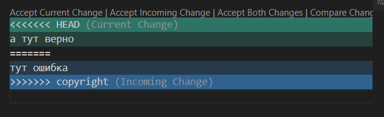
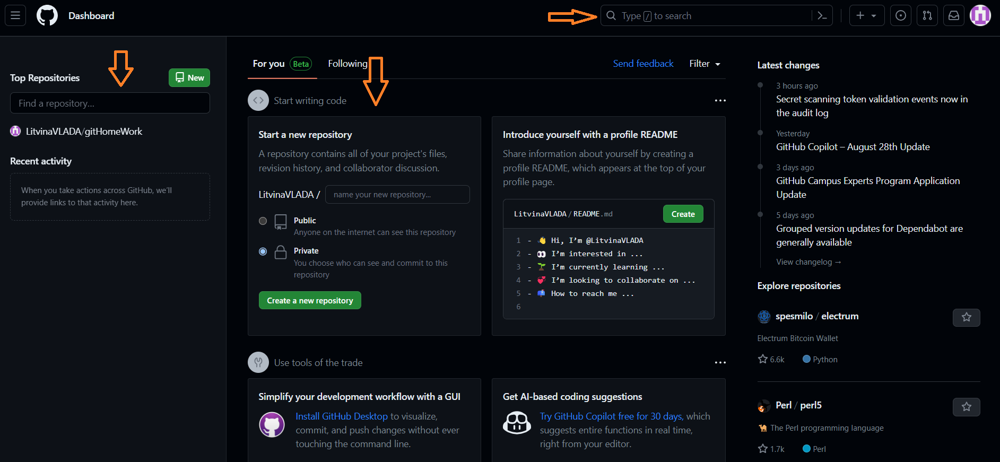
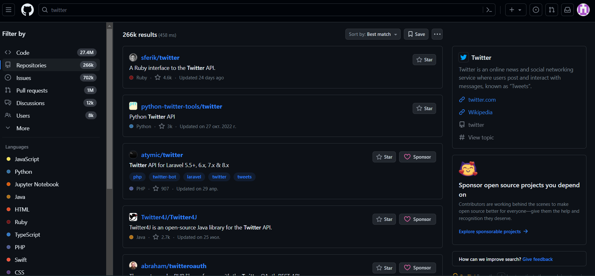
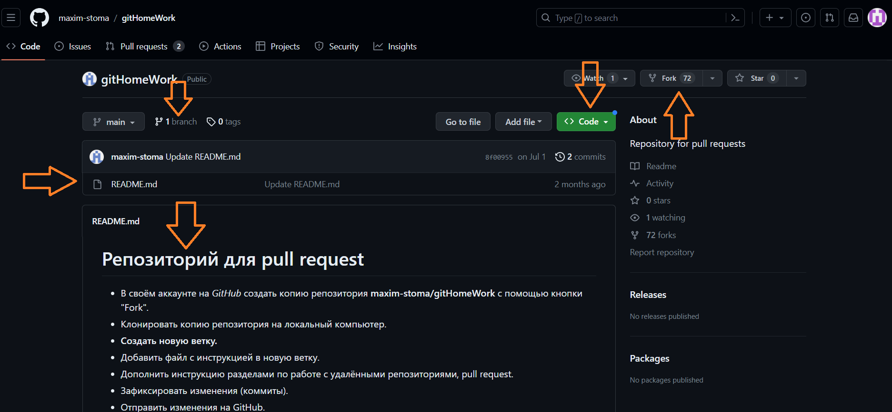
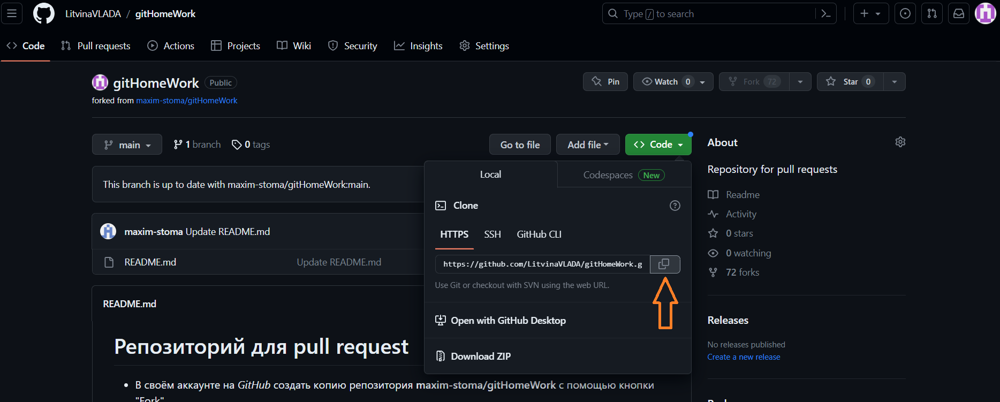
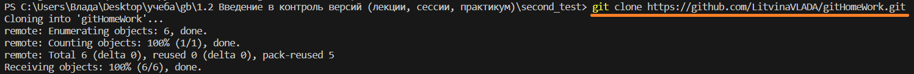
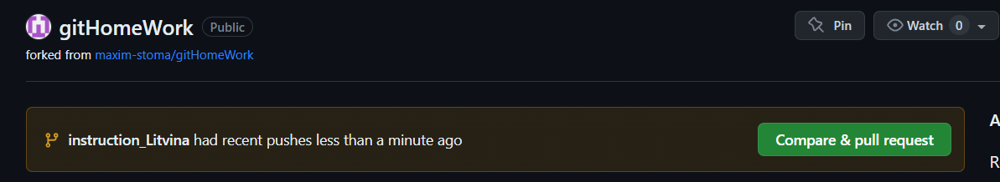
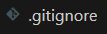
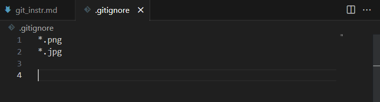

# Инструкция по работе с системой контроля версий Git

## Основные команды для работы с Git

* **git init** – инициализация локального репозитория (начало любой работы с Git, говорит программе *"отслеживай этот файл"*)
* **git status** – получить информацию от git о его текущем состоянии (команда помогает увидеть всё ли работает правильно, всё ли сохранено, спрашивает у программы *"что мы сейчас имеем? всё ли идёт корректно? всё ли сохранено?"*)
* **git commit -m "сообщение"** – создание коммита (+ создание комментария к нашему сохранению, который поможет ориентироваться среди них, говорит программе *"сохрани эту версию файла в своём журнале версий и добавь пометку"*)
* **git add** – добавить файл или файлы к следующему коммиту (показывает Git что мы хотим сохранить при следующем коммите, говорит программе *"когда будешь сохранять в свой журнал новую версию, вот это возьми обязательно"*)
* **git log** – вывод на экран истории всех коммитов с их хеш-кодами (т.е. просмотр журнала наших изменений и сохранений, говорит программе *"покажи что мы там на сохраняли"*)
* **git checkout**  – переход от одного коммита к другому (помогает перемещаться между версиями)
* **git checkout master** – вернуться к актуальному состоянию и продолжить работу (возвращает нас к основной верссии файла)
* **git diff** – увидеть разницу между текущим файлом и закоммиченным файлом (показывает разницу файлов построчно)

## Начало работы с Git в VSC

Для работы с Git **нужно представиться** = познакомиться с программой. Это необходимо для командной работы, программа будет помечать кто внёс изменения.

1. Вводим команду ***git config --global user.name "<ваше_имя>"***, где вместо <ваше_имя> прописываем своё имя.
2. Вводим команду ***git config --global user.email "<адрес_почты@email.com>"***, где вместо <адрес_почты@email.com> указываем свою почту. Почту можно указать любую, никаких подтверждений не потребуется.

## Процесс работы с Git

### 1. Создание репозитория

Через VSC заходим в папку где будет происходит работа с файлом и прописываем команду ***git init***. Она сообщит программе что в этой папке нужно создать репозиторий и здесь будет проивзодиться работа.

Но программа пока не понимает что ей отслеживать. Мы указали ей только площадку. Это как привести зоолога в Зоопарк но не сказать за каким животным он будет следить.

Для решения этого вопроса указываем программе за каким файлом ей нужно следить, через команду ***git add <имя_файла>***. Теперь наш зоолог знает за кем следит. 

Теперь важно зафиксировтаь в нашем журнале начало работы с данным файлом. Это делается через команду ***git commit -m "<комментарий>"***, где <комментарий> это любой понятный меседж указывающий что фиксируется вэтом шаге. Для первого месседжа лучше оставлять месседж "init commit".

### 2. Рутинные процессы в Git

Далее, после создания репозитория мы можем приступить к работе с нашим файлом. В процессе работы постоянно повторяются рутинные команды:

* После каждого действия в терминале обязательно прописывать ***git status***. Это позволит нам постоянно контролировать корректность процессов и сохранений.
* После внесения изменений/корректировок в файл сохраняем версию с помощью команды ***git commit --am "комментарий к версии"***. В ковычках указываем необходимые пометки или информацию, которая позволит понять что это за сохранение.

### 3. Перемещение между версиями

Ну и основное. То ради чего всё это. 

* Для просмотра журнала наших версий вводим команду ***git log***
Программа выведет в терминале перечисление коммитов. Пример:
__________________

    commit 495b1a84f1d5b2a1dd820c49fb29b948800a764e (HEAD -> master)
    Author: LitvinaVlada <vladamay@outlook.com>
    Date:   Mon Aug 7 20:38:50 2023 +0300

    p.3_p.2_work

    commit bebb691b299a0d82f329efc4abd994f99c9b6d7b
    Author: LitvinaVlada <vladamay@outlook.com>
    Date:   Mon Aug 7 20:29:26 2023 +0300

    p.3_p.1_work

_________________

* Для перемещения на другую версию файла нужно ввести команду ***git checkout 495b***. Она переместить нас в ту версию код которой начинается символами 495b. Код это то что выводится после слова commit в нашем журнале версий.

* Команда ***git checkout master*** вернёт вас к основной ветке с которой вы работаете.

### 4. Слияние веток в Git

В программа Git основной изюминкой является возможность работы в разных ветках, а так же их сравнение  слияние. Этот процесс мы сейчас и рассмотрим. 

Для создания новой ветки используется команда ***git branch название новой ветки***. 
Для просмотра имеющихся в файле веток используется команда ***git branch***. Она выводит в терминале список всех веток ***в алфавитном порядке***, НЕ В ТОМ в котором они создавались.

Для перемещения между ветками используем команду ***git checkout название ветки***.

Далее проводится необходима работа в параллельных ветках нашего файла. Изменения в одной ветке, никак не отразятся в другой. Более того их log будут отличаться между собой, то есть видны будут только коммиты текущей ветки + те что были до её создания. После слияния веток их история коммитов объединится.

После того как вы провели необходимую работу в параллельной ветке, для слияния её с мастером, необходимо:
1. переместиться на ветку master (на основную рабочую)
2. использвать команду ***git merge название ветки которую сливаем с основной***

Далее, если нет никаких ошибок, программа просто вольёт дополнительную ветку в основную (из которой мы писали команду).

Если же есть ошибки, программа спросит у автора какое решение ей применить. Ошибка выскакиевает когда в текущей ветке есть что-то в той же строке куда собирается записать информацию вливаемая ветка. То есть ошибку выдаст в тех строках где есть информация в обеих ветках. Выглядит это так:

Выбрать нужно из трёх вариантов в верхней строчке:
* Accept Current Change = Оставить текущие изменения (зелёное)
* Accept Incoming Change = Оставить входящие изменения (голубое)
* Accept Both Changes = Оставить оба изменения

### 5. Работа с удалёнными репозиториями через GitHub
**GitHub** — это сервис компании Microsoft, который позволяет интегрироваться с
программой Git и настроить удалённую работу с вашим репозиторием.
То есть с помощью данного сервиса можно работать в команде или с разных устройств.
GitHub лишь один из многих сервисов для такой работы, но считается самым популярным.

На главноей странице сайта (после регистрации) можно найти существущий репозиторий или создать свой. 

В поисковой строке можно ввести имя автора, название репозитория или его составную часть. Пример того как выглядит результат поиска ниже:

Если же у вас уже есть ссылка на нужный репозиторий, сразу переходим по ней и попадаем на страницу репозитория. На этой странице мы можем скопировать данный репозиторий в свой аккаунт (fork), клонировать репозиторий к себе локально, посмотреть какие в нём есть файлы, увидеть что внутри этих файлов, какие у них ветки, коммиты и многое другое. Главное для нас сейчас это кнопка FORK. Через эту кнопку у нас в аккаунте создаём копию этого репозитория.

Когда мы форкнули репозиторий к себе в аккаунт, следующим шагом мы клонируем его = делаем из нгео локлаьный репозиторий у сея на компьютере.

В терминале прописываем такую команду (ПОСЛЕ GIT INIT):

Теперь нужный репозиторий скопирован в локальный на нашем устройстве. Теперь осталось создать новую ветку (это нормы приличия при работе с чужим файлом) и произвести неоходимые изменения на этой ветке.

Когда мы произвесли все необходимые изменения (закоммитили их!), осталось только передать наш локальный репозиторий обратно на GitHub и далее направить нашу версию автору, который может принять или не принять нашу версию. Это делает через езлёную кнопку на картинке ниже.

___
## Справочные материалы по Markdown

**Markdown** — это облегченный язык разметки с синтаксисом форматирования обычного текста. Иными словами markdown помогает с оформлением текста. Ниже мы разберём немного базы языка markdown.

___
### *1. Блок цитирования*

Блок для цитирования или выделения текста выделается с помощью символа перед текстом: >. Пример:   
     
     > Это цитата.

И после выглядит таким образом:
> Это цитата.
___
### *2. Полужирный и курсив*

Для выделения текста курсивом он обрамляется * с обеих сторон. Пример: 
     
     *курсив*

После текст выглядит так: *курсив*

Для выделения текста журным он обрамляется ** с обеих сторон. Пример: 

    
    **жирный**
После текст выглядит так: **жирный**

Для выделения текста журным и курсивом он обрамляется *** с обеих сторон. Пример: 
    
    ***жирный курсив***
После текст выглядит так: ***жирный курсив***
____
### *3. Заголовки*

Заголовки с помощью языка markdown можно сделать 6 уровневыми. Заголовок первого уровня выделяется # в начале, заголовок второго уровня ## в начале и так далее до 6 го.
Пример: 
    
    # Заголовок 1
    ## Заголовок 2
    ### Заголовок 3
    #### Заголовок 4
    ##### Заголовок 5
    ###### Заголовок 6
По итогу выглядит это так:
# Заголовок 1
## Заголовок 2
### Заголовок 3
#### Заголовок 4
##### Заголовок 5
###### Заголовок 6
___
### *4. Горизонтальные линии*
Для создания в файле горизонтальных линий разделяющих наш текст, нужно прописать в пустой строке 3 символа _ подряд. Пример: 
    
    ___
Выглядеть это будет так:
___

### 5. Добавление изображений
Для добавления изображения, необходимо разместить его в папке (репозитории) с нашим рабочим файлом. Но когда мы сделаем это, новые появившиеся в репозитории файлы будут в статусе Untracted для нашей программы, то есть не будут отслеживаться. Дабы эта ошибка не мешала нам работать, необходимо в нашем репозитории создать файл **".gitignore"** (ВАЖНО именно такое написание с точкой в начале)

Выглядеть это будет так:

Далее переходим в этот файл у казываем в нём форматы файлов которые необходимо игнорировать в данном репозитории. Или можно указать полное название файла при необходимости.
Выглядеть это будет так:

Обратите **ВНИМАНИЕ**  что для игнорирования всех файлов определенного формата нужно прописать * и затем расширение (например .png, .doc, .jpg)

Теперь осталось добавить изображение в наш файл. Прописать это нужно таким образом сначала **!**, затем **в квадратных скобках** понятное описание картинки, будет выводиться на экран если кратинка пропадёт из репозитория, и потом **в круглых скобках** само название файла вместе с его форматом. 

Пример:

    
Выглядеть это будет так:
