# Контроль версий 

### Содержание

* [Что такое *GIT*](#что-такое-git)
* [Ветки в *GIT*](#ветки-git)
* [Команды](#команды)
* [Изображения в *GIT*](#изображения-в-git) 
* [Файл *.gitignore*](#файл-gitignore)
* [Конфликты](#конфликты)
* [Работа с удалёнными репозиториями](#работа-с-удалёнными-репозиториями)

## Что такое ***GIT***

***GIT*** - это система контроля версий. Или другими словами — хранилище, база данных истории разработки проекта. Такая система нужна для учета всех версий файлов когда-либо созданных в проекте и содержащихся в *Git* (базе данных).  

Базовый принцип *Git* достаточно прост — мы добавляем туда начальную версию файлов и если что-то отредактировали, то добавляем вторую и так далее до бесконечности. Если нам вдруг понадобилось «откатиться» до предыдущей версии, то *Git* без проблем позволяет это сделать.  

  

*Git* незаменим при командной разработке, когда любой человек из команды может получить все уже созданные ранее версии файлов и при необходимости внести в них изменения. Система снабжена обнаружением конфликтов при попытке изменить один и тот же файл разными людьми. В этом случае *Git* предложит пути решения, чтобы внести тот или иной результат в редактируемый файл.

## Ветки *GIT*  

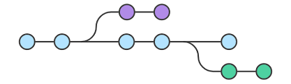

В Git ветки — это элемент повседневного процесса разработки. По сути ветки в Git представляют собой указатель на снимок изменений. Если нужно добавить новую возможность или исправить ошибку (незначительную или серьезную), вы создаете новую ветку, в которой будут размещаться эти изменения.

Зачем вообще нужны ветки в *GIT*? Для того, чтобы разделять код. Например одна ветка у нас может быть основная для разработки. Если мы делаем новый функционал, то мы создаем новую ветку под него, а после окончания работы сливаем то, что мы сделали в основную ветку.

## Команды

* ***git init***  

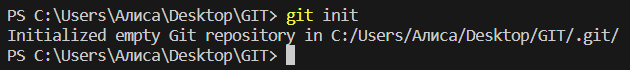

Инициализация.  
В терминале, находясь в папке, которую мы хотим сделать репозиторием, вводим команду *git init*.  
В этой папке появится скрытая папка *.git*  
Теперь мы можем создавать файлы и отслеживать все изменения в нашем репозитории.  
*Репозиторий* - место, где хранятся и поддерживаются какие-либо данные.

* ***git add***  

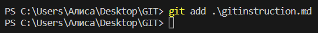

Сборка слепка будущего коммита.  
Добавление:  
*git add <название файла, где происходили какие-либо изменения или действия>*.

* ***git commit***

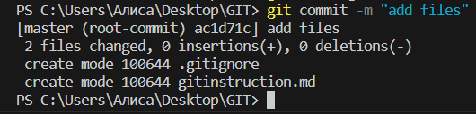  

*Закоммитить* - зафиксировать, сохранить.  
Функция *git commit* берёт все данные, добавленные в слепок с помощью *git add* и сохраняет их во внутренней базе данных.
Закоммитить данные:  
*git commit -m "коментарий для коммита"* 

Для простоты и экономии времени вместо команды *git add* можно использовать:  

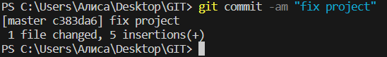  

*git commit -am "комментарий для коммита"*, где **-а** означает добавление.

* ***git status***
 
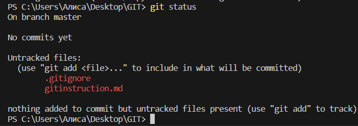
 

Показывает текущее состояние *git*, есть ли изменения, которые нужно закоммитить.

* ***git branch***

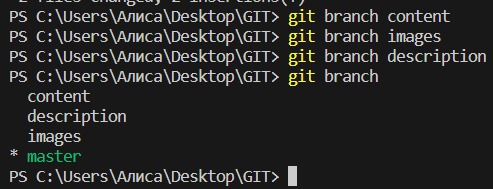

Позволяет создавать, просматривать и удалять ветки.  
Для просмотра существующих веток:  
*git branch*  
<*> отмечено, на какой ветке мы находимся в данный момент.  
 Создать ветку:  
*git branch <название ветки>*.  
Удалить ветку:  
*git branch -d <название ветки>*.  
При этом ***-d*** это безопасное удаление(например, если что-то не закоммиченно, *git* нас об этом предупредит), а ***-D*** это удаление принудительное.

* ***git log*** 

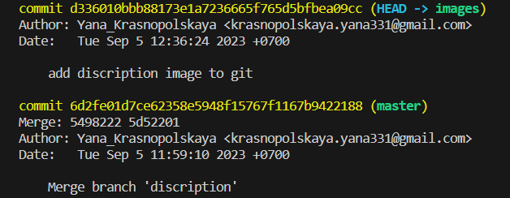

Журнал изменений. В нём содержится информация с номером, автором, коментарием и датой коммита. Перед переключением версий файла в *git* используется команда *git log*, чтобы увидеть количество коммитов и, если требуется, переключиться на нужный коммит.

* ***git checkout*** 

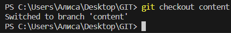

Переключение между ветками и версиями. Для этого вводим:  
*git checkout <название ветки или первые четыре символа нужного нам коммита>*.

* ***git merge***

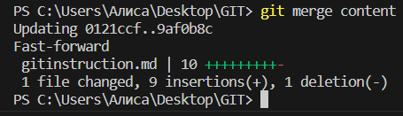

Команда используется для слияния одной или нескольких веток в текущую. Затем она устанавливает указатель текущей ветки на результирующий коммит.  
**ВАЖНО!!** Команду нужно прописывать в той ветке, куда мы хотим слить другую ветку.  
*git merge <название ветки, которую хотим слить>*

* ***git diff*** 

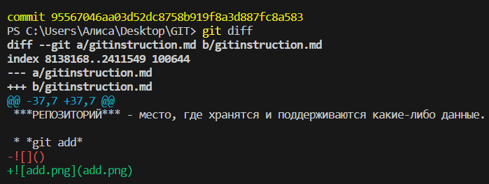

Показывает разницу между текущим и сохранённым файлом, что было изменено, добавлено, удалено.

* ***git clone***

*git clone* — это команда *Git* для выбора существующего репозитория и создания его клона, т.е. копии.  
Как сделать клон с [*GitHub*](#github---популярный-сервис-компании-microsoft-для-организации-работы-удалённых-репозиториев)?  
Откройте браузер и перейдите к своей учетной записи *GitHub*, перейдите на вкладку репозитории и выберите репозиторий для клонирования. На странице репозитория *GitHub* выберите **CODE**, чтобы открыть всплывающее окно. Скопируйте URL-адрес клона из всплывающего окна.  
Далее в терминале на своём ПК вводим:  
*git clone <вставляем скопированную ссылку>*

* ***git push***

Команда используется для выгрузки содержимого локального репозитория в удаленный репозиторий. Она позволяет передать коммиты из локального репозитория в удаленный.

* ***git pull***

Команда используется для извлечения и загрузки содержимого из удаленного репозитория и немедленного обновления локального репозитория этим содержимым.  
При этом *git pull* имеет двойное действие. Она не только извлекает содержимое из локалки, но и мержит (*merge*) содержимое. То есть происходит слияние и не исключён конфликт.

## Изображения в *GIT*

Для того, чтобы добавить изображение в проект, нам потребуется набор символов: <!>, <[]>, <()>.  
Вначале ставим **восклицательный знак**, затем **квадратные скобки**(в них мы записываем название изображения. При ошибки показа изображения, нам будет доступно название этого изображения) и в конце **круглые скобки**(в них мы записываем название изображения, чтобы оно показалось на экране)

## Файл *.gitignore*

Файл, явным образом помеченный для Git как файл, который необходимо игнорировать.  
*.gitignore* нужен для скрытия файлов и папок от системы контроля версий *Git*. Обычно скрывают конфигурационные файлы (особенно с паролями), временные файли и папки.  
Есть несколько способов прописания файлов в *.gitignore*:

1. Прописать название файла с расширением
2. Прописать только расширение. В таком случае все файлы в этом расширении будут игнорироваться. Например: **.png*
3. Прописать расширение с слэшом. В таком случае будут игнорироваться все файлы с этим расширением, которые находятся в основной папке и остальных подпапках. Например: **/.png*

## Конфликты

Большую часть слияний система *Git* способна обрабатывать самостоятельно с помощью функций автоматического слияния. Конфликт возникает, когда в двух ветках была изменена одна и та же строка в файле или когда некий файл удален в одной ветке и отредактирован в другой. Как правило, конфликты возникают в командной работе.

Пример конфликта  

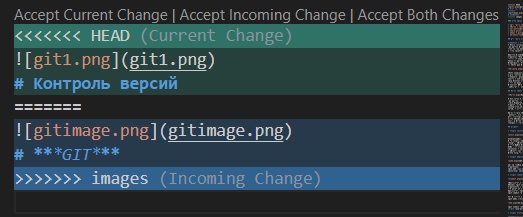

В данном примере мы задали название и картинку проекта в основной ветке master и сделали то же самое в дополнительной ветке. При слиянии *git* оповещает нас о конфликте и предлагает методы его решения. Мы можем оставить текущее название и картинку, выбрать название из доп ветки, либо добавить оба варианта.  

## Работа с удалёнными репозиториями

**Что значит удалённый репозиторий** - это репозиторий, который хранится на каком-либо сервисе, а не на нашем компьютере. В данном случае мы рассмотрим ***GitHub***

### GitHub - популярный сервис компании Microsoft для организации работы удалённых репозиториев.

Мы можем поучаствовать в каком-то большом проекте, доступ к которому есть на *GitHub*.  
Для этого нужно предложить свои изменения. Как это сделать:  
1. Сделать ***Fork*** репозитория на аккаунте интересующего пользователя. Этот репозиторий появиться на нашем аккаунте.

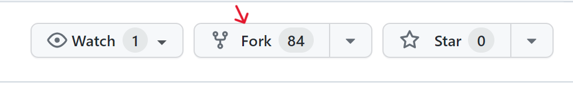

2. Клонировать репозиторий на свой ПК. С помощью кнопки ***Code*** скопировать ссылку. 

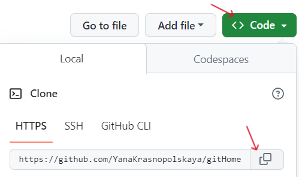

В терминале ввести:  
*git clone <ссылка>*  

3. Создать ветку с предлогаемыми изменениями.  
**ВАЖНО!!! - изменения делать только в новой ветке!!!**.
4. Отправить изменения с помощью команды *git push*
в свой аккаунт на *GitHub*.
5. Дать команду *Pull request*.

