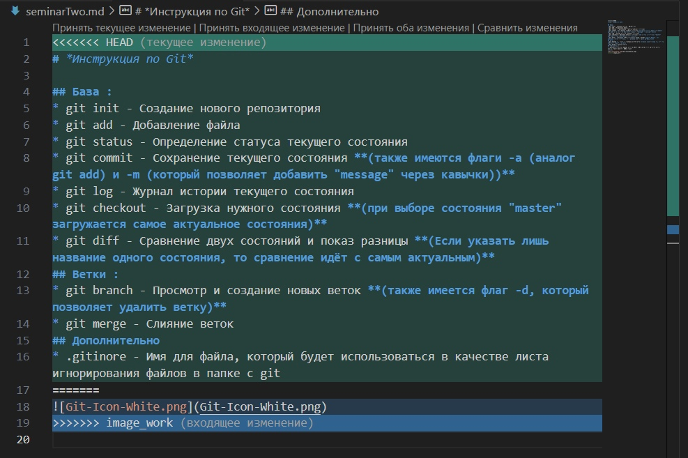
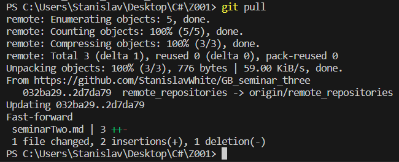

# *Инструкция по Git*

## База :
* git init - Создание нового репозитория
* git add - Добавление файла
* git status - Определение статуса текущего состояния
* git commit - Сохранение текущего состояния **(также имеются флаги -a (аналог git add) и -m (который позволяет добавить "message" через кавычки))**
* git log - Журнал истории текущего состояния
* git checkout - Загрузка нужного состояния **(при выборе состояния "master" загружается самое актуальное состояния)**
* git diff - Сравнение двух состояний и показ разницы **(Если указать лишь название одного состояния, то сравнение идёт с самым актуальным)**
## Ветки :
* git branch - Просмотр и создание новых веток **(также имеется флаг -d, который позволяет удалить ветку)**
* git merge - Слияние веток
## Дополнительно
* .gitinore - Имя для файла, который будет использоваться в качестве листа игнорирования файлов в папке с git
## Конфликты
При слияние двух веток, возникает конфликт, пример которого находится на изображение ниже 
Сверху располагается 4 интерактивных кнопки
* Первая кнопка позволяет оставить лишь то, что находится в бирюзовой рамке
* Вторая кнопка позволяет оставить лишь то, что находится в синей рамке
* Третья кнопка позволяет оставить и то, что находится в бирюзовой рамке, но и то, что находится в синей рамке
* Четвёртая кнопка позволяет сравнить содержание рамок
## Удалённые репозитории
Для создания удалённого репозитория необходимо зарегестрироваться на GitHub, затем кликнуть плюсик сверху, выбрать пункт **New repository**, ввести имя и нажать кнопку **Create repository**. Затем на экране появится текст с командами, которые нужно ввести в вашем терминале git, чтобы произвести соединение.
* git remote add origin **ссылка на ваш репозиторий, полученная в GitHub**
* git branch -M main - Указываем, что ветка "main" является ключевой
* git push - Загружаем на удалённый репозиторий локальную версию
* git pull - Загружаем с удалённого репозитория удалённую версию

## Fork 

Для того, чтобы поучавствовать в работе над другим проектом, достаточно перейти на этот проект в **GitHub**, затем сверху кликнуть на кнопоку **Fork**, после чего появится ваша версия этого проекта. Далее нажимаем кнопочку **Code**, копируем ссылку, затем переходим в VSCode и прописываем комманду
* git clone **ссылка** - клонирует репозиторий

Затем, когда мы внесли достаточно изменений, проводим push и возвращаемся назад в GitHub, где у нас в копии проекта появляется кнопочка **Compare and pull request**, при нажатие на которую мы можем отправить свой **Fork** владельцу проекта