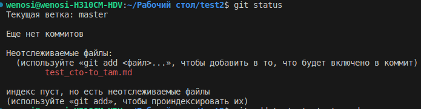
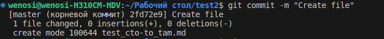
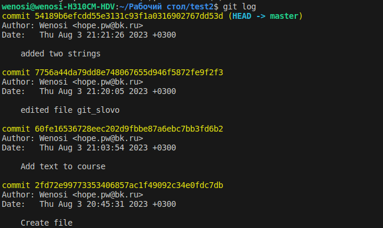
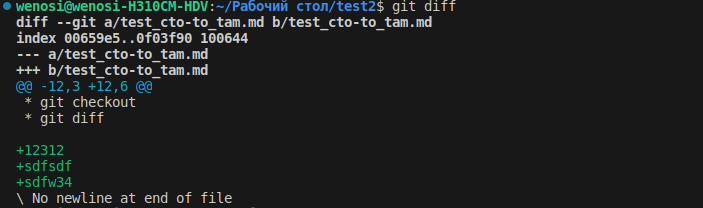
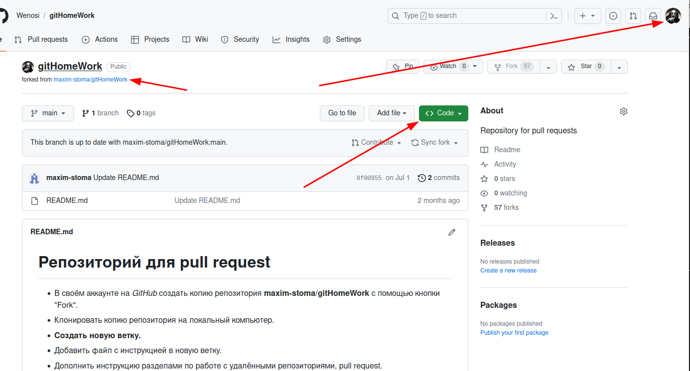

# Инструкция по работе системой контроля версий

## Firs state

### Не хватает креативности, поэтому я просто добавил изображения к названиям команд, как они работают. Своего рода тоже инструкция

* git init

* git stаtus

* git add
 скрин пропал на втором семинаре ))
* git commit

* git log

* git checkout

* git diff

### Команды второго семинара

* git branch - просмотр всех существующих веток

* git checkout branch_name - создан для того, чтоб переходить к другой ветке

* git merge - служит для слияния двух веток, использование:
переходим в ветку основную, и пишем git merge (название ветки которую нужно слить)

* git log --graph - создан для просмотра визуального отображения всех коммитов с указателем всех веток

* Каждый смайл был добавлен отдельно в каждой ветке, а затем слит в один файл

* скриншот ошибки

Данная ошибка указывает на то, что в ветке 1 с каким-то именем, имеются данные, которые были добавлены, после создания ветки, и в ветке 2 имеются какие-то изменения. Решается этот конфликт одним из указанных способов выше, например я принял изменения нажав одну из кнопок, например:

## Дополнение файла инструкции, для домашнего задания к третьему семинару.

Первым делом необходимо войти на сайт Github.com под своей учетной записью, созданной ранее, либо создать, если этого не было сделано ранее. Затем необходимо найти желаемый репозиторий для работы, в нашем случае репозиторий преподавателя. Далее необходимо "форкнуть" репозиторий к себе на учетную запись, затем получить ссылку на репозиторий и перейти в ВСкод.

* git clone \<url> - при вводе данной команды, с вставкой из сайта Github.com произойдет загрузка всего репозитория на локальный компьютер
Данная функция создаст полную локальную копию всей работы (за исключением указанных в файле .gitignore) на вашем локальном репозитории.

* pull request - эта функция появится в вашем репозитории на сайте Github после внесения изменений на вашем локальном компьютере, которые были отправлены в ваш удаленный репозиторий.