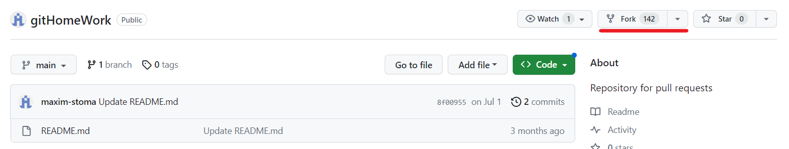

# Инструкция по использованию системы контроля версий GIT
## Навигация
- [Установка Git](#установка-git)
    - [Windows](#windows)
    - [Linux(Unix)](#linuxunix)
    - [Mac](#mac)
- [Основные команды работы с Git](#основные-команды-работы-с-git)
- [Работа с командами ](#работа-с-командами)
    - [Создание нового репозитория](#создание-нового-репозитория)
    - [Определение состояния](#определение-состояния)
    - [Подготовка файлов](#подготовка-файлов)
    - [Фиксация изменений](#фиксация-изменений)
    - [Как посмотреть коммиты](#как-посмотреть-коммиты)

- [Ветвление](#ветвление)
    - [Создание новой ветки](#создание-новой-ветки)
    - [Переключение между ветками](#переключение-между-ветками)
    - [Слияние веток](#слияние-веток)
- [Удаленные репозитории]
	- [Создание форка репозитория](#создание-форка-репозитория)
	- [Клонирование вилки репозитория](#клонирование-вилки-репозитория)
	- [Подключение к удаленному репозиторию](#подключение-к-удаленному-репозиторию)
	- [Отправка изменений на сервер](#отправка-изменений-на-сервер)
	- [Выполнение pull request](#выполнение-pull-request)

- [Полезные ссылки](#полезные-ссылки)


## Установка Git
### Windows
Вариант 1: Скачиать с официального сайта установочный файл соответствующий вашей системе:
<https://git-scm.com/download/win>
Устанавливить Git  с настройками "поумолчанию".

Вариант 2: Из командной строки запустить команду 

```winget install --id Git.Git -e --source winget```
### Linux(Unix)
#### Debian/Ubuntu
For the latest stable version for your release of Debian/Ubuntu

```apt-get install git```

For Ubuntu, this PPA provides the latest stable upstream Git version

```add-apt-repository ppa:git-core/ppa``` 

```apt update; apt install git```

#### Fedora
```yum install git``` (up to Fedora 21)

```dnf install git``` (Fedora 22 and later)
#### Gentoo
```emerge --ask --verbose dev-vcs/git```
#### Arch Linux
```pacman -S git```
#### openSUSE
```zypper install git```
#### Mageia
```urpmi git```
#### Nix/NixOS
```nix-env -i git```
#### FreeBSD
```pkg install git```
#### Solaris 9/10/11 (OpenCSW)
```pkgutil -i git```
#### Solaris 11 Express
```pkg install developer/versioning/git```
#### OpenBSD
```pkg_add git```
#### Alpine
```apk add git```

### Mac 
Существует несколько способов установки Git на Mac. Самый простой — установить Xcode Command Line Tools. В версии Mavericks (10.9) и выше вы можете добиться этого просто первый раз выполнив 'git' в терминале.

```git --version```

Если Git не установлен, вам будет предложено его установить.

Если Вы хотите получить более актуальную версию, то можете воспользоваться бинарным установщиком. Установщик Git для OS X доступен для скачивания с сайта Git <https://git-scm.com/download/mac>.

## Основные команды работы с Git
```git init``` - инициализация

```git add <filename>``` - добавить файл к отслеживанию

```git version``` - версия git

```git status``` - статус текущего состояния git

```git log``` - журнал действий в системе контроля версий

```git commit``` - фиксирует изменения в системе контроля версий

## Работа с командами 
### Создание нового репозитория
git хранит свои файлы и историю прямо в папке проекта. Чтобы создать новый репозиторий, нам нужно открыть терминал, зайти в папку нашего проекта и выполнить команду init. Это включит приложение в этой конкретной папке и создаст скрытую директорию .git, где будет храниться история репозитория и настройки.
Создайте на рабочем столе папку под названием проекта. Для этого в окне терминала введите:
```
git init
```
Командная строка должна вернуть что-то вроде:
```
Initialized empty Git repository in /home/user/Desktop/git_exercise/.git/
```
### Определение состояния
status — это еще одна важнейшая команда, которая показывает информацию о текущем состоянии репозитория: актуальна ли информация на нём, нет ли чего-то нового, что поменялось, и так далее. Запуск ```git status``` на нашем свежесозданном репозитории должен выдать:
```
# git status
On branch master
Initial commit
Untracked files:
(use "git add ..." to include in what will be committed)
hello.txt
```
Сообщение говорит о том, что файл hello.txt неотслеживаемый. Это значит, что файл новый и система еще не знает, нужно ли следить за изменениями в файле или его можно просто игнорировать. Для того, чтобы начать отслеживать новый файл, нужно его специальным образом объявить.
### Подготовка файлов
В git есть концепция области подготовленных файлов. Можно представить ее как холст, на который наносят изменения, которые нужны в коммите. Сперва он пустой, но затем мы добавляем на него файлы (или части файлов, или даже одиночные строчки) командой add и, наконец, коммитим все нужное в репозиторий (создаем слепок нужного нам состояния) командой ```commit```.
В нашем случае у нас только один файл, так что добавим его:
```
git add hello.txt
```
Если нам нужно добавить все, что находится в директории, мы можем использовать
```
git add -A
```
Проверим статус снова, на этот раз мы должны получить другой ответ:

```
git status
```
```
On branch master
Initial commit
Changes to be committed:
(use "git rm --cached ..." to unstage)
new file: hello.txt
```
Файл готов к коммиту. Сообщение о состоянии также говорит нам о том, какие изменения относительно файла были проведены в области подготовки — в данном случае это новый файл, но файлы могут быть модифицированы или удалены.

## Фиксация изменений
Для сохранения изменений, их необходимо закоммитить. Но сначала, мы должны обозначить эти файлы для Гита, при помощи команды ```git add```, добавляющей (или подготавливающей) их к коммиту. Добавлять их можно по отдельности:
```
git add hello.txt
```

```
git commit -m 'Add some text'
```

## Как посмотреть коммиты
Для просмотра все выполненных фиксаций можно воспользоваться историей коммитов. Она содержит сведения о каждом проведенном коммите проекта. Запросить ее можно при помощи команды:
```
git log
```

## Ветвление
### Создание новой ветки
Основная ветка в каждом репозитории называется master. Чтобы создать еще одну ветку, используем команду ```branch <name>```
```
git branch amazing_new_feature
```
Это создаст новую ветку, пока что точную копию ветки **master**.
### Переключение между ветками
Сейчас, если мы запустим ```branch```, мы увидим две доступные опции:
```
git branch
```

```
amazing_new_feature
* master
```
**master** — это активная ветка, она помечена звездочкой. Но мы хотим работать с нашей “_новой потрясающей фичей_”, так что нам понадобится переключиться на другую ветку. Для этого воспользуемся командой ```checkout```, она принимает один параметр — имя ветки, на которую необходимо переключиться.
```
git checkout amazing_new_feature
```
В Git ветка — это отдельная линия разработки. Git checkout позволяет нам переключаться как между удаленными, так и меду локальными ветками. Это один из способов получить доступ к работе коллеги или соавтора, обеспечивающий более высокую продуктивность совместной работы. Однако тут надо помнить, что пока вы не закомитили изменения, вы не сможете переключиться на другую ветку. В такой ситуации нужно либо сделать коммит, либо отложить его, при помощи команды git stash, добавляющей текущие незакоммиченные изменения в стек изменений и сбрасывающей рабочую копию до HEAD'а репозитория.

### Слияние веток
Наша “_потрясающая новая фича_” будет еще одним текстовым файлом под названием **feature.txt**. Мы создадим его, добавим и закоммитим:
```
git add feature.txt
git commit -m "New feature complete.”
```
Изменения завершены, теперь мы можем переключиться обратно на ветку **master**.
```
git checkout master
```
Теперь, если мы откроем наш проект в файловом менеджере, мы не увидим файла **feature.txt**, потому что мы переключились обратно на ветку **master**, в которой такого файла не существует. Чтобы он появился, нужно воспользоваться merge для объединения веток (применения изменений из ветки **amazing_new_feature** к основной версии проекта).
```
git merge amazing_new_feature
```
Теперь ветка master актуальна. Ветка amazing_new_feature больше не нужна, и ее можно удалить.
```
git branch -d awesome_new_feature
```
Если хотите создать копию удаленного репозитория - используйте git clone. Однако если вам нужна только определенная его ветка, а не все хранилище - после git clone выполните следующую команду в соответствующем репозитории:
```
git checkout -b <имя ветки> origin/<имя ветки>
```
## Удаленные репозитории
Сейчас наш коммит является локальным — существует только в директории .git на нашей файловой системе. Несмотря на то, что сам по себе локальный репозиторий полезен, в большинстве случаев мы хотим поделиться нашей работой или доставить код на сервер, где он будет выполняться.
Клонирование
Клонирование - это когда вы копируете удаленный репозиторий к себе на локальный ПК. Это то, с чего обычно начинается любой проект. При этом вы переносите себе все файлы и папки проекта, а также всю его историю с момента его создания. Чтобы склонировать проект, сперва, необходимо узнать где он расположен и скопировать ссылку на него. 
### Создание форка репозитория
Вы можете создать форк проекта, чтобы предложить изменения в репозитории вышестоящий. В этом случае рекомендуется регулярно синхронизировать форк с вышестоящим репозиторием. Для этого необходимо использовать GIT в командной строке. Вы можете попрактиковаться в настройке вышестоящего репозитория, используя репозиторий username/projectname, форк которого вы только что создали.

1. На GitHub.comперейдите в репозиторий username/projectname .

2. В правом верхнем углу страницы щелкните Fork.



3. В разделе "Владелец" выберите раскрывающееся меню и выберите владельца для форка репозитория.

4. По умолчанию форка называются так же, как и их вышестоящий репозитории. При необходимости, чтобы дополнительно различать форк, в поле "Имя репозитория" введите имя.

5. При необходимости в поле "Описание" введите описание форка.

6. При необходимости выберите Копировать только ветвь DEFAULT. 
Для многих сценариев разветвления, таких как участие в проектах с открытым кодом, необходимо скопировать только ветвь по умолчанию. Если этот параметр не выбран, все ветви будут скопированы в новую вилку.

7. Нажмите Создать форк.

### Клонирование вилки репозитория
Теперь у вас есть вилка репозитория projectname, но нет файлов в этом репозитории локально на компьютере.
1. На GitHub.com перейдите к форку репозитория projectname.
2. Над списком файлов щелкните Code.
3. Скопируйте URL-адрес репозитория.
- Чтобы клонировать репозиторий по протоколу HTTPS, в разделе "HTTPS" щелкните .
- Чтобы клонировать репозиторий с помощью ключа SSH, включая сертификат, выданный центром сертификации SSH вашей организации, щелкните SSH, а затем выберите .
- Чтобы клонировать репозиторий с помощью GitHub CLI, щелкните GitHub CLI, а затем выберите .
4. Откройте GIT Bash.
5. Измените текущий рабочий каталог на расположение, где должен находиться клонированный каталог.
6. Введите git clone и вставьте URL-адрес, скопированный ранее. Он будет выглядеть следующим образом с вашим именем пользователя GitHub вместо YOUR-USERNAME
```
git clone https://github.com/username/awesome-project
```
При клонировании в текущий каталог, там будет создана папка, в которую поместятся все проектные файлы и скрытая директория .git, с самим репозиторием, или с необходимой информацией о нем. В такой ситуации, для клонируемого репозитория, по умолчанию, будет создана папка с одноименным названием, но его можно залить и в другую директорию, например:
```
git clone https://github.com/username/awesome-project new-folder
```
### Подключение к удаленному репозиторию
Чтобы загрузить что-нибудь в удаленный репозиторий, сначала нужно к нему подключиться. Регистрация и установка может занять время, но все подобные сервисы предоставляют хорошую документацию.
Чтобы связать наш локальный репозиторий с репозиторием на GitHub, выполним следующую команду в терминале. Обратите внимание, что нужно обязательно изменить URI репозитория на свой.
```
# This is only an example. Replace the URI with your own repository address.
$ git remote add origin https://github.com/username/awesome-project.git
```
Проект может иметь несколько удаленных репозиториев одновременно. Чтобы их различать, мы дадим им разные имена. Обычно главный репозиторий называется ```origin```.
### Отправка изменений на сервер
Сейчас самое время переслать наш локальный коммит на сервер. Этот процесс происходит каждый раз, когда мы хотим обновить данные в удаленном репозитории.
Команда, предназначенная для этого - ```push```. Она принимает два параметра: имя удаленного репозитория (мы назвали наш ```origin```) и ветку, в которую необходимо внести изменения (```master``` — это ветка по умолчанию для всех репозиториев).
```
$ git push origin master
Counting objects: 3, done.
Writing objects: 100% (3/3), 212 bytes | 0 bytes/s, done.
Total 3 (delta 0), reused 0 (delta 0)
To https://github.com/tutorialzine/awesome-project.git
* [new branch] master -> master
```
Эта команда немного похожа на ```git fetch```, с той лишь разницей, что при помощи ```fetch``` мы импортируем коммиты в локальную ветку, а применив ```push```, мы экспортируем их из локальной в удаленную. Если вам необходимо настроить удаленную ветку используйте `git remote`. Однако пушить надо осторожно, ведь рассматриваемая команда перезаписывает безвозвратно все изменения. В большинстве случаев, ее используют, чтобы опубликовать выгружаемые локальные изменения в центральный репозиторий. А еще ее применяют для того, чтобы поделиться, внесенными в локальный репозиторий, нововведениями, с коллегами или другими удаленными участниками разработки проекта. Подытожив сказанное, можно назвать `git push` - командой выгрузки, а `git pull` и `git fetch` - командами загрузки или скачивания. После того как вы успешно запушили измененные данные, их необходимо внедрить или интегрировать, при помощи команды слияния `git merge`.
В зависимости от сервиса, который вы используете, вам может потребоваться аутентифицироваться, чтобы изменения отправились. Если все сделано правильно, то когда вы посмотрите в удаленный репозиторий при помощи браузера, вы увидите свой файл.
### Выполнение pull request
Наконец, вы готовы предложить изменения для основного проекта. Это последний этап работы с форком чужого проекта, и, пожалуй, самый важный. Если вы внесли изменение, которое, как вам кажется, принесет пользу всему сообществу, определенно стоит подумать о том, чтобы поделиться им.

Для этого перейдите к репозиторию на GitHub, где находится проект. В данном примере это будет https://github.com/username/projectname. Вы увидите баннер с сообщением о том, что до слияния вашей ветви с username:main остался один коммит. Щелкните Compare & pull request.

На GitHub откроется страница с различиями между вашего форка и репозиторием username/projectname. Щелкните Create pull request.

GitHub перенаправит вас на страницу, где можно ввести заголовок и описание изменений. Очень важно предоставить как можно более подробную информацию и обоснование для запроса на вытягивание. Исходя из этого владелец проекта сможет решить, является ли ваше изменение таким полезным для всех, каким вы его считаете. Наконец, щелкните Create pull request.


## Полезные ссылки:
[Оффициальний сайт GIT](https://git-scm.com/)

[Полная инструкция на русском языке](https://git-scm.com/book/ru/v2/)

[Habr - Git для новичков](https://habr.com/ru/articles/541258/)

[GitHub - Краткое руководство](https://docs.github.com/ru/get-started/quickstart)

[Git за полчаса: руководство для начинающих](https://proglib.io/p/git-for-half-an-hour)